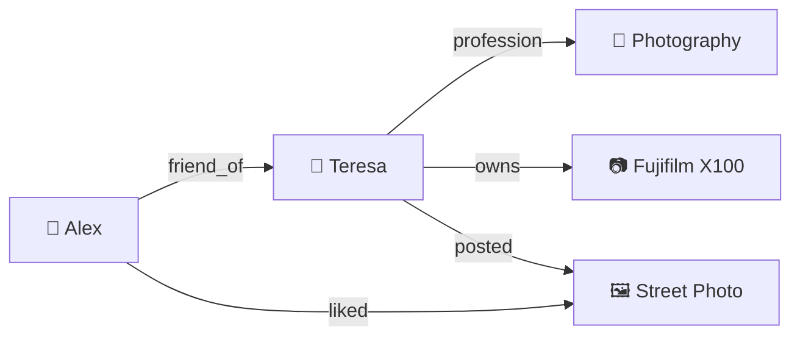

# Hypergraph

> Framework for building web3 apps

This file contains all documentation content in a single document following the llmstxt.org standard.

## in another tab

## Running Connect and Sync Server Locally

To run the Connect and Sync Server locally, you need to get the Hypergraph repository:

```bash
git clone https://github.com/graphprotocol/hypergraph.git
cd hypergraph
pnpm install
```

```bash
cd apps/connect
pnpm dev
# in another tab
cd apps/server
pnpm dev
```

The Connect app is available at `http://localhost:5173` and the Sync Server is available at `http://localhost:3000`.

---

## AI Usage


## Cursor

You can use the Docs feature to add Hypergraph documentation and reference it in your prompts.

1. Type `@docs` and select `Add new doc`
2. Provide the `https://docs.hypergraph.thegraph.com/llms-full.txt` URL
3. Add `Hypergraph` as the name

Now you can mention `@Hypergraph` in your prompts whenever you work with Hypergraph.

## Docs for LLMs

We support the [llms.txt](https://llmstxt.org/) standard for making documentation available to llms.

We offer the following pages:

- [`/llms.txt`](/llms.txt) — a listing of the available pages
- [`/llms-full.txt`](/llms-full.txt) — complete documentation

---

## Class: InvalidIdentityError


Defined in: packages/hypergraph/src/connect/types.ts:70

## Constructors

### Constructor

> **new InvalidIdentityError**(): `InvalidIdentityError`

#### Returns

`InvalidIdentityError`

## Properties

### \_tag

> `readonly` **\_tag**: `"InvalidIdentityError"` = `'InvalidIdentityError'`

Defined in: packages/hypergraph/src/connect/types.ts:71

---

## Function: addSmartAccountOwner()


> **addSmartAccountOwner**(`smartAccountClient`, `newOwner`, `chain`, `rpcUrl`): `Promise`\<`undefined` \| \{ \}\>

Defined in: packages/hypergraph/src/connect/smart-account.ts:590

## Parameters

### smartAccountClient

`SmartAccountClient`

### newOwner

`` `0x${string}` ``

### chain

`Chain`

### rpcUrl

`string`

## Returns

`Promise`\<`undefined` \| \{ \}\>

---

## Function: buildAccountAddressStorageKey()


> **buildAccountAddressStorageKey**(): `string`

Defined in: packages/hypergraph/src/connect/auth-storage.ts:9

## Returns

`string`

---

## Function: buildKeysStorageKey()


> **buildKeysStorageKey**(`walletAddress`): `string`

Defined in: packages/hypergraph/src/connect/auth-storage.ts:11

## Parameters

### walletAddress

`string`

## Returns

`string`

---

## Function: buildSessionTokenStorageKey()


> **buildSessionTokenStorageKey**(`walletAddress`): `string`

Defined in: packages/hypergraph/src/connect/auth-storage.ts:14

## Parameters

### walletAddress

`string`

## Returns

`string`

---

## Function: createAppIdentity()


> **createAppIdentity**(): [`IdentityKeys`](../type-aliases/IdentityKeys.md) & `object`

Defined in: packages/hypergraph/src/connect/create-app-identity.ts:6

## Returns

[`IdentityKeys`](../type-aliases/IdentityKeys.md) & `object`

---

## Function: createAuthUrl()


> **createAuthUrl**(`params`): `object`

Defined in: packages/hypergraph/src/connect/create-auth-url.ts:12

## Parameters

### params

`CreateAuthUrlParams`

## Returns

`object`

### expiry

> **expiry**: `number`

### nonce

> **nonce**: `string`

### publicKey

> **publicKey**: `string`

### secretKey

> **secretKey**: `string`

### url

> **url**: `URL`

---

## Function: createCallbackParams()


> **createCallbackParams**(`__namedParameters`): `object`

Defined in: packages/hypergraph/src/connect/create-callback-params.ts:23

## Parameters

### \_\_namedParameters

`CreateAuthUrlParams`

## Returns

`object`

### ciphertext

> **ciphertext**: `string`

### nonce

> **nonce**: `string`

---

## Function: createSmartSession()


> **createSmartSession**(`owner`, `accountAddress`, `sessionPrivateKey`, `chain`, `rpcUrl`, `__namedParameters`): `Promise`\<`` `0x${string}` ``\>

Defined in: packages/hypergraph/src/connect/smart-account.ts:643

## Parameters

### owner

\{ \} | \{ \}

### accountAddress

`` `0x${string}` ``

### sessionPrivateKey

`` `0x${string}` ``

### chain

`Chain`

### rpcUrl

`string`

### \_\_namedParameters

#### additionalActions?

[`Action`](../type-aliases/Action.md)[] = `[]`

#### allowCreateSpace?

`boolean` = `false`

#### spaces?

`object`[] = `[]`

## Returns

`Promise`\<`` `0x${string}` ``\>

---

## Function: decryptAppIdentity()


> **decryptAppIdentity**(`ciphertext`, `keys`): `Promise`\<[`AppIdentityForEncryption`](../type-aliases/AppIdentityForEncryption.md)\>

Defined in: packages/hypergraph/src/connect/identity-encryption.ts:166

## Parameters

### ciphertext

`string`

### keys

[`IdentityKeys`](../type-aliases/IdentityKeys.md)

## Returns

`Promise`\<[`AppIdentityForEncryption`](../type-aliases/AppIdentityForEncryption.md)\>

---

## Function: decryptIdentity()


> **decryptIdentity**(`signer`, `ciphertext`, `nonce`): `Promise`\<[`IdentityKeys`](../type-aliases/IdentityKeys.md)\>

Defined in: packages/hypergraph/src/connect/identity-encryption.ts:104

## Parameters

### signer

[`Signer`](../type-aliases/Signer.md)

### ciphertext

`string`

### nonce

`string`

## Returns

`Promise`\<[`IdentityKeys`](../type-aliases/IdentityKeys.md)\>

---

## Function: encryptAppIdentity()


> **encryptAppIdentity**(`appIdentity`, `keys`): `Promise`\<\{ `ciphertext`: `string`; \}\>

Defined in: packages/hypergraph/src/connect/identity-encryption.ts:141

## Parameters

### appIdentity

[`AppIdentityForEncryption`](../type-aliases/AppIdentityForEncryption.md)

### keys

[`IdentityKeys`](../type-aliases/IdentityKeys.md)

## Returns

`Promise`\<\{ `ciphertext`: `string`; \}\>

---

## Function: encryptIdentity()


> **encryptIdentity**(`signer`, `keys`): `Promise`\<\{ `ciphertext`: `string`; `nonce`: `string`; \}\>

Defined in: packages/hypergraph/src/connect/identity-encryption.ts:73

## Parameters

### signer

[`Signer`](../type-aliases/Signer.md)

### keys

[`IdentityKeys`](../type-aliases/IdentityKeys.md)

## Returns

`Promise`\<\{ `ciphertext`: `string`; `nonce`: `string`; \}\>

---

## Function: getEnv()


> **getEnv**(): `"dev"` \| `"production"` \| `"local"`

Defined in: packages/hypergraph/src/connect/auth-storage.ts:5

## Returns

`"dev"` \| `"production"` \| `"local"`

---

## Function: getSmartAccountWalletClient()


> **getSmartAccountWalletClient**(`__namedParameters`): `Promise`\<`SmartAccountClient`\>

Defined in: packages/hypergraph/src/connect/smart-account.ts:357

## Parameters

### \_\_namedParameters

[`SmartAccountParams`](../type-aliases/SmartAccountParams.md)

## Returns

`Promise`\<`SmartAccountClient`\>

---

## Function: getSmartSessionClient()


> **getSmartSessionClient**(`__namedParameters`): `Promise`\<[`SmartSessionClient`](../type-aliases/SmartSessionClient.md)\>

Defined in: packages/hypergraph/src/connect/smart-account.ts:869

## Parameters

### \_\_namedParameters

#### accountAddress

`` `0x${string}` ``

#### apiKey?

`string` = `DEFAULT_API_KEY`

#### chain?

`Chain` = `GEOGENESIS`

#### permissionId

`` `0x${string}` ``

#### rpcUrl?

`string` = `DEFAULT_RPC_URL`

#### sessionPrivateKey

`` `0x${string}` ``

## Returns

`Promise`\<[`SmartSessionClient`](../type-aliases/SmartSessionClient.md)\>

---

## Function: identityExists()


> **identityExists**(`accountAddress`, `syncServerUri`): `Promise`\<`boolean`\>

Defined in: packages/hypergraph/src/connect/login.ts:21

## Parameters

### accountAddress

`string`

### syncServerUri

`string`

## Returns

`Promise`\<`boolean`\>

---

## Function: isSmartAccountDeployed()


> **isSmartAccountDeployed**(`smartAccountClient`): `Promise`\<`boolean`\>

Defined in: packages/hypergraph/src/connect/smart-account.ts:339

## Parameters

### smartAccountClient

`SmartAccountClient`

## Returns

`Promise`\<`boolean`\>

---

## Function: legacySmartAccountUpdateStatus()


> **legacySmartAccountUpdateStatus**(`smartAccountClient`, `chain`, `rpcUrl`): `Promise`\<\{ `has7579Module`: `boolean`; `hasOwnableValidator`: `boolean`; `hasSmartSessionsValidator`: `boolean`; \}\>

Defined in: packages/hypergraph/src/connect/smart-account.ts:385

## Parameters

### smartAccountClient

`SmartAccountClient`

### chain

`Chain`

### rpcUrl

`string`

## Returns

`Promise`\<\{ `has7579Module`: `boolean`; `hasOwnableValidator`: `boolean`; `hasSmartSessionsValidator`: `boolean`; \}\>

---

## Function: loadAccountAddress()


> **loadAccountAddress**(`storage`): `null` \| `string`

Defined in: packages/hypergraph/src/connect/auth-storage.ts:57

## Parameters

### storage

[`Storage`](../type-aliases/Storage.md)

## Returns

`null` \| `string`

---

## Function: loadKeys()


> **loadKeys**(`storage`, `walletAddress`): `null` \| [`IdentityKeys`](../type-aliases/IdentityKeys.md)

Defined in: packages/hypergraph/src/connect/auth-storage.ts:17

## Parameters

### storage

[`Storage`](../type-aliases/Storage.md)

### walletAddress

`string`

## Returns

`null` \| [`IdentityKeys`](../type-aliases/IdentityKeys.md)

---

## Function: loadSyncServerSessionToken()


> **loadSyncServerSessionToken**(`storage`, `address`): `null` \| `string`

Defined in: packages/hypergraph/src/connect/auth-storage.ts:42

## Parameters

### storage

[`Storage`](../type-aliases/Storage.md)

### address

`string`

## Returns

`null` \| `string`

---

## Function: login()


> **login**(`__namedParameters`): `Promise`\<`void`\>

Defined in: packages/hypergraph/src/connect/login.ts:152

## Parameters

### \_\_namedParameters

#### addressStorage

[`Storage`](../type-aliases/Storage.md)

#### chain

`Chain`

#### identityToken

`string`

#### keysStorage

[`Storage`](../type-aliases/Storage.md)

#### rpcUrl

`string`

#### signer

[`Signer`](../type-aliases/Signer.md)

#### syncServerUri

`string`

#### walletClient

\{ \}

## Returns

`Promise`\<`void`\>

---

## Function: parseAuthParams()


> **parseAuthParams**(`params`): `Effect`\<\{ `nonce`: `string`; `payload`: \{ `appId`: `string`; `encryptionPublicKey`: `string`; `expiry`: `number`; \}; `redirect`: `string`; \}, [`FailedToParseConnectAuthUrl`](../../../../classes/FailedToParseConnectAuthUrl.md)\>

Defined in: packages/hypergraph/src/connect/parse-auth-params.ts:14

## Parameters

### params

`ParseAuthUrlParams`

## Returns

`Effect`\<\{ `nonce`: `string`; `payload`: \{ `appId`: `string`; `encryptionPublicKey`: `string`; `expiry`: `number`; \}; `redirect`: `string`; \}, [`FailedToParseConnectAuthUrl`](../../../../classes/FailedToParseConnectAuthUrl.md)\>

---

## Function: parseCallbackParams()


> **parseCallbackParams**(`__namedParameters`): `Effect`\<\{ `accountAddress`: `string`; `appIdentityAddress`: `string`; `appIdentityAddressPrivateKey`: `string`; `encryptionPrivateKey`: `string`; `encryptionPublicKey`: `string`; `permissionId`: `string`; `privateSpaces`: readonly `object`[]; `publicSpaces`: readonly `object`[]; `sessionToken`: `string`; `sessionTokenExpires`: `Date`; `signaturePrivateKey`: `string`; `signaturePublicKey`: `string`; \}, [`FailedToParseAuthCallbackUrl`](../../../../classes/FailedToParseAuthCallbackUrl.md)\>

Defined in: packages/hypergraph/src/connect/parse-callback-params.ts:19

## Parameters

### \_\_namedParameters

`ParseCallbackUrlParams`

## Returns

`Effect`\<\{ `accountAddress`: `string`; `appIdentityAddress`: `string`; `appIdentityAddressPrivateKey`: `string`; `encryptionPrivateKey`: `string`; `encryptionPublicKey`: `string`; `permissionId`: `string`; `privateSpaces`: readonly `object`[]; `publicSpaces`: readonly `object`[]; `sessionToken`: `string`; `sessionTokenExpires`: `Date`; `signaturePrivateKey`: `string`; `signaturePublicKey`: `string`; \}, [`FailedToParseAuthCallbackUrl`](../../../../classes/FailedToParseAuthCallbackUrl.md)\>

---

## Function: restoreKeys()


> **restoreKeys**(`signer`, `accountAddress`, `syncServerUri`, `addressStorage`, `keysStorage`, `identityToken`): `Promise`\<\{ `accountAddress`: `` `0x${string}` ``; `keys`: [`IdentityKeys`](../type-aliases/IdentityKeys.md); \}\>

Defined in: packages/hypergraph/src/connect/login.ts:86

## Parameters

### signer

[`Signer`](../type-aliases/Signer.md)

### accountAddress

`` `0x${string}` ``

### syncServerUri

`string`

### addressStorage

[`Storage`](../type-aliases/Storage.md)

### keysStorage

[`Storage`](../type-aliases/Storage.md)

### identityToken

`string`

## Returns

`Promise`\<\{ `accountAddress`: `` `0x${string}` ``; `keys`: [`IdentityKeys`](../type-aliases/IdentityKeys.md); \}\>

---

## Function: signup()


> **signup**(`signer`, `_walletClient`, `smartAccountClient`, `accountAddress`, `syncServerUri`, `addressStorage`, `keysStorage`, `identityToken`, `chain`, `rpcUrl`): `Promise`\<\{ `accountAddress`: `` `0x${string}` ``; `keys`: [`IdentityKeys`](../type-aliases/IdentityKeys.md); \}\>

Defined in: packages/hypergraph/src/connect/login.ts:28

## Parameters

### signer

[`Signer`](../type-aliases/Signer.md)

### \_walletClient

### smartAccountClient

`SmartAccountClient`

### accountAddress

`` `0x${string}` ``

### syncServerUri

`string`

### addressStorage

[`Storage`](../type-aliases/Storage.md)

### keysStorage

[`Storage`](../type-aliases/Storage.md)

### identityToken

`string`

### chain

`Chain`

### rpcUrl

`string`

## Returns

`Promise`\<\{ `accountAddress`: `` `0x${string}` ``; `keys`: [`IdentityKeys`](../type-aliases/IdentityKeys.md); \}\>

---

## Function: smartAccountNeedsUpdate()


> **smartAccountNeedsUpdate**(`smartAccountClient`, `chain`, `rpcUrl`): `Promise`\<`boolean`\>

Defined in: packages/hypergraph/src/connect/smart-account.ts:438

## Parameters

### smartAccountClient

`SmartAccountClient`

### chain

`Chain`

### rpcUrl

`string`

## Returns

`Promise`\<`boolean`\>

---

## Function: storeAccountAddress()


> **storeAccountAddress**(`storage`, `accountId`): `void`

Defined in: packages/hypergraph/src/connect/auth-storage.ts:61

## Parameters

### storage

[`Storage`](../type-aliases/Storage.md)

### accountId

`string`

## Returns

`void`

---

## Function: storeKeys()


> **storeKeys**(`storage`, `walletAddress`, `keys`): `void`

Defined in: packages/hypergraph/src/connect/auth-storage.ts:32

## Parameters

### storage

[`Storage`](../type-aliases/Storage.md)

### walletAddress

`string`

### keys

[`IdentityKeys`](../type-aliases/IdentityKeys.md)

## Returns

`void`

---

## Function: storeSyncServerSessionToken()


> **storeSyncServerSessionToken**(`storage`, `address`, `sessionToken`): `void`

Defined in: packages/hypergraph/src/connect/auth-storage.ts:48

## Parameters

### storage

[`Storage`](../type-aliases/Storage.md)

### address

`string`

### sessionToken

`string`

## Returns

`void`

---

## Function: updateLegacySmartAccount()


> **updateLegacySmartAccount**(`smartAccountClient`, `chain`, `rpcUrl`): `Promise`\<`undefined` \| \{ \}\>

Defined in: packages/hypergraph/src/connect/smart-account.ts:462

## Parameters

### smartAccountClient

`SmartAccountClient`

### chain

`Chain`

### rpcUrl

`string`

## Returns

`Promise`\<`undefined` \| \{ \}\>

---

## Function: wipeAccountAddress()


> **wipeAccountAddress**(`storage`): `void`

Defined in: packages/hypergraph/src/connect/auth-storage.ts:65

## Parameters

### storage

[`Storage`](../type-aliases/Storage.md)

## Returns

`void`

---

## Function: wipeAllAuthData()


> **wipeAllAuthData**(`addressStorage`, `keysAndTokenStorage`): `void`

Defined in: packages/hypergraph/src/connect/auth-storage.ts:69

## Parameters

### addressStorage

[`Storage`](../type-aliases/Storage.md)

### keysAndTokenStorage

[`Storage`](../type-aliases/Storage.md)

## Returns

`void`

---

## Function: wipeKeys()


> **wipeKeys**(`storage`, `walletAddress`): `void`

Defined in: packages/hypergraph/src/connect/auth-storage.ts:37

## Parameters

### storage

[`Storage`](../type-aliases/Storage.md)

### walletAddress

`string`

## Returns

`void`

---

## Function: wipeSyncServerSessionToken()


> **wipeSyncServerSessionToken**(`storage`, `walletAddress`): `void`

Defined in: packages/hypergraph/src/connect/auth-storage.ts:53

## Parameters

### storage

[`Storage`](../type-aliases/Storage.md)

### walletAddress

`string`

## Returns

`void`

---

## Connect


## Classes

- [InvalidIdentityError](classes/InvalidIdentityError.md)

## Type Aliases

- [Action](type-aliases/Action.md)
- [AppIdentityForEncryption](type-aliases/AppIdentityForEncryption.md)
- [AppIdentityResponse](type-aliases/AppIdentityResponse.md)
- [GetAddress](type-aliases/GetAddress.md)
- [Identity](type-aliases/Identity.md)
- [IdentityKeys](type-aliases/IdentityKeys.md)
- [KeysSchema](type-aliases/KeysSchema.md)
- [PrivateAppIdentity](type-aliases/PrivateAppIdentity.md)
- [PrivatePrivyAppIdentity](type-aliases/PrivatePrivyAppIdentity.md)
- [PublicAppIdentity](type-aliases/PublicAppIdentity.md)
- [Signer](type-aliases/Signer.md)
- [SignMessage](type-aliases/SignMessage.md)
- [SmartAccountParams](type-aliases/SmartAccountParams.md)
- [SmartSessionClient](type-aliases/SmartSessionClient.md)
- [Storage](type-aliases/Storage.md)

## Variables

- [AppIdentityResponse](variables/AppIdentityResponse.md)
- [DEFAULT\_RPC\_URL](variables/DEFAULT_RPC_URL.md)
- [GEO\_TESTNET](variables/GEO_TESTNET.md)
- [GEOGENESIS](variables/GEOGENESIS.md)
- [KeysSchema](variables/KeysSchema.md)
- [TESTNET\_RPC\_URL](variables/TESTNET_RPC_URL.md)

## Functions

- [addSmartAccountOwner](functions/addSmartAccountOwner.md)
- [buildAccountAddressStorageKey](functions/buildAccountAddressStorageKey.md)
- [buildKeysStorageKey](functions/buildKeysStorageKey.md)
- [buildSessionTokenStorageKey](functions/buildSessionTokenStorageKey.md)
- [createAppIdentity](functions/createAppIdentity.md)
- [createAuthUrl](functions/createAuthUrl.md)
- [createCallbackParams](functions/createCallbackParams.md)
- [createSmartSession](functions/createSmartSession.md)
- [decryptAppIdentity](functions/decryptAppIdentity.md)
- [decryptIdentity](functions/decryptIdentity.md)
- [encryptAppIdentity](functions/encryptAppIdentity.md)
- [encryptIdentity](functions/encryptIdentity.md)
- [getEnv](functions/getEnv.md)
- [getSmartAccountWalletClient](functions/getSmartAccountWalletClient.md)
- [getSmartSessionClient](functions/getSmartSessionClient.md)
- [identityExists](functions/identityExists.md)
- [isSmartAccountDeployed](functions/isSmartAccountDeployed.md)
- [legacySmartAccountUpdateStatus](functions/legacySmartAccountUpdateStatus.md)
- [loadAccountAddress](functions/loadAccountAddress.md)
- [loadKeys](functions/loadKeys.md)
- [loadSyncServerSessionToken](functions/loadSyncServerSessionToken.md)
- [login](functions/login.md)
- [parseAuthParams](functions/parseAuthParams.md)
- [parseCallbackParams](functions/parseCallbackParams.md)
- [restoreKeys](functions/restoreKeys.md)
- [signup](functions/signup.md)
- [smartAccountNeedsUpdate](functions/smartAccountNeedsUpdate.md)
- [storeAccountAddress](functions/storeAccountAddress.md)
- [storeKeys](functions/storeKeys.md)
- [storeSyncServerSessionToken](functions/storeSyncServerSessionToken.md)
- [updateLegacySmartAccount](functions/updateLegacySmartAccount.md)
- [wipeAccountAddress](functions/wipeAccountAddress.md)
- [wipeAllAuthData](functions/wipeAllAuthData.md)
- [wipeKeys](functions/wipeKeys.md)
- [wipeSyncServerSessionToken](functions/wipeSyncServerSessionToken.md)

---

## Type Alias: Action


> **Action** = `object`

Defined in: packages/hypergraph/src/connect/smart-account.ts:151

## Properties

### actionPolicies

> **actionPolicies**: `object`[]

Defined in: packages/hypergraph/src/connect/smart-account.ts:154

#### address

> **address**: `Address`

#### initData

> **initData**: `Hex`

#### policy

> **policy**: `Address`

***

### actionTarget

> **actionTarget**: `Address`

Defined in: packages/hypergraph/src/connect/smart-account.ts:152

***

### actionTargetSelector

> **actionTargetSelector**: `Hex`

Defined in: packages/hypergraph/src/connect/smart-account.ts:153

---

## Type Alias: AppIdentityForEncryption


> **AppIdentityForEncryption** = `Omit`\<[`PrivateAppIdentity`](PrivateAppIdentity.md), `"sessionToken"` \| `"sessionTokenExpires"` \| `"accountAddress"`\>

Defined in: packages/hypergraph/src/connect/identity-encryption.ts:11

---

## Type Alias: AppIdentityResponse


> **AppIdentityResponse** = `Schema.Schema.Type`\<*typeof* [`AppIdentityResponse`](../variables/AppIdentityResponse.md)\>

Defined in: packages/hypergraph/src/connect/types.ts:32

---

## Type Alias: GetAddress()


> **GetAddress** = () => `Promise`\<`string`\> \| `string`

Defined in: packages/hypergraph/src/connect/types.ts:10

## Returns

`Promise`\<`string`\> \| `string`

---

## Type Alias: Identity


> **Identity** = [`IdentityKeys`](IdentityKeys.md) & `object`

Defined in: packages/hypergraph/src/connect/types.ts:47

## Type declaration

### accountAddress

> **accountAddress**: `string`

---

## Type Alias: IdentityKeys


> **IdentityKeys** = `object`

Defined in: packages/hypergraph/src/connect/types.ts:16

## Properties

### encryptionPrivateKey

> **encryptionPrivateKey**: `string`

Defined in: packages/hypergraph/src/connect/types.ts:18

***

### encryptionPublicKey

> **encryptionPublicKey**: `string`

Defined in: packages/hypergraph/src/connect/types.ts:17

***

### signaturePrivateKey

> **signaturePrivateKey**: `string`

Defined in: packages/hypergraph/src/connect/types.ts:20

***

### signaturePublicKey

> **signaturePublicKey**: `string`

Defined in: packages/hypergraph/src/connect/types.ts:19

---

## Type Alias: KeysSchema


> **KeysSchema** = `Schema.Schema.Type`\<*typeof* [`KeysSchema`](../variables/KeysSchema.md)\>

Defined in: packages/hypergraph/src/connect/types.ts:23

---

## Type Alias: PrivateAppIdentity


> **PrivateAppIdentity** = [`IdentityKeys`](IdentityKeys.md) & `object`

Defined in: packages/hypergraph/src/connect/types.ts:57

## Type declaration

### accountAddress

> **accountAddress**: `string`

### address

> **address**: `string`

### addressPrivateKey

> **addressPrivateKey**: `string`

### permissionId

> **permissionId**: `string`

### sessionToken

> **sessionToken**: `string`

### sessionTokenExpires

> **sessionTokenExpires**: `Date`

---

## Type Alias: PrivatePrivyAppIdentity


> **PrivatePrivyAppIdentity** = [`IdentityKeys`](IdentityKeys.md) & `object`

Defined in: packages/hypergraph/src/connect/types.ts:66

## Type declaration

### accountAddress

> **accountAddress**: `string`

### privyIdentityToken

> **privyIdentityToken**: `string`

---

## Type Alias: PublicAppIdentity


> **PublicAppIdentity** = `object`

Defined in: packages/hypergraph/src/connect/types.ts:51

## Properties

### address

> **address**: `string`

Defined in: packages/hypergraph/src/connect/types.ts:52

***

### encryptionPublicKey

> **encryptionPublicKey**: `string`

Defined in: packages/hypergraph/src/connect/types.ts:53

***

### signaturePublicKey

> **signaturePublicKey**: `string`

Defined in: packages/hypergraph/src/connect/types.ts:54

---

## Type Alias: SignMessage()


> **SignMessage** = (`message`) => `Promise`\<`string`\> \| `string`

Defined in: packages/hypergraph/src/connect/types.ts:9

## Parameters

### message

`string`

## Returns

`Promise`\<`string`\> \| `string`

---

## Type Alias: Signer


> **Signer** = `object`

Defined in: packages/hypergraph/src/connect/types.ts:11

## Properties

### getAddress

> **getAddress**: [`GetAddress`](GetAddress.md)

Defined in: packages/hypergraph/src/connect/types.ts:12

***

### signMessage

> **signMessage**: [`SignMessage`](SignMessage.md)

Defined in: packages/hypergraph/src/connect/types.ts:13

---

## Type Alias: SmartAccountParams


> **SmartAccountParams** = `object`

Defined in: packages/hypergraph/src/connect/smart-account.ts:346

## Properties

### address?

> `optional` **address**: `Hex`

Defined in: packages/hypergraph/src/connect/smart-account.ts:348

***

### apiKey?

> `optional` **apiKey**: `string`

Defined in: packages/hypergraph/src/connect/smart-account.ts:351

***

### chain?

> `optional` **chain**: `Chain`

Defined in: packages/hypergraph/src/connect/smart-account.ts:349

***

### owner

> **owner**: `WalletClient` \| `Account`

Defined in: packages/hypergraph/src/connect/smart-account.ts:347

***

### rpcUrl?

> `optional` **rpcUrl**: `string`

Defined in: packages/hypergraph/src/connect/smart-account.ts:350

---

## Type Alias: SmartSessionClient


> **SmartSessionClient** = `object`

Defined in: packages/hypergraph/src/connect/smart-account.ts:168

## Properties

### account

> **account**: `Account`

Defined in: packages/hypergraph/src/connect/smart-account.ts:169

***

### chain

> **chain**: `Chain`

Defined in: packages/hypergraph/src/connect/smart-account.ts:170

***

### sendUserOperation()

> **sendUserOperation**: \<`calls`\>(`{ calls }`) => `Promise`\<`string`\>

Defined in: packages/hypergraph/src/connect/smart-account.ts:171

#### Type Parameters

##### calls

`calls` *extends* readonly `unknown`[]

#### Parameters

##### \{ calls \}

###### calls

`calls`

#### Returns

`Promise`\<`string`\>

***

### signMessage()

> **signMessage**: (`{ message }`) => `Promise`\<`Hex`\>

Defined in: packages/hypergraph/src/connect/smart-account.ts:173

#### Parameters

##### \{ message \}

###### message

`SignableMessage`

#### Returns

`Promise`\<`Hex`\>

***

### waitForUserOperationReceipt()

> **waitForUserOperationReceipt**: (`{ hash }`) => `Promise`\<`WaitForUserOperationReceiptReturnType`\>

Defined in: packages/hypergraph/src/connect/smart-account.ts:172

#### Parameters

##### \{ hash \}

###### hash

`Hex`

#### Returns

`Promise`\<`WaitForUserOperationReceiptReturnType`\>

---

## Type Alias: Storage


> **Storage** = `object`

Defined in: packages/hypergraph/src/connect/types.ts:3

## Properties

### getItem()

> **getItem**: (`key`) => `string` \| `null`

Defined in: packages/hypergraph/src/connect/types.ts:4

#### Parameters

##### key

`string`

#### Returns

`string` \| `null`

***

### removeItem()

> **removeItem**: (`key`) => `void`

Defined in: packages/hypergraph/src/connect/types.ts:6

#### Parameters

##### key

`string`

#### Returns

`void`

***

### setItem()

> **setItem**: (`key`, `value`) => `void`

Defined in: packages/hypergraph/src/connect/types.ts:5

#### Parameters

##### key

`string`

##### value

`string`

#### Returns

`void`

---

## Variable: AppIdentityResponse


> `const` **AppIdentityResponse**: `Struct`\<\{ `accountAddress`: *typeof* `String$`; `accountProof`: *typeof* `String$`; `address`: *typeof* `String$`; `appId`: *typeof* `String$`; `ciphertext`: *typeof* `String$`; `encryptionPublicKey`: *typeof* `String$`; `keyProof`: *typeof* `String$`; `sessionToken`: *typeof* `String$`; `sessionTokenExpires`: *typeof* `String$`; `signaturePublicKey`: *typeof* `String$`; \}\>

Defined in: packages/hypergraph/src/connect/types.ts:32

---

## Variable: DEFAULT\_RPC\_URL


> `const` **DEFAULT\_RPC\_URL**: `"https://rpc-geo-genesis-h0q2s21xx8.t.conduit.xyz"` = `'https://rpc-geo-genesis-h0q2s21xx8.t.conduit.xyz'`

Defined in: packages/hypergraph/src/connect/smart-account.ts:67

---

## Variable: GEOGENESIS


> `const` **GEOGENESIS**: `object`

Defined in: packages/hypergraph/src/connect/smart-account.ts:115

## Type declaration

### id

> **id**: `number`

### name

> **name**: `string` = `'Geo Genesis'`

### nativeCurrency

> **nativeCurrency**: `object`

#### nativeCurrency.decimals

> **decimals**: `number` = `18`

#### nativeCurrency.name

> **name**: `string` = `'Graph Token'`

#### nativeCurrency.symbol

> **symbol**: `string` = `'GRT'`

### rpcUrls

> **rpcUrls**: `object`

#### rpcUrls.default

> **default**: `object`

#### rpcUrls.default.http

> **http**: `string`[]

#### rpcUrls.public

> **public**: `object`

#### rpcUrls.public.http

> **http**: `string`[]

---

## Variable: GEO\_TESTNET


> `const` **GEO\_TESTNET**: `object`

Defined in: packages/hypergraph/src/connect/smart-account.ts:133

## Type declaration

### id

> **id**: `number`

### name

> **name**: `string` = `'Geo Testnet'`

### nativeCurrency

> **nativeCurrency**: `object`

#### nativeCurrency.decimals

> **decimals**: `number` = `18`

#### nativeCurrency.name

> **name**: `string` = `'Sepolia Ether'`

#### nativeCurrency.symbol

> **symbol**: `string` = `'ETH'`

### rpcUrls

> **rpcUrls**: `object`

#### rpcUrls.default

> **default**: `object`

#### rpcUrls.default.http

> **http**: `string`[]

#### rpcUrls.public

> **public**: `object`

#### rpcUrls.public.http

> **http**: `string`[]

---

## Variable: KeysSchema


> `const` **KeysSchema**: `Struct`\<\{ `encryptionPrivateKey`: *typeof* `String$`; `encryptionPublicKey`: *typeof* `String$`; `signaturePrivateKey`: *typeof* `String$`; `signaturePublicKey`: *typeof* `String$`; \}\>

Defined in: packages/hypergraph/src/connect/types.ts:23

---

## Variable: TESTNET\_RPC\_URL


> `const` **TESTNET\_RPC\_URL**: `"https://rpc-geo-test-zc16z3tcvf.t.conduit.xyz"` = `'https://rpc-geo-test-zc16z3tcvf.t.conduit.xyz'`

Defined in: packages/hypergraph/src/connect/smart-account.ts:68

---

## Class: EntityNotFoundError


Defined in: packages/hypergraph/src/entity/entity.ts:22

## Extends

- `YieldableError`\<`this`\> & `object` & `Readonly`\<\{ `cause?`: `unknown`; `id`: `string`; `type`: [`AnyNoContext`](../type-aliases/AnyNoContext.md); \}\>

## Constructors

### Constructor

> **new EntityNotFoundError**(`args`): `EntityNotFoundError`

Defined in: node\_modules/.pnpm/effect@3.17.13/node\_modules/effect/dist/dts/Data.d.ts:610

#### Parameters

##### args

###### cause?

`unknown`

###### id

`string`

###### type

[`AnyNoContext`](../type-aliases/AnyNoContext.md)

#### Returns

`EntityNotFoundError`

#### Inherited from

`Data.TaggedError('EntityNotFoundError')<{ id: string; type: AnyNoContext; cause?: unknown; }>.constructor`

## Properties

### cause?

> `optional` **cause**: `unknown`

Defined in: node\_modules/.pnpm/typescript@5.9.2/node\_modules/typescript/lib/lib.es2022.error.d.ts:26

#### Inherited from

`Data.TaggedError('EntityNotFoundError').cause`

***

### id

> `readonly` **id**: `string`

Defined in: packages/hypergraph/src/entity/entity.ts:23

#### Inherited from

`Data.TaggedError('EntityNotFoundError').id`

***

### type

> `readonly` **type**: [`AnyNoContext`](../type-aliases/AnyNoContext.md)

Defined in: packages/hypergraph/src/entity/entity.ts:24

#### Inherited from

`Data.TaggedError('EntityNotFoundError').type`

---

## Function: create()


> **create**\<`S`\>(`handle`, `type`): (`data`) => [`Entity`](../type-aliases/Entity.md)\<`S`\>

Defined in: packages/hypergraph/src/entity/create.ts:11

Creates an entity model of given type and stores it in the repo.

## Type Parameters

### S

`S` *extends* [`AnyNoContext`](../type-aliases/AnyNoContext.md)

## Parameters

### handle

`DocHandle`\<[`DocumentContent`](../type-aliases/DocumentContent.md)\>

### type

`S`

## Returns

> (`data`): [`Entity`](../type-aliases/Entity.md)\<`S`\>

### Parameters

#### data

`Readonly`\<`Schema.Schema.Type`\<[`Insert`](../type-aliases/Insert.md)\<`S`\>\>\>

### Returns

[`Entity`](../type-aliases/Entity.md)\<`S`\>

---

## Function: delete()


> **delete**(`handle`): (`id`) => `boolean`

Defined in: packages/hypergraph/src/entity/delete.ts:7

Deletes the exiting entity from the repo.

## Parameters

### handle

`DocHandle`\<[`DocumentContent`](../type-aliases/DocumentContent.md)\>

## Returns

> (`id`): `boolean`

### Parameters

#### id

`string`

### Returns

`boolean`

---

## Function: findMany()


> **findMany**\<`S`\>(`handle`, `type`, `filter`, `include`): `object`

Defined in: packages/hypergraph/src/entity/findMany.ts:238

Queries for a list of entities of the given type from the repo.

## Type Parameters

### S

`S` *extends* [`AnyNoContext`](../type-aliases/AnyNoContext.md)

## Parameters

### handle

`DocHandle`\<[`DocumentContent`](../type-aliases/DocumentContent.md)\>

### type

`S`

### filter

`undefined` | [`EntityFilter`](../type-aliases/EntityFilter.md)\<`Type`\<`S`\>\>

### include

`undefined` | \{ \[K in string \| number \| symbol\]?: Record\<string, Record\<string, never\>\> \}

## Returns

`object`

### corruptEntityIds

> **corruptEntityIds**: readonly `string`[]

### entities

> **entities**: readonly [`Entity`](../type-aliases/Entity.md)\<`S`\>[]

---

## Function: findOne()


> **findOne**\<`S`\>(`handle`, `type`, `include`): (`id`) => `undefined` \| [`Entity`](../type-aliases/Entity.md)\<`S`\>

Defined in: packages/hypergraph/src/entity/findOne.ts:10

Find the entity of the given type, with the given id, from the repo.

## Type Parameters

### S

`S` *extends* [`AnyNoContext`](../type-aliases/AnyNoContext.md)

## Parameters

### handle

`DocHandle`\<[`DocumentContent`](../type-aliases/DocumentContent.md)\>

### type

`S`

### include

`undefined` | \{ \[K in string \| number \| symbol\]?: Record\<string, Record\<string, never\>\> \}

## Returns

> (`id`): `undefined` \| [`Entity`](../type-aliases/Entity.md)\<`S`\>

### Parameters

#### id

`string`

### Returns

`undefined` \| [`Entity`](../type-aliases/Entity.md)\<`S`\>

---

## Function: markAsDeleted()


> **markAsDeleted**(`handle`): (`id`) => `boolean`

Defined in: packages/hypergraph/src/entity/delete.ts:33

Deletes the exiting entity from the repo.

## Parameters

### handle

`DocHandle`\<[`DocumentContent`](../type-aliases/DocumentContent.md)\>

## Returns

> (`id`): `boolean`

### Parameters

#### id

`string`

### Returns

`boolean`

---

## Function: removeRelation()


> **removeRelation**(`handle`): (`relationId`) => `boolean`

Defined in: packages/hypergraph/src/entity/removeRelation.ts:7

Removes a relation from an entity

## Parameters

### handle

`DocHandle`\<[`DocumentContent`](../type-aliases/DocumentContent.md)\>

## Returns

> (`relationId`): `boolean`

### Parameters

#### relationId

`string`

### Returns

`boolean`

---

## Function: subscribeToFindMany()


> **subscribeToFindMany**\<`S`\>(`handle`, `type`, `filter`, `include`): [`FindManySubscription`](../type-aliases/FindManySubscription.md)\<`S`\>

Defined in: packages/hypergraph/src/entity/findMany.ts:398

## Type Parameters

### S

`S` *extends* [`AnyNoContext`](../type-aliases/AnyNoContext.md)

## Parameters

### handle

`DocHandle`\<[`DocumentContent`](../type-aliases/DocumentContent.md)\>

### type

`S`

### filter

`undefined` | \{ \[K in string \| number \| symbol\]?: EntityFieldFilter\<Type\<S\>\[K\]\> \}

### include

`undefined` | \{ \[K in string \| number \| symbol\]?: Record\<string, Record\<string, never\>\> \}

## Returns

[`FindManySubscription`](../type-aliases/FindManySubscription.md)\<`S`\>

---

## Function: update()


> **update**\<`S`\>(`handle`, `type`): (`id`, `data`) => [`Entity`](../type-aliases/Entity.md)\<`S`\>

Defined in: packages/hypergraph/src/entity/update.ts:9

Update an existing entity model of given type in the repo.

## Type Parameters

### S

`S` *extends* [`AnyNoContext`](../type-aliases/AnyNoContext.md)

## Parameters

### handle

`DocHandle`\<[`DocumentContent`](../type-aliases/DocumentContent.md)\>

### type

`S`

## Returns

> (`id`, `data`): [`Entity`](../type-aliases/Entity.md)\<`S`\>

### Parameters

#### id

`string`

#### data

\{ \[K in string \| number \| symbol\]: Partial\<Type\<Update\<S\>\>\>\[K\] \}

### Returns

[`Entity`](../type-aliases/Entity.md)\<`S`\>

---

## Entity


## Classes

- [EntityNotFoundError](classes/EntityNotFoundError.md)

## Type Aliases

- [Any](type-aliases/Any.md)
- [AnyNoContext](type-aliases/AnyNoContext.md)
- [CrossFieldFilter](type-aliases/CrossFieldFilter.md)
- [DocumentContent](type-aliases/DocumentContent.md)
- [DocumentEntity](type-aliases/DocumentEntity.md)
- [DocumentRelation](type-aliases/DocumentRelation.md)
- [Entity](type-aliases/Entity.md)
- [EntityBooleanFilter](type-aliases/EntityBooleanFilter.md)
- [EntityFieldFilter](type-aliases/EntityFieldFilter.md)
- [EntityFilter](type-aliases/EntityFilter.md)
- [EntityNumberFilter](type-aliases/EntityNumberFilter.md)
- [EntityStringFilter](type-aliases/EntityStringFilter.md)
- [EntityWithRelation](type-aliases/EntityWithRelation.md)
- [FindManySubscription](type-aliases/FindManySubscription.md)
- [Insert](type-aliases/Insert.md)
- [Update](type-aliases/Update.md)

## Variables

- [Class](variables/Class.md)
- [Field](variables/Field.md)

## Functions

- [create](functions/create.md)
- [delete](functions/delete.md)
- [findMany](functions/findMany.md)
- [findOne](functions/findOne.md)
- [markAsDeleted](functions/markAsDeleted.md)
- [removeRelation](functions/removeRelation.md)
- [subscribeToFindMany](functions/subscribeToFindMany.md)
- [update](functions/update.md)

---

## Type Alias: Any


> **Any** = `Schema.Schema.Any` & `object`

Defined in: packages/hypergraph/src/entity/types.ts:3

## Type declaration

### fields

> `readonly` **fields**: `Schema.Struct.Fields`

### insert

> `readonly` **insert**: `Schema.Schema.Any`

### update

> `readonly` **update**: `Schema.Schema.Any`

---

## Type Alias: AnyNoContext


> **AnyNoContext** = `Schema.Schema.AnyNoContext` & `object`

Defined in: packages/hypergraph/src/entity/types.ts:9

## Type declaration

### fields

> `readonly` **fields**: `Schema.Struct.Fields`

### insert

> `readonly` **insert**: `Schema.Schema.AnyNoContext`

### update

> `readonly` **update**: `Schema.Schema.AnyNoContext`

---

## Type Alias: CrossFieldFilter\<T\>


> **CrossFieldFilter**\<`T`\> = `{ [K in keyof T]?: EntityFieldFilter<T[K]> }` & `object`

Defined in: packages/hypergraph/src/entity/types.ts:67

## Type declaration

### not?

> `optional` **not**: `CrossFieldFilter`\<`T`\>

### or?

> `optional` **or**: `CrossFieldFilter`\<`T`\>[]

## Type Parameters

### T

`T`

---

## Type Alias: DocumentContent


> **DocumentContent** = `object`

Defined in: packages/hypergraph/src/entity/types.ts:45

## Properties

### entities?

> `optional` **entities**: `Record`\<`string`, [`DocumentEntity`](DocumentEntity.md)\>

Defined in: packages/hypergraph/src/entity/types.ts:46

***

### relations?

> `optional` **relations**: `Record`\<`string`, [`DocumentRelation`](DocumentRelation.md)\>

Defined in: packages/hypergraph/src/entity/types.ts:47

---

## Type Alias: DocumentEntity


> **DocumentEntity** = `object`

Defined in: packages/hypergraph/src/entity/types.ts:31

## Indexable

\[`key`: `string`\]: `unknown`

## Properties

### \_\_deleted

> **\_\_deleted**: `boolean`

Defined in: packages/hypergraph/src/entity/types.ts:32

---

## Type Alias: DocumentRelation


> **DocumentRelation** = `object`

Defined in: packages/hypergraph/src/entity/types.ts:36

## Indexable

\[`key`: `string`\]: `unknown`

## Properties

### \_\_deleted

> **\_\_deleted**: `boolean`

Defined in: packages/hypergraph/src/entity/types.ts:41

***

### from

> **from**: `string`

Defined in: packages/hypergraph/src/entity/types.ts:37

***

### fromPropertyName

> **fromPropertyName**: `string`

Defined in: packages/hypergraph/src/entity/types.ts:40

***

### fromTypeName

> **fromTypeName**: `string`

Defined in: packages/hypergraph/src/entity/types.ts:39

***

### to

> **to**: `string`

Defined in: packages/hypergraph/src/entity/types.ts:38

---

## Type Alias: Entity\<S\>


> **Entity**\<`S`\> = `Schema.Schema.Type`\<`S`\> & `object`

Defined in: packages/hypergraph/src/entity/types.ts:18

## Type declaration

### id

> **id**: `string`

### type

> **type**: `string`

## Type Parameters

### S

`S` *extends* [`AnyNoContext`](AnyNoContext.md)

---

## Type Alias: EntityBooleanFilter


> **EntityBooleanFilter** = `object`

Defined in: packages/hypergraph/src/entity/types.ts:50

## Properties

### is

> **is**: `boolean`

Defined in: packages/hypergraph/src/entity/types.ts:51

---

## Type Alias: EntityFieldFilter\<T\>


> **EntityFieldFilter**\<`T`\> = `object` & `T` *extends* `boolean` ? `object` : `T` *extends* `number` ? `object` : `T` *extends* `string` ? `object` : `Record`\<`string`, `never`\>

Defined in: packages/hypergraph/src/entity/types.ts:74

## Type declaration

### is?

> `optional` **is**: `T`

## Type Parameters

### T

`T`

---

## Type Alias: EntityFilter\<T\>


> **EntityFilter**\<`T`\> = [`CrossFieldFilter`](CrossFieldFilter.md)\<`T`\>

Defined in: packages/hypergraph/src/entity/types.ts:93

## Type Parameters

### T

`T`

---

## Type Alias: EntityNumberFilter


> **EntityNumberFilter** = `object`

Defined in: packages/hypergraph/src/entity/types.ts:54

## Properties

### greaterThan?

> `optional` **greaterThan**: `number`

Defined in: packages/hypergraph/src/entity/types.ts:56

***

### is?

> `optional` **is**: `number`

Defined in: packages/hypergraph/src/entity/types.ts:55

***

### lessThan?

> `optional` **lessThan**: `number`

Defined in: packages/hypergraph/src/entity/types.ts:57

---

## Type Alias: EntityStringFilter


> **EntityStringFilter** = `object`

Defined in: packages/hypergraph/src/entity/types.ts:60

## Properties

### contains?

> `optional` **contains**: `string`

Defined in: packages/hypergraph/src/entity/types.ts:64

***

### endsWith?

> `optional` **endsWith**: `string`

Defined in: packages/hypergraph/src/entity/types.ts:63

***

### is?

> `optional` **is**: `string`

Defined in: packages/hypergraph/src/entity/types.ts:61

***

### startsWith?

> `optional` **startsWith**: `string`

Defined in: packages/hypergraph/src/entity/types.ts:62

---

## Type Alias: EntityWithRelation\<S\>


> **EntityWithRelation**\<`S`\> = [`Entity`](Entity.md)\<`S`\> & `object`

Defined in: packages/hypergraph/src/entity/types.ts:27

## Type declaration

### \_relation

> **\_relation**: \{ `id`: `string`; \} \| `undefined`

## Type Parameters

### S

`S` *extends* [`AnyNoContext`](AnyNoContext.md)

---

## Type Alias: FindManySubscription\<S\>


> **FindManySubscription**\<`S`\> = `object`

Defined in: packages/hypergraph/src/entity/findMany.ts:393

## Type Parameters

### S

`S` *extends* [`AnyNoContext`](AnyNoContext.md)

## Properties

### getEntities()

> **getEntities**: () => `Readonly`\<[`Entity`](Entity.md)\<`S`\>[]\>

Defined in: packages/hypergraph/src/entity/findMany.ts:395

#### Returns

`Readonly`\<[`Entity`](Entity.md)\<`S`\>[]\>

***

### subscribe()

> **subscribe**: (`callback`) => () => `void`

Defined in: packages/hypergraph/src/entity/findMany.ts:394

#### Parameters

##### callback

() => `void`

#### Returns

> (): `void`

##### Returns

`void`

---

## Type Alias: Insert\<S\>


> **Insert**\<`S`\> = `S`\[`"insert"`\]

Defined in: packages/hypergraph/src/entity/types.ts:16

## Type Parameters

### S

`S` *extends* [`Any`](Any.md)

---

## Type Alias: Update\<S\>


> **Update**\<`S`\> = `S`\[`"update"`\]

Defined in: packages/hypergraph/src/entity/types.ts:15

## Type Parameters

### S

`S` *extends* [`Any`](Any.md)

---

## Variable: Class()


> **Class**: \<`Self`\>(`identifier`) => \<`Fields`\>(`fields`, `annotations?`) => \[`Self`\] *extends* \[`never`\] ? `` "Missing `Self` generic - use `class Self extends Class<Self>()({ ... })`" `` : `ClassFromFields`\<`Self`, `Fields`, \{ \[K in string \| number \| symbol\]: ExtractFields\<"select", Fields, true\>\[K\] \}\> & `object`

Defined in: packages/hypergraph/src/entity/entity.ts:6

## Type Parameters

### Self

`Self` = `never`

## Parameters

### identifier

`string`

## Returns

> \<`Fields`\>(`fields`, `annotations?`): \[`Self`\] *extends* \[`never`\] ? `` "Missing `Self` generic - use `class Self extends Class<Self>()({ ... })`" `` : `ClassFromFields`\<`Self`, `Fields`, \{ \[K in string \| number \| symbol\]: ExtractFields\<"select", Fields, true\>\[K\] \}\> & `object`

### Type Parameters

#### Fields

`Fields` *extends* `Fields`

### Parameters

#### fields

`Fields` & `Validate`\<`Fields`, `"update"` \| `"insert"` \| `"select"`\>

#### annotations?

`Schema`\<`Self`, readonly \[\]\>

### Returns

\[`Self`\] *extends* \[`never`\] ? `` "Missing `Self` generic - use `class Self extends Class<Self>()({ ... })`" `` : `ClassFromFields`\<`Self`, `Fields`, \{ \[K in string \| number \| symbol\]: ExtractFields\<"select", Fields, true\>\[K\] \}\> & `object`

---

## Variable: Field()


> **Field**: \<`A`\>(`config`) => `Field`\<`A`\>

Defined in: packages/hypergraph/src/entity/entity.ts:7

## Type Parameters

### A

`A` *extends* `ConfigWithKeys`\<`"update"` \| `"insert"` \| `"select"`\>

## Parameters

### config

`A` & \{ readonly \[K in string \| number \| symbol\]: never \}

## Returns

`Field`\<`A`\>

---

## Class: InvalidIdentityError (Classes)


Defined in: packages/hypergraph/src/identity/types.ts:43

## Extends

- `YieldableError`\<`this`\> & `object` & `Readonly`\<\{ \}\>

## Constructors

### Constructor

> **new InvalidIdentityError**(`args`): `InvalidIdentityError`

Defined in: node\_modules/.pnpm/effect@3.17.13/node\_modules/effect/dist/dts/Data.d.ts:610

#### Parameters

##### args

`void`

#### Returns

`InvalidIdentityError`

#### Inherited from

`Data.TaggedError('InvalidIdentityError').constructor`

---

## Function: decryptIdentity() (Functions)


> **decryptIdentity**(`signer`, `accountAddress`, `ciphertext`, `nonce`): `Promise`\<[`IdentityKeys`](../type-aliases/IdentityKeys.md)\>

Defined in: packages/hypergraph/src/identity/identity-encryption.ts:100

## Parameters

### signer

[`Signer`](../type-aliases/Signer.md)

### accountAddress

`string`

### ciphertext

`string`

### nonce

`string`

## Returns

`Promise`\<[`IdentityKeys`](../type-aliases/IdentityKeys.md)\>

---

## Function: encryptIdentity() (Functions)


> **encryptIdentity**(`signer`, `accountAddress`, `keys`): `Promise`\<\{ `ciphertext`: `string`; `nonce`: `string`; \}\>

Defined in: packages/hypergraph/src/identity/identity-encryption.ts:68

## Parameters

### signer

[`Signer`](../type-aliases/Signer.md)

### accountAddress

`string`

### keys

[`IdentityKeys`](../type-aliases/IdentityKeys.md)

## Returns

`Promise`\<\{ `ciphertext`: `string`; `nonce`: `string`; \}\>

---

## Function: getAccountProofMessage()


> **getAccountProofMessage**(`accountAddress`, `publicKey`): `string`

Defined in: packages/hypergraph/src/identity/prove-ownership.ts:7

## Parameters

### accountAddress

`string`

### publicKey

`string`

## Returns

`string`

---

## Function: getKeyProofMessage()


> **getKeyProofMessage**(`accountAddress`, `publicKey`): `string`

Defined in: packages/hypergraph/src/identity/prove-ownership.ts:11

## Parameters

### accountAddress

`string`

### publicKey

`string`

## Returns

`string`

---

## Function: getVerifiedIdentity()


> **getVerifiedIdentity**(`accountAddress`, `signaturePublicKey`, `appId`, `syncServerUri`, `chain`, `rpcUrl`): `Promise`\<\{ `accountAddress`: `string`; `encryptionPublicKey`: `string`; `signaturePublicKey`: `string`; \}\>

Defined in: packages/hypergraph/src/identity/get-verified-identity.ts:7

## Parameters

### accountAddress

`string`

### signaturePublicKey

`null` | `string`

### appId

`null` | `string`

### syncServerUri

`string`

### chain

`Chain`

### rpcUrl

`string`

## Returns

`Promise`\<\{ `accountAddress`: `string`; `encryptionPublicKey`: `string`; `signaturePublicKey`: `string`; \}\>

---

## Function: loadIdentity()


> **loadIdentity**(`storage`): `null` \| [`PrivateAppIdentity`](../../Connect/type-aliases/PrivateAppIdentity.md)

Defined in: packages/hypergraph/src/identity/auth-storage.ts:50

## Parameters

### storage

[`Storage`](../type-aliases/Storage.md)

## Returns

`null` \| [`PrivateAppIdentity`](../../Connect/type-aliases/PrivateAppIdentity.md)

---

## Function: loadPrivyIdentity()


> **loadPrivyIdentity**(`storage`): `null` \| [`PrivatePrivyAppIdentity`](../../Connect/type-aliases/PrivatePrivyAppIdentity.md)

Defined in: packages/hypergraph/src/identity/auth-storage.ts:26

## Parameters

### storage

[`Storage`](../type-aliases/Storage.md)

## Returns

`null` \| [`PrivatePrivyAppIdentity`](../../Connect/type-aliases/PrivatePrivyAppIdentity.md)

---

## Function: logout()


> **logout**(`storage`): `void`

Defined in: packages/hypergraph/src/identity/logout.ts:5

## Parameters

### storage

[`Storage`](../type-aliases/Storage.md)

## Returns

`void`

---

## Function: proveIdentityOwnership()


> **proveIdentityOwnership**(`smartAccountClient`, `accountAddress`, `keys`): `Promise`\<\{ `accountProof`: `string`; `keyProof`: `string`; \}\>

Defined in: packages/hypergraph/src/identity/prove-ownership.ts:20

## Parameters

### smartAccountClient

`SmartAccountClient`

### accountAddress

`string`

### keys

[`IdentityKeys`](../type-aliases/IdentityKeys.md)

## Returns

`Promise`\<\{ `accountProof`: `string`; `keyProof`: `string`; \}\>

---

## Function: storeIdentity()


> **storeIdentity**(`storage`, `identity`): `void`

Defined in: packages/hypergraph/src/identity/auth-storage.ts:4

## Parameters

### storage

[`Storage`](../type-aliases/Storage.md)

### identity

[`PrivateAppIdentity`](../../Connect/type-aliases/PrivateAppIdentity.md)

## Returns

`void`

---

## Function: storePrivyIdentity()


> **storePrivyIdentity**(`storage`, `identity`): `void`

Defined in: packages/hypergraph/src/identity/auth-storage.ts:17

## Parameters

### storage

[`Storage`](../type-aliases/Storage.md)

### identity

[`PrivatePrivyAppIdentity`](../../Connect/type-aliases/PrivatePrivyAppIdentity.md)

## Returns

`void`

---

## Function: verifyIdentityOwnership()


> **verifyIdentityOwnership**(`accountAddress`, `publicKey`, `accountProof`, `keyProof`, `chain`, `rpcUrl`): `Promise`\<`boolean`\>

Defined in: packages/hypergraph/src/identity/prove-ownership.ts:50

## Parameters

### accountAddress

`string`

### publicKey

`string`

### accountProof

`string`

### keyProof

`string`

### chain

`Chain`

### rpcUrl

`string`

## Returns

`Promise`\<`boolean`\>

---

## Function: wipeIdentity()


> **wipeIdentity**(`storage`): `void`

Defined in: packages/hypergraph/src/identity/auth-storage.ts:89

## Parameters

### storage

[`Storage`](../type-aliases/Storage.md)

## Returns

`void`

---

## Function: wipePrivyIdentity()


> **wipePrivyIdentity**(`storage`): `void`

Defined in: packages/hypergraph/src/identity/auth-storage.ts:102

## Parameters

### storage

[`Storage`](../type-aliases/Storage.md)

## Returns

`void`

---

## Identity


## Classes

- [InvalidIdentityError](classes/InvalidIdentityError.md)

## Type Aliases

- [GetAddress](type-aliases/GetAddress.md)
- [Identity](type-aliases/Identity.md)
- [IdentityKeys](type-aliases/IdentityKeys.md)
- [KeysSchema](type-aliases/KeysSchema.md)
- [PublicIdentity](type-aliases/PublicIdentity.md)
- [Signer](type-aliases/Signer.md)
- [SignMessage](type-aliases/SignMessage.md)
- [Storage](type-aliases/Storage.md)

## Variables

- [accountProofDomain](variables/accountProofDomain.md)
- [KeysSchema](variables/KeysSchema.md)

## Functions

- [decryptIdentity](functions/decryptIdentity.md)
- [encryptIdentity](functions/encryptIdentity.md)
- [getAccountProofMessage](functions/getAccountProofMessage.md)
- [getKeyProofMessage](functions/getKeyProofMessage.md)
- [getVerifiedIdentity](functions/getVerifiedIdentity.md)
- [loadIdentity](functions/loadIdentity.md)
- [loadPrivyIdentity](functions/loadPrivyIdentity.md)
- [logout](functions/logout.md)
- [proveIdentityOwnership](functions/proveIdentityOwnership.md)
- [storeIdentity](functions/storeIdentity.md)
- [storePrivyIdentity](functions/storePrivyIdentity.md)
- [verifyIdentityOwnership](functions/verifyIdentityOwnership.md)
- [wipeIdentity](functions/wipeIdentity.md)
- [wipePrivyIdentity](functions/wipePrivyIdentity.md)

---

## Type Alias: GetAddress() (Type-aliases)


> **GetAddress** = () => `Promise`\<`string`\> \| `string`

Defined in: packages/hypergraph/src/identity/types.ts:11

## Returns

`Promise`\<`string`\> \| `string`

---

## Type Alias: Identity (Type-aliases)


> **Identity** = [`IdentityKeys`](IdentityKeys.md) & `object`

Defined in: packages/hypergraph/src/identity/types.ts:33

## Type declaration

### accountAddress

> **accountAddress**: `string`

---

## Type Alias: IdentityKeys (Type-aliases)


> **IdentityKeys** = `object`

Defined in: packages/hypergraph/src/identity/types.ts:17

## Properties

### encryptionPrivateKey

> **encryptionPrivateKey**: `string`

Defined in: packages/hypergraph/src/identity/types.ts:19

***

### encryptionPublicKey

> **encryptionPublicKey**: `string`

Defined in: packages/hypergraph/src/identity/types.ts:18

***

### signaturePrivateKey

> **signaturePrivateKey**: `string`

Defined in: packages/hypergraph/src/identity/types.ts:21

***

### signaturePublicKey

> **signaturePublicKey**: `string`

Defined in: packages/hypergraph/src/identity/types.ts:20

---

## Type Alias: KeysSchema (Type-aliases)


> **KeysSchema** = `Schema.Schema.Type`\<*typeof* [`KeysSchema`](../variables/KeysSchema.md)\>

Defined in: packages/hypergraph/src/identity/types.ts:24

---

## Type Alias: PublicIdentity


> **PublicIdentity** = `object`

Defined in: packages/hypergraph/src/identity/types.ts:37

## Properties

### accountAddress

> **accountAddress**: `string`

Defined in: packages/hypergraph/src/identity/types.ts:38

***

### encryptionPublicKey

> **encryptionPublicKey**: `string`

Defined in: packages/hypergraph/src/identity/types.ts:39

***

### signaturePublicKey

> **signaturePublicKey**: `string`

Defined in: packages/hypergraph/src/identity/types.ts:40

---

## Type Alias: SignMessage() (Type-aliases)


> **SignMessage** = (`message`) => `Promise`\<`string`\> \| `string`

Defined in: packages/hypergraph/src/identity/types.ts:10

## Parameters

### message

`string`

## Returns

`Promise`\<`string`\> \| `string`

---

## Type Alias: Signer (Type-aliases)


> **Signer** = `object`

Defined in: packages/hypergraph/src/identity/types.ts:12

## Properties

### getAddress

> **getAddress**: [`GetAddress`](GetAddress.md)

Defined in: packages/hypergraph/src/identity/types.ts:13

***

### signMessage

> **signMessage**: [`SignMessage`](SignMessage.md)

Defined in: packages/hypergraph/src/identity/types.ts:14

---

## Type Alias: Storage (Type-aliases)


> **Storage** = `object`

Defined in: packages/hypergraph/src/identity/types.ts:4

## Properties

### getItem()

> **getItem**: (`key`) => `string` \| `null`

Defined in: packages/hypergraph/src/identity/types.ts:5

#### Parameters

##### key

`string`

#### Returns

`string` \| `null`

***

### removeItem()

> **removeItem**: (`key`) => `void`

Defined in: packages/hypergraph/src/identity/types.ts:7

#### Parameters

##### key

`string`

#### Returns

`void`

***

### setItem()

> **setItem**: (`key`, `value`) => `void`

Defined in: packages/hypergraph/src/identity/types.ts:6

#### Parameters

##### key

`string`

##### value

`string`

#### Returns

`void`

---

## Variable: KeysSchema (Variables)


> `const` **KeysSchema**: `Struct`\<\{ `encryptionPrivateKey`: *typeof* `String$`; `encryptionPublicKey`: *typeof* `String$`; `signaturePrivateKey`: *typeof* `String$`; `signaturePublicKey`: *typeof* `String$`; \}\>

Defined in: packages/hypergraph/src/identity/types.ts:24

---

## Variable: accountProofDomain


> `const` **accountProofDomain**: `object`

Defined in: packages/hypergraph/src/identity/prove-ownership.ts:15

## Type declaration

### name

> **name**: `string` = `'Hypergraph'`

### version

> **version**: `string` = `'1'`

---

## Function: createAccountInboxCreationMessage()


> **createAccountInboxCreationMessage**(`__namedParameters`): `object`

Defined in: packages/hypergraph/src/inboxes/create-inbox.ts:30

## Parameters

### \_\_namedParameters

`CreateAccountInboxParams`

## Returns

`object`

### accountAddress

> `readonly` **accountAddress**: `string` = `Schema.String`

### authPolicy

> `readonly` **authPolicy**: `"anonymous"` \| `"optional_auth"` \| `"requires_auth"` = `InboxSenderAuthPolicy`

### encryptionPublicKey

> `readonly` **encryptionPublicKey**: `string` = `Schema.String`

### inboxId

> `readonly` **inboxId**: `string` = `Schema.String`

### isPublic

> `readonly` **isPublic**: `boolean` = `Schema.Boolean`

### signature

> `readonly` **signature**: `object` = `SignatureWithRecovery`

#### signature.hex

> `readonly` **hex**: `string` = `Schema.String`

#### signature.recovery

> `readonly` **recovery**: `number` = `Schema.Number`

### type

> `readonly` **type**: `"create-account-inbox"`

---

## Function: createSpaceInboxCreationMessage()


> **createSpaceInboxCreationMessage**(`__namedParameters`): `Promise`\<\{ `event`: \{ `author`: \{ `accountAddress`: `string`; `signature`: \{ `hex`: `string`; `recovery`: `number`; \}; \}; `transaction`: \{ `authPolicy`: `"anonymous"` \| `"optional_auth"` \| `"requires_auth"`; `encryptionPublicKey`: `string`; `id`: `string`; `inboxId`: `string`; `isPublic`: `boolean`; `previousEventHash`: `string`; `secretKey`: `string`; `spaceId`: `string`; `type`: `"create-space-inbox"`; \}; \}; `spaceId`: `string`; `type`: `"create-space-inbox-event"`; \}\>

Defined in: packages/hypergraph/src/inboxes/create-inbox.ts:66

## Parameters

### \_\_namedParameters

`CreateSpaceInboxParams`

## Returns

`Promise`\<\{ `event`: \{ `author`: \{ `accountAddress`: `string`; `signature`: \{ `hex`: `string`; `recovery`: `number`; \}; \}; `transaction`: \{ `authPolicy`: `"anonymous"` \| `"optional_auth"` \| `"requires_auth"`; `encryptionPublicKey`: `string`; `id`: `string`; `inboxId`: `string`; `isPublic`: `boolean`; `previousEventHash`: `string`; `secretKey`: `string`; `spaceId`: `string`; `type`: `"create-space-inbox"`; \}; \}; `spaceId`: `string`; `type`: `"create-space-inbox-event"`; \}\>

---

## Function: decryptInboxMessage()


> **decryptInboxMessage**(`__namedParameters`): `string`

Defined in: packages/hypergraph/src/inboxes/message-encryption.ts:26

## Parameters

### \_\_namedParameters

`DecryptParams`

## Returns

`string`

---

## Function: encryptInboxMessage()


> **encryptInboxMessage**(`__namedParameters`): `object`

Defined in: packages/hypergraph/src/inboxes/message-encryption.ts:15

## Parameters

### \_\_namedParameters

`EncryptParams`

## Returns

`object`

### ciphertext

> **ciphertext**: `string`

---

## Function: getAccountInbox()


> **getAccountInbox**(`__namedParameters`): `Promise`\<\{ `accountAddress`: `string`; `authPolicy`: `"anonymous"` \| `"optional_auth"` \| `"requires_auth"`; `encryptionPublicKey`: `string`; `inboxId`: `string`; `isPublic`: `boolean`; `signature`: \{ `hex`: `string`; `recovery`: `number`; \}; \}\>

Defined in: packages/hypergraph/src/inboxes/get-list-inboxes.ts:38

## Parameters

### \_\_namedParameters

`Readonly`\<\{ `accountAddress`: `string`; `inboxId`: `string`; `syncServerUri`: `string`; \}\>

## Returns

`Promise`\<\{ `accountAddress`: `string`; `authPolicy`: `"anonymous"` \| `"optional_auth"` \| `"requires_auth"`; `encryptionPublicKey`: `string`; `inboxId`: `string`; `isPublic`: `boolean`; `signature`: \{ `hex`: `string`; `recovery`: `number`; \}; \}\>

---

## Function: getSpaceInbox()


> **getSpaceInbox**(`__namedParameters`): `Promise`\<\{ `authPolicy`: `"anonymous"` \| `"optional_auth"` \| `"requires_auth"`; `creationEvent`: \{ `author`: \{ `accountAddress`: `string`; `signature`: \{ `hex`: `string`; `recovery`: `number`; \}; \}; `transaction`: \{ `authPolicy`: `"anonymous"` \| `"optional_auth"` \| `"requires_auth"`; `encryptionPublicKey`: `string`; `id`: `string`; `inboxId`: `string`; `isPublic`: `boolean`; `previousEventHash`: `string`; `secretKey`: `string`; `spaceId`: `string`; `type`: `"create-space-inbox"`; \}; \}; `encryptionPublicKey`: `string`; `inboxId`: `string`; `isPublic`: `boolean`; \}\>

Defined in: packages/hypergraph/src/inboxes/get-list-inboxes.ts:26

## Parameters

### \_\_namedParameters

`Readonly`\<\{ `inboxId`: `string`; `spaceId`: `string`; `syncServerUri`: `string`; \}\>

## Returns

`Promise`\<\{ `authPolicy`: `"anonymous"` \| `"optional_auth"` \| `"requires_auth"`; `creationEvent`: \{ `author`: \{ `accountAddress`: `string`; `signature`: \{ `hex`: `string`; `recovery`: `number`; \}; \}; `transaction`: \{ `authPolicy`: `"anonymous"` \| `"optional_auth"` \| `"requires_auth"`; `encryptionPublicKey`: `string`; `id`: `string`; `inboxId`: `string`; `isPublic`: `boolean`; `previousEventHash`: `string`; `secretKey`: `string`; `spaceId`: `string`; `type`: `"create-space-inbox"`; \}; \}; `encryptionPublicKey`: `string`; `inboxId`: `string`; `isPublic`: `boolean`; \}\>

---

## Function: listPublicAccountInboxes()


> **listPublicAccountInboxes**(`__namedParameters`): `Promise`\<readonly `object`[]\>

Defined in: packages/hypergraph/src/inboxes/get-list-inboxes.ts:15

## Parameters

### \_\_namedParameters

`Readonly`\<\{ `accountAddress`: `string`; `syncServerUri`: `string`; \}\>

## Returns

`Promise`\<readonly `object`[]\>

---

## Function: listPublicSpaceInboxes()


> **listPublicSpaceInboxes**(`__namedParameters`): `Promise`\<readonly `object`[]\>

Defined in: packages/hypergraph/src/inboxes/get-list-inboxes.ts:4

## Parameters

### \_\_namedParameters

`Readonly`\<\{ `spaceId`: `string`; `syncServerUri`: `string`; \}\>

## Returns

`Promise`\<readonly `object`[]\>

---

## Function: mergeMessages()


> **mergeMessages**(`existingMessages`, `existingSeenIds`, `newMessages`): `object`

Defined in: packages/hypergraph/src/inboxes/merge-messages.ts:3

## Parameters

### existingMessages

[`InboxMessageStorageEntry`](../../../../type-aliases/InboxMessageStorageEntry.md)[]

### existingSeenIds

`Set`\<`string`\>

### newMessages

[`InboxMessageStorageEntry`](../../../../type-aliases/InboxMessageStorageEntry.md)[]

## Returns

`object`

### messages

> **messages**: [`InboxMessageStorageEntry`](../../../../type-aliases/InboxMessageStorageEntry.md)[]

### seenMessageIds

> **seenMessageIds**: `Set`\<`string`\>

---

## Function: prepareAccountInboxMessage()


> **prepareAccountInboxMessage**(`__namedParameters`): `Promise`\<\{ `authorAccountAddress?`: `string`; `ciphertext`: `string`; `signature?`: \{ `hex`: `string`; `recovery`: `number`; \}; \}\>

Defined in: packages/hypergraph/src/inboxes/prepare-message.ts:47

## Parameters

### \_\_namedParameters

`Readonly`\<\{ `accountAddress`: `string`; `authorAccountAddress`: `string` \| `null`; `encryptionPublicKey`: `string`; `inboxId`: `string`; `message`: `string`; `signaturePrivateKey`: `string` \| `null`; \}\>

## Returns

`Promise`\<\{ `authorAccountAddress?`: `string`; `ciphertext`: `string`; `signature?`: \{ `hex`: `string`; `recovery`: `number`; \}; \}\>

---

## Function: prepareSpaceInboxMessage()


> **prepareSpaceInboxMessage**(`__namedParameters`): `Promise`\<\{ `authorAccountAddress?`: `string`; `ciphertext`: `string`; `signature?`: \{ `hex`: `string`; `recovery`: `number`; \}; \}\>

Defined in: packages/hypergraph/src/inboxes/prepare-message.ts:7

## Parameters

### \_\_namedParameters

`Readonly`\<\{ `authorAccountAddress`: `string` \| `null`; `encryptionPublicKey`: `string`; `inboxId`: `string`; `message`: `string`; `signaturePrivateKey`: `string` \| `null`; `spaceId`: `string`; \}\>

## Returns

`Promise`\<\{ `authorAccountAddress?`: `string`; `ciphertext`: `string`; `signature?`: \{ `hex`: `string`; `recovery`: `number`; \}; \}\>

---

## Function: recoverAccountInboxCreatorKey()


> **recoverAccountInboxCreatorKey**(`inbox`): `string`

Defined in: packages/hypergraph/src/inboxes/recover-inbox-creator.ts:7

## Parameters

### inbox

#### accountAddress

`string` = `Schema.String`

#### authPolicy

`"anonymous"` \| `"optional_auth"` \| `"requires_auth"` = `InboxSenderAuthPolicy`

#### encryptionPublicKey

`string` = `Schema.String`

#### inboxId

`string` = `Schema.String`

#### isPublic

`boolean` = `Schema.Boolean`

#### signature

\{ `hex`: `string`; `recovery`: `number`; \} = `SignatureWithRecovery`

#### signature.hex

`string` = `Schema.String`

#### signature.recovery

`number` = `Schema.Number`

## Returns

`string`

---

## Function: recoverAccountInboxMessageSigner()


> **recoverAccountInboxMessageSigner**(`message`, `accountAddress`, `inboxId`): `string`

Defined in: packages/hypergraph/src/inboxes/recover-inbox-message-signer.ts:25

## Parameters

### message

#### authorAccountAddress?

`string` = `...`

#### ciphertext

`string` = `Schema.String`

#### signature?

\{ `hex`: `string`; `recovery`: `number`; \} = `...`

#### signature.hex

`string` = `Schema.String`

#### signature.recovery

`number` = `Schema.Number`

### accountAddress

`string`

### inboxId

`string`

## Returns

`string`

---

## Function: recoverSpaceInboxCreatorKey()


> **recoverSpaceInboxCreatorKey**(`event`): `string`

Defined in: packages/hypergraph/src/inboxes/recover-inbox-creator.ts:22

## Parameters

### event

#### author

\{ `accountAddress`: `string`; `signature`: \{ `hex`: `string`; `recovery`: `number`; \}; \} = `EventAuthor`

#### author.accountAddress

`string` = `Schema.String`

#### author.signature

\{ `hex`: `string`; `recovery`: `number`; \} = `SignatureWithRecovery`

#### author.signature.hex

`string` = `Schema.String`

#### author.signature.recovery

`number` = `Schema.Number`

#### transaction

\{ `authPolicy`: `"anonymous"` \| `"optional_auth"` \| `"requires_auth"`; `encryptionPublicKey`: `string`; `id`: `string`; `inboxId`: `string`; `isPublic`: `boolean`; `previousEventHash`: `string`; `secretKey`: `string`; `spaceId`: `string`; `type`: `"create-space-inbox"`; \} = `...`

#### transaction.authPolicy

`"anonymous"` \| `"optional_auth"` \| `"requires_auth"` = `InboxSenderAuthPolicy`

#### transaction.encryptionPublicKey

`string` = `Schema.String`

#### transaction.id

`string` = `Schema.String`

#### transaction.inboxId

`string` = `Schema.String`

#### transaction.isPublic

`boolean` = `Schema.Boolean`

#### transaction.previousEventHash

`string` = `Schema.String`

#### transaction.secretKey

`string` = `Schema.String`

#### transaction.spaceId

`string` = `Schema.String`

#### transaction.type

`"create-space-inbox"` = `...`

## Returns

`string`

---

## Function: recoverSpaceInboxMessageSigner()


> **recoverSpaceInboxMessageSigner**(`message`, `spaceId`, `inboxId`): `string`

Defined in: packages/hypergraph/src/inboxes/recover-inbox-message-signer.ts:6

## Parameters

### message

#### authorAccountAddress?

`string` = `...`

#### ciphertext

`string` = `Schema.String`

#### signature?

\{ `hex`: `string`; `recovery`: `number`; \} = `...`

#### signature.hex

`string` = `Schema.String`

#### signature.recovery

`number` = `Schema.Number`

### spaceId

`string`

### inboxId

`string`

## Returns

`string`

---

## Function: sendAccountInboxMessage()


> **sendAccountInboxMessage**(`__namedParameters`): `Promise`\<`void`\>

Defined in: packages/hypergraph/src/inboxes/send-message.ts:40

## Parameters

### \_\_namedParameters

`Readonly`\<\{ `accountAddress`: `string`; `authorAccountAddress`: `string` \| `null`; `encryptionPublicKey`: `string`; `inboxId`: `string`; `message`: `string`; `signaturePrivateKey`: `string` \| `null`; `syncServerUri`: `string`; \}\>

## Returns

`Promise`\<`void`\>

---

## Function: sendSpaceInboxMessage()


> **sendSpaceInboxMessage**(`__namedParameters`): `Promise`\<`void`\>

Defined in: packages/hypergraph/src/inboxes/send-message.ts:3

## Parameters

### \_\_namedParameters

`Readonly`\<\{ `authorAccountAddress`: `string` \| `null`; `encryptionPublicKey`: `string`; `inboxId`: `string`; `message`: `string`; `signaturePrivateKey`: `string` \| `null`; `spaceId`: `string`; `syncServerUri`: `string`; \}\>

## Returns

`Promise`\<`void`\>

---

## Function: validateAccountInboxMessage()


> **validateAccountInboxMessage**(`message`, `inbox`, `accountAddress`, `syncServerUri`, `chain`, `rpcUrl`): `Promise`\<`boolean`\>

Defined in: packages/hypergraph/src/inboxes/message-validation.ts:47

## Parameters

### message

#### authorAccountAddress?

`string` = `...`

#### ciphertext

`string` = `Schema.String`

#### createdAt

`Date` = `Schema.Date`

#### id

`string` = `Schema.String`

#### signature?

\{ `hex`: `string`; `recovery`: `number`; \} = `...`

#### signature.hex

`string` = `Schema.String`

#### signature.recovery

`number` = `Schema.Number`

### inbox

[`AccountInboxStorageEntry`](../../../../type-aliases/AccountInboxStorageEntry.md)

### accountAddress

`string`

### syncServerUri

`string`

### chain

`Chain`

### rpcUrl

`string`

## Returns

`Promise`\<`boolean`\>

---

## Function: validateSpaceInboxMessage()


> **validateSpaceInboxMessage**(`message`, `inbox`, `spaceId`, `syncServerUri`, `chain`, `rpcUrl`): `Promise`\<`boolean`\>

Defined in: packages/hypergraph/src/inboxes/message-validation.ts:7

## Parameters

### message

#### authorAccountAddress?

`string` = `...`

#### ciphertext

`string` = `Schema.String`

#### createdAt

`Date` = `Schema.Date`

#### id

`string` = `Schema.String`

#### signature?

\{ `hex`: `string`; `recovery`: `number`; \} = `...`

#### signature.hex

`string` = `Schema.String`

#### signature.recovery

`number` = `Schema.Number`

### inbox

[`SpaceInboxStorageEntry`](../../../../type-aliases/SpaceInboxStorageEntry.md)

### spaceId

`string`

### syncServerUri

`string`

### chain

`Chain`

### rpcUrl

`string`

## Returns

`Promise`\<`boolean`\>

---

## Inboxes


## Type Aliases

- [InboxSenderAuthPolicy](type-aliases/InboxSenderAuthPolicy.md)

## Variables

- [InboxSenderAuthPolicy](variables/InboxSenderAuthPolicy.md)

## Functions

- [createAccountInboxCreationMessage](functions/createAccountInboxCreationMessage.md)
- [createSpaceInboxCreationMessage](functions/createSpaceInboxCreationMessage.md)
- [decryptInboxMessage](functions/decryptInboxMessage.md)
- [encryptInboxMessage](functions/encryptInboxMessage.md)
- [getAccountInbox](functions/getAccountInbox.md)
- [getSpaceInbox](functions/getSpaceInbox.md)
- [listPublicAccountInboxes](functions/listPublicAccountInboxes.md)
- [listPublicSpaceInboxes](functions/listPublicSpaceInboxes.md)
- [mergeMessages](functions/mergeMessages.md)
- [prepareAccountInboxMessage](functions/prepareAccountInboxMessage.md)
- [prepareSpaceInboxMessage](functions/prepareSpaceInboxMessage.md)
- [recoverAccountInboxCreatorKey](functions/recoverAccountInboxCreatorKey.md)
- [recoverAccountInboxMessageSigner](functions/recoverAccountInboxMessageSigner.md)
- [recoverSpaceInboxCreatorKey](functions/recoverSpaceInboxCreatorKey.md)
- [recoverSpaceInboxMessageSigner](functions/recoverSpaceInboxMessageSigner.md)
- [sendAccountInboxMessage](functions/sendAccountInboxMessage.md)
- [sendSpaceInboxMessage](functions/sendSpaceInboxMessage.md)
- [validateAccountInboxMessage](functions/validateAccountInboxMessage.md)
- [validateSpaceInboxMessage](functions/validateSpaceInboxMessage.md)

---

## Type Alias: InboxSenderAuthPolicy


> **InboxSenderAuthPolicy** = `Schema.Schema.Type`\<*typeof* [`InboxSenderAuthPolicy`](../variables/InboxSenderAuthPolicy.md)\>

Defined in: packages/hypergraph/src/inboxes/types.ts:3

---

## Variable: InboxSenderAuthPolicy


> `const` **InboxSenderAuthPolicy**: `Union`\<\[`Literal`\<\[`"anonymous"`\]\>, `Literal`\<\[`"optional_auth"`\]\>, `Literal`\<\[`"requires_auth"`\]\>\]\>

Defined in: packages/hypergraph/src/inboxes/types.ts:3

---

## Function: createKey()


> **createKey**(`__namedParameters`): `object`

Defined in: packages/hypergraph/src/key/create-key.ts:9

## Parameters

### \_\_namedParameters

`Params`

## Returns

`object`

### key

> **key**: `Uint8Array`

### keyBoxCiphertext

> **keyBoxCiphertext**: `Uint8Array`

### keyBoxNonce

> **keyBoxNonce**: `Uint8Array`

---

## Function: decryptKey()


> **decryptKey**(`__namedParameters`): `Uint8Array`

Defined in: packages/hypergraph/src/key/decrypt-key.ts:10

## Parameters

### \_\_namedParameters

`Params`

## Returns

`Uint8Array`

---

## Function: decryptKeyBox()


> **decryptKeyBox**(`__namedParameters`): `Uint8Array`

Defined in: packages/hypergraph/src/key/key-box.ts:29

## Parameters

### \_\_namedParameters

[`DecryptKeyBoxParams`](../type-aliases/DecryptKeyBoxParams.md)

## Returns

`Uint8Array`

---

## Function: encryptKey()


> **encryptKey**(`__namedParameters`): `object`

Defined in: packages/hypergraph/src/key/encrypt-key.ts:10

## Parameters

### \_\_namedParameters

`Params`

## Returns

`object`

### keyBoxCiphertext

> **keyBoxCiphertext**: `Uint8Array`

### keyBoxNonce

> **keyBoxNonce**: `Uint8Array`

---

## Function: encryptKeyBox()


> **encryptKeyBox**(`__namedParameters`): `Uint8Array`

Defined in: packages/hypergraph/src/key/key-box.ts:25

## Parameters

### \_\_namedParameters

[`EncryptKeyBoxParams`](../type-aliases/EncryptKeyBoxParams.md)

## Returns

`Uint8Array`

---

## Function: generateKeypair()


> **generateKeypair**(): `object`

Defined in: packages/hypergraph/src/key/key-box.ts:3

## Returns

`object`

### publicKey

> **publicKey**: `Uint8Array`

### secretKey

> **secretKey**: `Uint8Array`

---

## Key


## Type Aliases

- [DecryptKeyBoxParams](type-aliases/DecryptKeyBoxParams.md)
- [EncryptKeyBoxParams](type-aliases/EncryptKeyBoxParams.md)

## Functions

- [createKey](functions/createKey.md)
- [decryptKey](functions/decryptKey.md)
- [decryptKeyBox](functions/decryptKeyBox.md)
- [encryptKey](functions/encryptKey.md)
- [encryptKeyBox](functions/encryptKeyBox.md)
- [generateKeypair](functions/generateKeypair.md)

---

## Type Alias: DecryptKeyBoxParams


> **DecryptKeyBoxParams** = `object`

Defined in: packages/hypergraph/src/key/key-box.ts:18

## Properties

### ciphertext

> **ciphertext**: `Uint8Array`

Defined in: packages/hypergraph/src/key/key-box.ts:19

***

### nonce

> **nonce**: `Uint8Array`

Defined in: packages/hypergraph/src/key/key-box.ts:20

***

### publicKey

> **publicKey**: `Uint8Array`

Defined in: packages/hypergraph/src/key/key-box.ts:21

***

### secretKey

> **secretKey**: `Uint8Array`

Defined in: packages/hypergraph/src/key/key-box.ts:22

---

## Type Alias: EncryptKeyBoxParams


> **EncryptKeyBoxParams** = `object`

Defined in: packages/hypergraph/src/key/key-box.ts:11

## Properties

### message

> **message**: `Uint8Array`

Defined in: packages/hypergraph/src/key/key-box.ts:12

***

### nonce

> **nonce**: `Uint8Array`

Defined in: packages/hypergraph/src/key/key-box.ts:13

***

### publicKey

> **publicKey**: `Uint8Array`

Defined in: packages/hypergraph/src/key/key-box.ts:14

***

### secretKey

> **secretKey**: `Uint8Array`

Defined in: packages/hypergraph/src/key/key-box.ts:15

---

## Class: InvalidInputError


Defined in: packages/hypergraph/src/mapping/Utils.ts:124

## Extends

- `YieldableError`\<`this`\> & `object` & `Readonly`\<\{ `cause`: `unknown`; `input`: `string`; \}\>

## Constructors

### Constructor

> **new InvalidInputError**(`args`): `InvalidInputError`

Defined in: node\_modules/.pnpm/effect@3.17.13/node\_modules/effect/dist/dts/Data.d.ts:610

#### Parameters

##### args

###### cause

`unknown`

###### input

`string`

#### Returns

`InvalidInputError`

#### Inherited from

`Data.TaggedError('/typesync/errors/InvalidInputError')<{ readonly input: string; readonly cause: unknown; }>.constructor`

## Properties

### cause

> **cause**: `unknown`

Defined in: node\_modules/.pnpm/typescript@5.9.2/node\_modules/typescript/lib/lib.es2022.error.d.ts:26

#### Inherited from

`Data.TaggedError('/typesync/errors/InvalidInputError').cause`

***

### input

> `readonly` **input**: `string`

Defined in: packages/hypergraph/src/mapping/Utils.ts:125

#### Inherited from

`Data.TaggedError('/typesync/errors/InvalidInputError').input`

---

## Class: RelationValueTypeDoesNotExistError


Defined in: packages/hypergraph/src/mapping/Mapping.ts:773

## Extends

- `YieldableError`\<`this`\> & `object` & `Readonly`\<\{ `message`: `string`; `property`: `string`; `relatedType`: `string`; \}\>

## Constructors

### Constructor

> **new RelationValueTypeDoesNotExistError**(`args`): `RelationValueTypeDoesNotExistError`

Defined in: node\_modules/.pnpm/effect@3.17.13/node\_modules/effect/dist/dts/Data.d.ts:610

#### Parameters

##### args

###### message

`string`

###### property

`string`

###### relatedType

`string`

#### Returns

`RelationValueTypeDoesNotExistError`

#### Inherited from

`Data.TaggedError( '/typesync/errors/RelationValueTypeDoesNotExistError', )<{ readonly message: string; readonly property: string; readonly relatedType: string; }>.constructor`

## Properties

### message

> **message**: `string`

Defined in: node\_modules/.pnpm/typescript@5.9.2/node\_modules/typescript/lib/lib.es5.d.ts:1077

#### Inherited from

`Data.TaggedError( '/typesync/errors/RelationValueTypeDoesNotExistError', ).message`

***

### property

> `readonly` **property**: `string`

Defined in: packages/hypergraph/src/mapping/Mapping.ts:777

#### Inherited from

`Data.TaggedError( '/typesync/errors/RelationValueTypeDoesNotExistError', ).property`

***

### relatedType

> `readonly` **relatedType**: `string`

Defined in: packages/hypergraph/src/mapping/Mapping.ts:778

#### Inherited from

`Data.TaggedError( '/typesync/errors/RelationValueTypeDoesNotExistError', ).relatedType`

---

## Function: allRelationPropertyTypesExist()


> **allRelationPropertyTypesExist**(`types`): `boolean`

Defined in: packages/hypergraph/src/mapping/Mapping.ts:324

Iterate through all properties in all types in the schema of `dataType` === `Relation(${string})`
and validate that the schema.types have a type for the existing relation

## Parameters

### types

readonly `object`[]

the user-submitted schema types

## Returns

`boolean`

## Examples

```ts
import { allRelationPropertyTypesExist, type Mapping } from '@graphprotocol/hypergraph/mapping'

const types: Mapping['types'] = [
  {
    name: "Account",
    knowledgeGraphId: null,
    properties: [
      {
        name: "username",
        dataType: "String",
        knowledgeGraphId: null
      }
    ]
  },
  {
    name: "Event",
    knowledgeGraphId: null,
    properties: [
      {
        name: "speaker",
        dataType: "Relation(Account)"
        relationType: "Account",
        knowledgeGraphId: null,
      }
    ]
  }
]
expect(allRelationPropertyTypesExist(types)).toEqual(true)
```

```ts
import { allRelationPropertyTypesExist, type Mapping } from '@graphprotocol/hypergraph/mapping'

const types: Mapping['types'] = [
  {
    name: "Event",
    knowledgeGraphId: null,
    properties: [
      {
        name: "speaker",
        dataType: "Relation(Account)",
        relationType: "Account",
        knowledgeGraphId: null,
      }
    ]
  }
]
expect(allRelationPropertyTypesExist(types)).toEqual(false)
```

## Since

0.2.0

---

## Function: generateMapping()


> **generateMapping**(`input`): [`GenerateMappingResult`](../type-aliases/GenerateMappingResult.md)

Defined in: packages/hypergraph/src/mapping/Mapping.ts:633

Takes the user-submitted schema, validates it, and build the `Mapping` definition for the schema as well as the GRC-20 Ops needed to publish the schema/schema changes to the Knowledge Graph.

## Parameters

### input

user-built and submitted schema

#### types

readonly `object`[] = `...`

## Returns

[`GenerateMappingResult`](../type-aliases/GenerateMappingResult.md)

the generated [Mapping] definition from the submitted schema as well as the GRC-20 Ops required to publish the schema to the Knowledge Graph

## Example

```ts
import { Id } from "@graphprotocol/grc-20"
import { generateMapping } from "@graphprotocol/hypergraph"

const schema: Schema = {
  types: [
    {
      name: "Account",
      knowledgeGraphId: "a5fd07b1-120f-46c6-b46f-387ef98396a6",
      properties: [
        {
          name: "username",
          dataType: "String",
          knowledgeGraphId: "994edcff-6996-4a77-9797-a13e5e3efad8"
        },
        {
          name: "createdAt",
          dataType: "Date",
          knowledgeGraphId: null
        }
      ]
    },
    {
      name: "Event",
      knowledgeGraphId: null,
      properties: [
        {
          name: "name",
          dataType: "String",
          knowledgeGraphId: "3808e060-fb4a-4d08-8069-35b8c8a1902b"
        },
        {
          name: "description",
          dataType: "String",
          knowledgeGraphId: null
        },
        {
          name: "speaker",
          dataType: "Relation(Account)",
          relationType: "Account",
          knowledgeGraphId: null
        }
      ]
    }
  ],
}
const [mapping, ops] = generateMapping(schema)

expect(mapping).toEqual({
  Account: {
    typeIds: [Id("a5fd07b1-120f-46c6-b46f-387ef98396a6")], // comes from input schema
    properties: {
      username: Id("994edcff-6996-4a77-9797-a13e5e3efad8"), // comes from input schema
      createdAt: Id("8cd7d9ac-a878-4287-8000-e71e6f853117"), // generated from Graph.createProperty Op
    }
  },
  Event: {
    typeIds: [Id("20b3fe39-8e62-41a0-b9cb-92743fd760da")], // generated from Graph.createType Op
    properties: {
      name: Id("3808e060-fb4a-4d08-8069-35b8c8a1902b"), // comes from input schema
      description: Id("8fc4e17c-7581-4d6c-a712-943385afc7b5"), // generated from Graph.createProperty Op
    },
    relations: {
      speaker: Id("651ce59f-643b-4931-bf7a-5dc0ca0f5a47"), // generated from Graph.createProperty Op
    }
  }
})
expect(ops).toEqual([
  // Graph.createProperty Op for Account.createdAt property
  {
    type: "CREATE_PROPERTY",
    property: {
      id: Id("8cd7d9ac-a878-4287-8000-e71e6f853117"),
      dataType: "String"
    }
  },
  // Graph.createProperty Op for Event.description property
  {
    type: "CREATE_PROPERTY",
    property: {
      id: Id("8fc4e17c-7581-4d6c-a712-943385afc7b5"),
      dataType: "String"
    }
  },
  // Graph.createProperty Op for Event.speaker property
  {
    type: "CREATE_PROPERTY",
    property: {
      id: Id("651ce59f-643b-4931-bf7a-5dc0ca0f5a47"),
      dataType: "RELATION"
    }
  },
  // Graph.createType Op for Event type
  {
    type: "CREATE_PROPERTY",
    property: {
      id: Id("651ce59f-643b-4931-bf7a-5dc0ca0f5a47"),
      dataType: "RELATION"
    }
  },
])
```

## Since

0.2.0

---

## Function: getDataType()


> **getDataType**(`val`): `` `Relation(${string})` `` \| `"String"` \| `"Number"` \| `"Boolean"` \| `"Date"` \| `"Point"`

Defined in: packages/hypergraph/src/mapping/Mapping.ts:125

## Parameters

### val

`string`

## Returns

`` `Relation(${string})` `` \| `"String"` \| `"Number"` \| `"Boolean"` \| `"Date"` \| `"Point"`

## Since

0.4.0

---

## Function: isDataType()


> **isDataType**(`val`): val is \`Relation($\{string\})\` \| "String" \| "Number" \| "Boolean" \| "Date" \| "Point"

Defined in: packages/hypergraph/src/mapping/Mapping.ts:119

## Parameters

### val

`string`

## Returns

val is \`Relation($\{string\})\` \| "String" \| "Number" \| "Boolean" \| "Date" \| "Point"

## Since

0.4.0

---

## Function: isDataTypePrimitive()


> **isDataTypePrimitive**(`val`): val is "String" \| "Number" \| "Boolean" \| "Date" \| "Point"

Defined in: packages/hypergraph/src/mapping/Mapping.ts:105

## Parameters

### val

`string`

## Returns

val is "String" \| "Number" \| "Boolean" \| "Date" \| "Point"

## Since

0.4.0

---

## Function: isDataTypeRelation()


> **isDataTypeRelation**(`val`): `` val is `Relation(${string})` ``

Defined in: packages/hypergraph/src/mapping/Mapping.ts:81

## Parameters

### val

`string`

## Returns

`` val is `Relation(${string})` ``

## Since

0.2.0

---

## Function: mapSchemaDataTypeToGRC20PropDataType()


> **mapSchemaDataTypeToGRC20PropDataType**(`dataType`): `ValueDataType` \| `"RELATION"`

Defined in: packages/hypergraph/src/mapping/Mapping.ts:787

## Parameters

### dataType

the dataType from the user-submitted schema

`` `Relation(${string})` `` | `"String"` | `"Number"` | `"Boolean"` | `"Date"` | `"Point"`

## Returns

`ValueDataType` \| `"RELATION"`

the mapped to GRC-20 dataType for the GRC-20 ops

## Since

0.2.0

---

## Function: namesAreUnique()


> **namesAreUnique**\<`T`\>(`entries`): `boolean`

Defined in: packages/hypergraph/src/mapping/Utils.ts:144

Adds schema validation that the array of objects with property `name` only has unique names

## Type Parameters

### T

`T` *extends* `object`

## Parameters

### entries

readonly `T`[]

## Returns

`boolean`

## Examples

```ts
const types = [{name:'Account'}, {name:'Event'}]
expect(namesAreUnique(types)).toEqual(true)
```

```ts
const types = [{name:'Account'}, {name:'Event'}, {name:'Account'}]
expect(namesAreUnique(types)).toEqual(false)
```

---

## Function: propertyIsRelation()


> **propertyIsRelation**(`property`): property is \{ dataType: \`Relation($\{string\})\`; knowledgeGraphId: null \| string; name: string; optional?: null \| boolean; relationType: string \}

Defined in: packages/hypergraph/src/mapping/Mapping.ts:173

## Parameters

### property

\{ `dataType`: `` `Relation(${string})` ``; `knowledgeGraphId`: `null` \| `string`; `name`: `string`; `optional?`: `null` \| `boolean`; `relationType`: `string`; \}

#### dataType

`` `Relation(${string})` `` = `SchemaDataTypeRelation`

#### knowledgeGraphId

`null` \| `string` = `...`

#### name

`string` = `EffectSchema.NonEmptyTrimmedString`

#### optional?

`null` \| `boolean` = `...`

**Since**

0.4.0

#### relationType

`string` = `...`

|

\{ `dataType`: `"String"` \| `"Number"` \| `"Boolean"` \| `"Date"` \| `"Point"`; `knowledgeGraphId`: `null` \| `string`; `name`: `string`; `optional?`: `null` \| `boolean`; \}

#### dataType

`"String"` \| `"Number"` \| `"Boolean"` \| `"Date"` \| `"Point"` = `SchemaDataTypePrimitive`

#### knowledgeGraphId

`null` \| `string` = `...`

#### name

`string` = `EffectSchema.NonEmptyTrimmedString`

#### optional?

`null` \| `boolean` = `...`

**Since**

0.4.0

## Returns

property is \{ dataType: \`Relation($\{string\})\`; knowledgeGraphId: null \| string; name: string; optional?: null \| boolean; relationType: string \}

## Since

0.2.0

---

## Function: toCamelCase()


> **toCamelCase**(`str`): `string`

Defined in: packages/hypergraph/src/mapping/Utils.ts:25

Takes the input string and returns the camelCase equivalent

## Parameters

### str

`string`

input string

## Returns

`string`

camelCased value of the input string

## Example

```ts
import { toCamelCase } from '@graphprotocol/hypergraph/mapping'

expect(toCamelCase('Address line 1')).toEqual('addressLine1');
expect(toCamelCase('AddressLine1')).toEqual('addressLine1');
expect(toCamelCase('addressLine1')).toEqual('addressLine1');
expect(toCamelCase('address_line_1')).toEqual('addressLine1');
expect(toCamelCase('address-line-1')).toEqual('addressLine1');
expect(toCamelCase('address-line_1')).toEqual('addressLine1');
expect(toCamelCase('address-line 1')).toEqual('addressLine1');
expect(toCamelCase('ADDRESS_LINE_1')).toEqual('addressLine1');
```

## Since

0.2.0

---

## Function: toPascalCase()


> **toPascalCase**(`str`): `string`

Defined in: packages/hypergraph/src/mapping/Utils.ts:87

Takes the input string and returns the PascalCase equivalent

## Parameters

### str

`string`

input string

## Returns

`string`

PascalCased value of the input string

## Example

```ts
iimport { toPascalCase } from '@graphprotocol/hypergraph/mapping'

expect(toPascalCase('Address line 1')).toEqual('AddressLine1');
expect(toPascalCase('AddressLine1')).toEqual('AddressLine1');
expect(toPascalCase('addressLine1')).toEqual('AddressLine1');
expect(toPascalCase('address_line_1')).toEqual('AddressLine1');
expect(toPascalCase('address-line-1')).toEqual('AddressLine1');
expect(toPascalCase('address-line_1')).toEqual('AddressLine1');
expect(toPascalCase('address-line 1')).toEqual('AddressLine1');
expect(toPascalCase('ADDRESS_LINE_1')).toEqual('AddressLine1');
```

## Since

0.2.0

---

## Mapping


## Classes

- [InvalidInputError](classes/InvalidInputError.md)
- [RelationValueTypeDoesNotExistError](classes/RelationValueTypeDoesNotExistError.md)

## Type Aliases

- [DataTypeRelation](type-aliases/DataTypeRelation.md)
- [GenerateMappingResult](type-aliases/GenerateMappingResult.md)
- [Mapping](type-aliases/Mapping.md)
- [MappingEntry](type-aliases/MappingEntry.md)
- [Schema](type-aliases/Schema.md)
- [SchemaDataType](type-aliases/SchemaDataType.md)
- [SchemaDataTypePrimitive](type-aliases/SchemaDataTypePrimitive.md)
- [SchemaDataTypeRelation](type-aliases/SchemaDataTypeRelation.md)
- [SchemaType](type-aliases/SchemaType.md)
- [SchemaTypePropertyPrimitive](type-aliases/SchemaTypePropertyPrimitive.md)
- [SchemaTypePropertyRelation](type-aliases/SchemaTypePropertyRelation.md)

## Variables

- [Schema](variables/Schema.md)
- [SchemaDataType](variables/SchemaDataType.md)
- [SchemaDataTypePrimitive](variables/SchemaDataTypePrimitive.md)
- [SchemaDataTypeRelation](variables/SchemaDataTypeRelation.md)
- [SchemaKnownDecoder](variables/SchemaKnownDecoder.md)
- [SchemaType](variables/SchemaType.md)
- [SchemaTypePropertyPrimitive](variables/SchemaTypePropertyPrimitive.md)
- [SchemaTypePropertyRelation](variables/SchemaTypePropertyRelation.md)
- [SchemaUnknownDecoder](variables/SchemaUnknownDecoder.md)

## Functions

- [allRelationPropertyTypesExist](functions/allRelationPropertyTypesExist.md)
- [generateMapping](functions/generateMapping.md)
- [getDataType](functions/getDataType.md)
- [isDataType](functions/isDataType.md)
- [isDataTypePrimitive](functions/isDataTypePrimitive.md)
- [isDataTypeRelation](functions/isDataTypeRelation.md)
- [mapSchemaDataTypeToGRC20PropDataType](functions/mapSchemaDataTypeToGRC20PropDataType.md)
- [namesAreUnique](functions/namesAreUnique.md)
- [propertyIsRelation](functions/propertyIsRelation.md)
- [toCamelCase](functions/toCamelCase.md)
- [toPascalCase](functions/toPascalCase.md)

---

## Type Alias: DataTypeRelation


> **DataTypeRelation** = `` `Relation(${string})` ``

Defined in: packages/hypergraph/src/mapping/Mapping.ts:77

## Since

0.2.0

---

## Type Alias: GenerateMappingResult


> **GenerateMappingResult** = \[[`Mapping`](Mapping.md), `ReadonlyArray`\<`Op`\>\]

Defined in: packages/hypergraph/src/mapping/Mapping.ts:334

---

## Type Alias: Mapping


> **Mapping** = `object`

Defined in: packages/hypergraph/src/mapping/Mapping.ts:70

## Index Signature

\[`key`: `string`\]: [`MappingEntry`](MappingEntry.md)

## Example

```ts
import { Id } from '@graphprotocol/hypergraph'
import type { Mapping } from '@graphprotocol/hypergraph/mapping'

const mapping: Mapping = {
  Account: {
    typeIds: [Id('a5fd07b1-120f-46c6-b46f-387ef98396a6')],
    properties: {
      username: Id('994edcff-6996-4a77-9797-a13e5e3efad8'),
      createdAt: Id('64bfba51-a69b-4746-be4b-213214a879fe')
    }
  },
  Event: {
    typeIds: [Id('0349187b-526f-435f-b2bb-9e9caf23127a')],
    properties: {
      name: Id('3808e060-fb4a-4d08-8069-35b8c8a1902b'),
      description: Id('1f0d9007-8da2-4b28-ab9f-3bc0709f4837'),
    },
    relations: {
      speaker: Id('a5fd07b1-120f-46c6-b46f-387ef98396a6')
    }
  }
}
```

## Since

0.2.0

---

## Type Alias: MappingEntry


> **MappingEntry** = `object`

Defined in: packages/hypergraph/src/mapping/Mapping.ts:11

Mappings for a schema type and its properties/relations

## Since

0.2.0

## Properties

### properties?

> `optional` **properties**: `object`

Defined in: packages/hypergraph/src/mapping/Mapping.ts:24

Record of property names to the `Id` of the type in the Knowledge Graph

#### Index Signature

\[`key`: `string`\]: `Id`

#### Since

0.2.0

***

### relations?

> `optional` **relations**: `object`

Defined in: packages/hypergraph/src/mapping/Mapping.ts:34

Record of relation properties to the `Id` of the type in the Knowledge Graph

#### Index Signature

\[`key`: `string`\]: `Id`

#### Since

0.2.0

***

### typeIds

> **typeIds**: `Grc20Id`[]

Defined in: packages/hypergraph/src/mapping/Mapping.ts:18

Array of the `Id` of the type in the Knowledge Graph.
Is an array because a type can belong to multiple spaces/extend multiple types.

#### Since

0.2.0

---

## Type Alias: Schema


> **Schema** = *typeof* `Schema.Type`

Defined in: packages/hypergraph/src/mapping/Mapping.ts:204

## Since

0.2.0

---

## Type Alias: SchemaDataType


> **SchemaDataType** = *typeof* `SchemaDataType.Type`

Defined in: packages/hypergraph/src/mapping/Mapping.ts:111

## Since

0.2.0

---

## Type Alias: SchemaDataTypePrimitive


> **SchemaDataTypePrimitive** = *typeof* `SchemaDataTypePrimitive.Type`

Defined in: packages/hypergraph/src/mapping/Mapping.ts:97

## Since

0.2.0

---

## Type Alias: SchemaDataTypeRelation


> **SchemaDataTypeRelation** = *typeof* `SchemaDataTypeRelation.Type`

Defined in: packages/hypergraph/src/mapping/Mapping.ts:87

## Since

0.2.0

---

## Type Alias: SchemaType


> **SchemaType** = *typeof* `SchemaType.Type`

Defined in: packages/hypergraph/src/mapping/Mapping.ts:182

## Since

0.2.0

---

## Type Alias: SchemaTypePropertyPrimitive


> **SchemaTypePropertyPrimitive** = *typeof* `SchemaTypePropertyPrimitive.Type`

Defined in: packages/hypergraph/src/mapping/Mapping.ts:161

## Since

0.2.0

---

## Type Alias: SchemaTypePropertyRelation


> **SchemaTypePropertyRelation** = *typeof* `SchemaTypePropertyRelation.Type`

Defined in: packages/hypergraph/src/mapping/Mapping.ts:145

## Since

0.2.0

---

## Variable: Schema


> `const` **Schema**: `Struct`\<\{ `types`: `filter`\<`filter`\<`filter`\<`Array$`\<`Struct`\<\{ `knowledgeGraphId`: `NullOr`\<*typeof* `UUID`\>; `name`: *typeof* `NonEmptyTrimmedString`; `properties`: `filter`\<`filter`\<`Array$`\<...\>\>\>; \}\>\>\>\>\>; \}\>

Defined in: packages/hypergraph/src/mapping/Mapping.ts:204

Represents the user-built schema object to generate a `Mappings` definition for

## Since

0.2.0

---

## Variable: SchemaDataType


> `const` **SchemaDataType**: `Union`\<\[`Literal`\<\[`"String"`, `"Number"`, `"Boolean"`, `"Date"`, `"Point"`\]\>, `refine`\<`` `Relation(${string})` ``, `Schema`\<`string`, `string`, `never`\>\>\]\>

Defined in: packages/hypergraph/src/mapping/Mapping.ts:111

## Since

0.2.0

---

## Variable: SchemaDataTypePrimitive


> `const` **SchemaDataTypePrimitive**: `Literal`\<\[`"String"`, `"Number"`, `"Boolean"`, `"Date"`, `"Point"`\]\>

Defined in: packages/hypergraph/src/mapping/Mapping.ts:97

## Since

0.2.0

---

## Variable: SchemaDataTypeRelation


> `const` **SchemaDataTypeRelation**: `refine`\<`` `Relation(${string})` ``, `Schema`\<`string`, `string`, `never`\>\>

Defined in: packages/hypergraph/src/mapping/Mapping.ts:87

## Since

0.2.0

---

## Variable: SchemaKnownDecoder()


> `const` **SchemaKnownDecoder**: (`i`, `overrideOptions?`) => `object`

Defined in: packages/hypergraph/src/mapping/Mapping.ts:257

## Parameters

### i

#### types

readonly `object`[]

### overrideOptions?

`ParseOptions`

## Returns

`object`

### types

> `readonly` **types**: readonly `object`[]

## Since

0.2.0

---

## Variable: SchemaType


> `const` **SchemaType**: `Struct`\<\{ `knowledgeGraphId`: `NullOr`\<*typeof* `UUID`\>; `name`: *typeof* `NonEmptyTrimmedString`; `properties`: `filter`\<`filter`\<`Array$`\<`Union`\<\[`Struct`\<\{ `dataType`: `Literal`\<\[..., ..., ..., ..., ...\]\>; `knowledgeGraphId`: `NullOr`\<*typeof* `UUID`\>; `name`: *typeof* `NonEmptyTrimmedString`; `optional`: `optional`\<`NullishOr`\<...\>\>; \}\>, `Struct`\<\{ `dataType`: `refine`\<`` `Relation(${(...)})` ``, `Schema`\<..., ..., ...\>\>; `knowledgeGraphId`: `NullOr`\<*typeof* `UUID`\>; `name`: *typeof* `NonEmptyTrimmedString`; `optional`: `optional`\<`NullishOr`\<...\>\>; `relationType`: `refine`\<`string`, *typeof* `Trimmed`\>; \}\>\]\>\>\>\>; \}\>

Defined in: packages/hypergraph/src/mapping/Mapping.ts:182

## Since

0.2.0

---

## Variable: SchemaTypePropertyPrimitive


> `const` **SchemaTypePropertyPrimitive**: `Struct`\<\{ `dataType`: `Literal`\<\[`"String"`, `"Number"`, `"Boolean"`, `"Date"`, `"Point"`\]\>; `knowledgeGraphId`: `NullOr`\<*typeof* `UUID`\>; `name`: *typeof* `NonEmptyTrimmedString`; `optional`: `optional`\<`NullishOr`\<*typeof* `Boolean$`\>\>; \}\>

Defined in: packages/hypergraph/src/mapping/Mapping.ts:161

## Since

0.2.0

---

## Variable: SchemaTypePropertyRelation


> `const` **SchemaTypePropertyRelation**: `Struct`\<\{ `dataType`: `refine`\<`` `Relation(${string})` ``, `Schema`\<`string`, `string`, `never`\>\>; `knowledgeGraphId`: `NullOr`\<*typeof* `UUID`\>; `name`: *typeof* `NonEmptyTrimmedString`; `optional`: `optional`\<`NullishOr`\<*typeof* `Boolean$`\>\>; `relationType`: `refine`\<`string`, *typeof* `Trimmed`\>; \}\>

Defined in: packages/hypergraph/src/mapping/Mapping.ts:145

## Since

0.2.0

---

## Variable: SchemaUnknownDecoder()


> `const` **SchemaUnknownDecoder**: (`u`, `overrideOptions?`) => `object`

Defined in: packages/hypergraph/src/mapping/Mapping.ts:261

## Parameters

### u

`unknown`

### overrideOptions?

`ParseOptions`

## Returns

`object`

### types

> `readonly` **types**: readonly `object`[]

## Since

0.2.0

---

## Function: decryptMessage()


> **decryptMessage**(`__namedParameters`): `Uint8Array`\<`ArrayBufferLike`\>

Defined in: packages/hypergraph/src/messages/decrypt-message.ts:8

## Parameters

### \_\_namedParameters

`Params`

## Returns

`Uint8Array`\<`ArrayBufferLike`\>

---

## Function: deserialize()


> **deserialize**(`json`): `unknown`

Defined in: packages/hypergraph/src/messages/serialize.ts:29

## Parameters

### json

`string`

## Returns

`unknown`

---

## Function: encryptMessage()


> **encryptMessage**(`__namedParameters`): `Uint8Array`\<`ArrayBuffer`\>

Defined in: packages/hypergraph/src/messages/encrypt-message.ts:9

## Parameters

### \_\_namedParameters

`Params`

## Returns

`Uint8Array`\<`ArrayBuffer`\>

---

## Function: recoverUpdateMessageSigner()


> **recoverUpdateMessageSigner**(`__namedParameters`): `string`

Defined in: packages/hypergraph/src/messages/signed-update-message.ts:66

## Parameters

### \_\_namedParameters

\{ `accountAddress`: `string`; `signature`: \{ `hex`: `string`; `recovery`: `number`; \}; `spaceId`: `string`; `type`: `"create-update"`; `update`: `Uint8Array`\<`ArrayBufferLike`\>; `updateId`: `string`; \} | `RecoverParams`

## Returns

`string`

---

## Function: serialize()


> **serialize**(`obj`): `string`

Defined in: packages/hypergraph/src/messages/serialize.ts:2

## Parameters

### obj

`any`

## Returns

`string`

---

## Function: serializeV2()


> **serializeV2**(`obj`): `any`

Defined in: packages/hypergraph/src/messages/serialize.ts:15

## Parameters

### obj

`any`

## Returns

`any`

---

## Function: signedUpdateMessage()


> **signedUpdateMessage**(`__namedParameters`): `object`

Defined in: packages/hypergraph/src/messages/signed-update-message.ts:27

## Parameters

### \_\_namedParameters

`SignedMessageParams`

## Returns

`object`

### accountAddress

> `readonly` **accountAddress**: `string` = `Schema.String`

### signature

> `readonly` **signature**: `object` = `SignatureWithRecovery`

#### signature.hex

> `readonly` **hex**: `string` = `Schema.String`

#### signature.recovery

> `readonly` **recovery**: `number` = `Schema.Number`

### spaceId

> `readonly` **spaceId**: `string` = `Schema.String`

### type

> `readonly` **type**: `"create-update"`

### update

> `readonly` **update**: `Uint8Array`\<`ArrayBufferLike`\> = `Schema.Uint8Array`

### updateId

> `readonly` **updateId**: `string` = `Schema.String`

---

## Messages


## Type Aliases

- [AccountInbox](type-aliases/AccountInbox.md)
- [AccountInboxPublic](type-aliases/AccountInboxPublic.md)
- [IdentityKeyBox](type-aliases/IdentityKeyBox.md)
- [InboxMessage](type-aliases/InboxMessage.md)
- [Invitation](type-aliases/Invitation.md)
- [KeyBox](type-aliases/KeyBox.md)
- [KeyBoxWithKeyId](type-aliases/KeyBoxWithKeyId.md)
- [RequestAcceptInvitationEvent](type-aliases/RequestAcceptInvitationEvent.md)
- [RequestConnectAddAppIdentityToSpaces](type-aliases/RequestConnectAddAppIdentityToSpaces.md)
- [RequestConnectCreateAppIdentity](type-aliases/RequestConnectCreateAppIdentity.md)
- [RequestConnectCreateIdentity](type-aliases/RequestConnectCreateIdentity.md)
- [RequestConnectCreateSpaceEvent](type-aliases/RequestConnectCreateSpaceEvent.md)
- [RequestCreateAccountInbox](type-aliases/RequestCreateAccountInbox.md)
- [RequestCreateAccountInboxMessage](type-aliases/RequestCreateAccountInboxMessage.md)
- [RequestCreateIdentity](type-aliases/RequestCreateIdentity.md)
- [RequestCreateInvitationEvent](type-aliases/RequestCreateInvitationEvent.md)
- [RequestCreateSpaceEvent](type-aliases/RequestCreateSpaceEvent.md)
- [RequestCreateSpaceInboxEvent](type-aliases/RequestCreateSpaceInboxEvent.md)
- [RequestCreateSpaceInboxMessage](type-aliases/RequestCreateSpaceInboxMessage.md)
- [RequestCreateUpdate](type-aliases/RequestCreateUpdate.md)
- [RequestGetAccountInboxes](type-aliases/RequestGetAccountInboxes.md)
- [RequestGetLatestAccountInboxMessages](type-aliases/RequestGetLatestAccountInboxMessages.md)
- [RequestGetLatestSpaceInboxMessages](type-aliases/RequestGetLatestSpaceInboxMessages.md)
- [RequestListInvitations](type-aliases/RequestListInvitations.md)
- [RequestListSpaces](type-aliases/RequestListSpaces.md)
- [RequestLogin](type-aliases/RequestLogin.md)
- [RequestLoginNonce](type-aliases/RequestLoginNonce.md)
- [RequestLoginWithSigningKey](type-aliases/RequestLoginWithSigningKey.md)
- [RequestMessage](type-aliases/RequestMessage.md)
- [RequestSubscribeToSpace](type-aliases/RequestSubscribeToSpace.md)
- [ResponseAccountInbox](type-aliases/ResponseAccountInbox.md)
- [ResponseAccountInboxes](type-aliases/ResponseAccountInboxes.md)
- [ResponseAccountInboxMessage](type-aliases/ResponseAccountInboxMessage.md)
- [ResponseAccountInboxMessages](type-aliases/ResponseAccountInboxMessages.md)
- [ResponseAccountInboxPublic](type-aliases/ResponseAccountInboxPublic.md)
- [ResponseConnectCreateIdentity](type-aliases/ResponseConnectCreateIdentity.md)
- [ResponseIdentity](type-aliases/ResponseIdentity.md)
- [ResponseIdentityEncrypted](type-aliases/ResponseIdentityEncrypted.md)
- [ResponseIdentityExistsError](type-aliases/ResponseIdentityExistsError.md)
- [ResponseIdentityNotFoundError](type-aliases/ResponseIdentityNotFoundError.md)
- [ResponseListAccountInboxesPublic](type-aliases/ResponseListAccountInboxesPublic.md)
- [ResponseListInvitations](type-aliases/ResponseListInvitations.md)
- [ResponseListSpaceInboxesPublic](type-aliases/ResponseListSpaceInboxesPublic.md)
- [ResponseListSpaces](type-aliases/ResponseListSpaces.md)
- [ResponseMessage](type-aliases/ResponseMessage.md)
- [ResponseSpace](type-aliases/ResponseSpace.md)
- [ResponseSpaceEvent](type-aliases/ResponseSpaceEvent.md)
- [ResponseSpaceInboxMessage](type-aliases/ResponseSpaceInboxMessage.md)
- [ResponseSpaceInboxMessages](type-aliases/ResponseSpaceInboxMessages.md)
- [ResponseSpaceInboxPublic](type-aliases/ResponseSpaceInboxPublic.md)
- [ResponseUpdateConfirmed](type-aliases/ResponseUpdateConfirmed.md)
- [ResponseUpdatesNotification](type-aliases/ResponseUpdatesNotification.md)
- [SpaceInbox](type-aliases/SpaceInbox.md)
- [SpaceInboxPublic](type-aliases/SpaceInboxPublic.md)
- [Updates](type-aliases/Updates.md)

## Variables

- [AccountInbox](variables/AccountInbox.md)
- [AccountInboxPublic](variables/AccountInboxPublic.md)
- [IdentityKeyBox](variables/IdentityKeyBox.md)
- [InboxMessage](variables/InboxMessage.md)
- [Invitation](variables/Invitation.md)
- [KeyBox](variables/KeyBox.md)
- [KeyBoxWithKeyId](variables/KeyBoxWithKeyId.md)
- [RequestAcceptInvitationEvent](variables/RequestAcceptInvitationEvent.md)
- [RequestConnectAddAppIdentityToSpaces](variables/RequestConnectAddAppIdentityToSpaces.md)
- [RequestConnectCreateAppIdentity](variables/RequestConnectCreateAppIdentity.md)
- [RequestConnectCreateIdentity](variables/RequestConnectCreateIdentity.md)
- [RequestConnectCreateSpaceEvent](variables/RequestConnectCreateSpaceEvent.md)
- [RequestCreateAccountInbox](variables/RequestCreateAccountInbox.md)
- [RequestCreateAccountInboxMessage](variables/RequestCreateAccountInboxMessage.md)
- [RequestCreateIdentity](variables/RequestCreateIdentity.md)
- [RequestCreateInvitationEvent](variables/RequestCreateInvitationEvent.md)
- [RequestCreateSpaceEvent](variables/RequestCreateSpaceEvent.md)
- [RequestCreateSpaceInboxEvent](variables/RequestCreateSpaceInboxEvent.md)
- [RequestCreateSpaceInboxMessage](variables/RequestCreateSpaceInboxMessage.md)
- [RequestCreateUpdate](variables/RequestCreateUpdate.md)
- [RequestGetAccountInboxes](variables/RequestGetAccountInboxes.md)
- [RequestGetLatestAccountInboxMessages](variables/RequestGetLatestAccountInboxMessages.md)
- [RequestGetLatestSpaceInboxMessages](variables/RequestGetLatestSpaceInboxMessages.md)
- [RequestListInvitations](variables/RequestListInvitations.md)
- [RequestListSpaces](variables/RequestListSpaces.md)
- [RequestLogin](variables/RequestLogin.md)
- [RequestLoginNonce](variables/RequestLoginNonce.md)
- [RequestLoginWithSigningKey](variables/RequestLoginWithSigningKey.md)
- [RequestMessage](variables/RequestMessage.md)
- [RequestSubscribeToSpace](variables/RequestSubscribeToSpace.md)
- [ResponseAccountInbox](variables/ResponseAccountInbox.md)
- [ResponseAccountInboxes](variables/ResponseAccountInboxes.md)
- [ResponseAccountInboxMessage](variables/ResponseAccountInboxMessage.md)
- [ResponseAccountInboxMessages](variables/ResponseAccountInboxMessages.md)
- [ResponseAccountInboxPublic](variables/ResponseAccountInboxPublic.md)
- [ResponseConnectCreateIdentity](variables/ResponseConnectCreateIdentity.md)
- [ResponseIdentity](variables/ResponseIdentity.md)
- [ResponseIdentityEncrypted](variables/ResponseIdentityEncrypted.md)
- [ResponseIdentityExistsError](variables/ResponseIdentityExistsError.md)
- [ResponseIdentityNotFoundError](variables/ResponseIdentityNotFoundError.md)
- [ResponseListAccountInboxesPublic](variables/ResponseListAccountInboxesPublic.md)
- [ResponseListInvitations](variables/ResponseListInvitations.md)
- [ResponseListSpaceInboxesPublic](variables/ResponseListSpaceInboxesPublic.md)
- [ResponseListSpaces](variables/ResponseListSpaces.md)
- [ResponseMessage](variables/ResponseMessage.md)
- [ResponseSpace](variables/ResponseSpace.md)
- [ResponseSpaceEvent](variables/ResponseSpaceEvent.md)
- [ResponseSpaceInboxMessage](variables/ResponseSpaceInboxMessage.md)
- [ResponseSpaceInboxMessages](variables/ResponseSpaceInboxMessages.md)
- [ResponseSpaceInboxPublic](variables/ResponseSpaceInboxPublic.md)
- [ResponseUpdateConfirmed](variables/ResponseUpdateConfirmed.md)
- [ResponseUpdatesNotification](variables/ResponseUpdatesNotification.md)
- [SignedUpdate](variables/SignedUpdate.md)
- [SpaceInbox](variables/SpaceInbox.md)
- [SpaceInboxPublic](variables/SpaceInboxPublic.md)
- [Updates](variables/Updates.md)

## Functions

- [decryptMessage](functions/decryptMessage.md)
- [deserialize](functions/deserialize.md)
- [encryptMessage](functions/encryptMessage.md)
- [recoverUpdateMessageSigner](functions/recoverUpdateMessageSigner.md)
- [serialize](functions/serialize.md)
- [serializeV2](functions/serializeV2.md)
- [signedUpdateMessage](functions/signedUpdateMessage.md)

---

## Type Alias: AccountInbox


> **AccountInbox** = `Schema.Schema.Type`\<*typeof* [`AccountInbox`](../variables/AccountInbox.md)\>

Defined in: packages/hypergraph/src/messages/types.ts:333

---

## Type Alias: AccountInboxPublic


> **AccountInboxPublic** = `Schema.Schema.Type`\<*typeof* [`AccountInboxPublic`](../variables/AccountInboxPublic.md)\>

Defined in: packages/hypergraph/src/messages/types.ts:479

---

## Type Alias: IdentityKeyBox


> **IdentityKeyBox** = `Schema.Schema.Type`\<*typeof* [`IdentityKeyBox`](../variables/IdentityKeyBox.md)\>

Defined in: packages/hypergraph/src/messages/types.ts:43

---

## Type Alias: InboxMessage


> **InboxMessage** = `Schema.Schema.Type`\<*typeof* [`InboxMessage`](../variables/InboxMessage.md)\>

Defined in: packages/hypergraph/src/messages/types.ts:313

---

## Type Alias: Invitation


> **Invitation** = `Schema.Schema.Type`\<*typeof* [`Invitation`](../variables/Invitation.md)\>

Defined in: packages/hypergraph/src/messages/types.ts:290

---

## Type Alias: KeyBox


> **KeyBox** = `Schema.Schema.Type`\<*typeof* [`KeyBox`](../variables/KeyBox.md)\>

Defined in: packages/hypergraph/src/messages/types.ts:27

---

## Type Alias: KeyBoxWithKeyId


> **KeyBoxWithKeyId** = `Schema.Schema.Type`\<*typeof* [`KeyBoxWithKeyId`](../variables/KeyBoxWithKeyId.md)\>

Defined in: packages/hypergraph/src/messages/types.ts:36

---

## Type Alias: RequestAcceptInvitationEvent


> **RequestAcceptInvitationEvent** = `Schema.Schema.Type`\<*typeof* [`RequestAcceptInvitationEvent`](../variables/RequestAcceptInvitationEvent.md)\>

Defined in: packages/hypergraph/src/messages/types.ts:98

---

## Type Alias: RequestConnectAddAppIdentityToSpaces


> **RequestConnectAddAppIdentityToSpaces** = `Schema.Schema.Type`\<*typeof* [`RequestConnectAddAppIdentityToSpaces`](../variables/RequestConnectAddAppIdentityToSpaces.md)\>

Defined in: packages/hypergraph/src/messages/types.ts:82

---

## Type Alias: RequestConnectCreateAppIdentity


> **RequestConnectCreateAppIdentity** = `Schema.Schema.Type`\<*typeof* [`RequestConnectCreateAppIdentity`](../variables/RequestConnectCreateAppIdentity.md)\>

Defined in: packages/hypergraph/src/messages/types.ts:243

---

## Type Alias: RequestConnectCreateIdentity


> **RequestConnectCreateIdentity** = `Schema.Schema.Type`\<*typeof* [`RequestConnectCreateIdentity`](../variables/RequestConnectCreateIdentity.md)\>

Defined in: packages/hypergraph/src/messages/types.ts:233

---

## Type Alias: RequestConnectCreateSpaceEvent


> **RequestConnectCreateSpaceEvent** = `Schema.Schema.Type`\<*typeof* [`RequestConnectCreateSpaceEvent`](../variables/RequestConnectCreateSpaceEvent.md)\>

Defined in: packages/hypergraph/src/messages/types.ts:62

---

## Type Alias: RequestCreateAccountInbox


> **RequestCreateAccountInbox** = `Schema.Schema.Type`\<*typeof* [`RequestCreateAccountInbox`](../variables/RequestCreateAccountInbox.md)\>

Defined in: packages/hypergraph/src/messages/types.ts:135

---

## Type Alias: RequestCreateAccountInboxMessage


> **RequestCreateAccountInboxMessage** = `Schema.Schema.Type`\<*typeof* [`RequestCreateAccountInboxMessage`](../variables/RequestCreateAccountInboxMessage.md)\>

Defined in: packages/hypergraph/src/messages/types.ts:270

---

## Type Alias: RequestCreateIdentity


> **RequestCreateIdentity** = `Schema.Schema.Type`\<*typeof* [`RequestCreateIdentity`](../variables/RequestCreateIdentity.md)\>

Defined in: packages/hypergraph/src/messages/types.ts:221

---

## Type Alias: RequestCreateInvitationEvent


> **RequestCreateInvitationEvent** = `Schema.Schema.Type`\<*typeof* [`RequestCreateInvitationEvent`](../variables/RequestCreateInvitationEvent.md)\>

Defined in: packages/hypergraph/src/messages/types.ts:75

---

## Type Alias: RequestCreateSpaceEvent


> **RequestCreateSpaceEvent** = `Schema.Schema.Type`\<*typeof* [`RequestCreateSpaceEvent`](../variables/RequestCreateSpaceEvent.md)\>

Defined in: packages/hypergraph/src/messages/types.ts:52

---

## Type Alias: RequestCreateSpaceInboxEvent


> **RequestCreateSpaceInboxEvent** = `Schema.Schema.Type`\<*typeof* [`RequestCreateSpaceInboxEvent`](../variables/RequestCreateSpaceInboxEvent.md)\>

Defined in: packages/hypergraph/src/messages/types.ts:147

---

## Type Alias: RequestCreateSpaceInboxMessage


> **RequestCreateSpaceInboxMessage** = `Schema.Schema.Type`\<*typeof* [`RequestCreateSpaceInboxMessage`](../variables/RequestCreateSpaceInboxMessage.md)\>

Defined in: packages/hypergraph/src/messages/types.ts:262

---

## Type Alias: RequestCreateUpdate


> **RequestCreateUpdate** = `Schema.Schema.Type`\<*typeof* [`RequestCreateUpdate`](../variables/RequestCreateUpdate.md)\>

Defined in: packages/hypergraph/src/messages/types.ts:126

---

## Type Alias: RequestGetAccountInboxes


> **RequestGetAccountInboxes** = `Schema.Schema.Type`\<*typeof* [`RequestGetAccountInboxes`](../variables/RequestGetAccountInboxes.md)\>

Defined in: packages/hypergraph/src/messages/types.ts:173

---

## Type Alias: RequestGetLatestAccountInboxMessages


> **RequestGetLatestAccountInboxMessages** = `Schema.Schema.Type`\<*typeof* [`RequestGetLatestAccountInboxMessages`](../variables/RequestGetLatestAccountInboxMessages.md)\>

Defined in: packages/hypergraph/src/messages/types.ts:164

---

## Type Alias: RequestGetLatestSpaceInboxMessages


> **RequestGetLatestSpaceInboxMessages** = `Schema.Schema.Type`\<*typeof* [`RequestGetLatestSpaceInboxMessages`](../variables/RequestGetLatestSpaceInboxMessages.md)\>

Defined in: packages/hypergraph/src/messages/types.ts:155

---

## Type Alias: RequestListInvitations


> **RequestListInvitations** = `Schema.Schema.Type`\<*typeof* [`RequestListInvitations`](../variables/RequestListInvitations.md)\>

Defined in: packages/hypergraph/src/messages/types.ts:120

---

## Type Alias: RequestListSpaces


> **RequestListSpaces** = `Schema.Schema.Type`\<*typeof* [`RequestListSpaces`](../variables/RequestListSpaces.md)\>

Defined in: packages/hypergraph/src/messages/types.ts:114

---

## Type Alias: RequestLogin


> **RequestLogin** = `Schema.Schema.Type`\<*typeof* [`RequestLogin`](../variables/RequestLogin.md)\>

Defined in: packages/hypergraph/src/messages/types.ts:204

---

## Type Alias: RequestLoginNonce


> **RequestLoginNonce** = `Schema.Schema.Type`\<*typeof* [`RequestLoginNonce`](../variables/RequestLoginNonce.md)\>

Defined in: packages/hypergraph/src/messages/types.ts:198

---

## Type Alias: RequestLoginWithSigningKey


> **RequestLoginWithSigningKey** = `Schema.Schema.Type`\<*typeof* [`RequestLoginWithSigningKey`](../variables/RequestLoginWithSigningKey.md)\>

Defined in: packages/hypergraph/src/messages/types.ts:212

---

## Type Alias: RequestMessage


> **RequestMessage** = `Schema.Schema.Type`\<*typeof* [`RequestMessage`](../variables/RequestMessage.md)\>

Defined in: packages/hypergraph/src/messages/types.ts:179

---

## Type Alias: RequestSubscribeToSpace


> **RequestSubscribeToSpace** = `Schema.Schema.Type`\<*typeof* [`RequestSubscribeToSpace`](../variables/RequestSubscribeToSpace.md)\>

Defined in: packages/hypergraph/src/messages/types.ts:106

---

## Type Alias: ResponseAccountInbox


> **ResponseAccountInbox** = `Schema.Schema.Type`\<*typeof* [`ResponseAccountInbox`](../variables/ResponseAccountInbox.md)\>

Defined in: packages/hypergraph/src/messages/types.ts:344

---

## Type Alias: ResponseAccountInboxMessage


> **ResponseAccountInboxMessage** = `Schema.Schema.Type`\<*typeof* [`ResponseAccountInboxMessage`](../variables/ResponseAccountInboxMessage.md)\>

Defined in: packages/hypergraph/src/messages/types.ts:398

---

## Type Alias: ResponseAccountInboxMessages


> **ResponseAccountInboxMessages** = `Schema.Schema.Type`\<*typeof* [`ResponseAccountInboxMessages`](../variables/ResponseAccountInboxMessages.md)\>

Defined in: packages/hypergraph/src/messages/types.ts:407

---

## Type Alias: ResponseAccountInboxPublic


> **ResponseAccountInboxPublic** = `Schema.Schema.Type`\<*typeof* [`ResponseAccountInboxPublic`](../variables/ResponseAccountInboxPublic.md)\>

Defined in: packages/hypergraph/src/messages/types.ts:490

---

## Type Alias: ResponseAccountInboxes


> **ResponseAccountInboxes** = `Schema.Schema.Type`\<*typeof* [`ResponseAccountInboxes`](../variables/ResponseAccountInboxes.md)\>

Defined in: packages/hypergraph/src/messages/types.ts:416

---

## Type Alias: ResponseConnectCreateIdentity


> **ResponseConnectCreateIdentity** = `Schema.Schema.Type`\<*typeof* [`ResponseConnectCreateIdentity`](../variables/ResponseConnectCreateIdentity.md)\>

Defined in: packages/hypergraph/src/messages/types.ts:256

---

## Type Alias: ResponseIdentity


> **ResponseIdentity** = `Schema.Schema.Type`\<*typeof* [`ResponseIdentity`](../variables/ResponseIdentity.md)\>

Defined in: packages/hypergraph/src/messages/types.ts:446

---

## Type Alias: ResponseIdentityEncrypted


> **ResponseIdentityEncrypted** = `Schema.Schema.Type`\<*typeof* [`ResponseIdentityEncrypted`](../variables/ResponseIdentityEncrypted.md)\>

Defined in: packages/hypergraph/src/messages/types.ts:440

---

## Type Alias: ResponseIdentityExistsError


> **ResponseIdentityExistsError** = `Schema.Schema.Type`\<*typeof* [`ResponseIdentityExistsError`](../variables/ResponseIdentityExistsError.md)\>

Defined in: packages/hypergraph/src/messages/types.ts:508

---

## Type Alias: ResponseIdentityNotFoundError


> **ResponseIdentityNotFoundError** = `Schema.Schema.Type`\<*typeof* [`ResponseIdentityNotFoundError`](../variables/ResponseIdentityNotFoundError.md)\>

Defined in: packages/hypergraph/src/messages/types.ts:502

---

## Type Alias: ResponseListAccountInboxesPublic


> **ResponseListAccountInboxesPublic** = `Schema.Schema.Type`\<*typeof* [`ResponseListAccountInboxesPublic`](../variables/ResponseListAccountInboxesPublic.md)\>

Defined in: packages/hypergraph/src/messages/types.ts:496

---

## Type Alias: ResponseListInvitations


> **ResponseListInvitations** = `Schema.Schema.Type`\<*typeof* [`ResponseListInvitations`](../variables/ResponseListInvitations.md)\>

Defined in: packages/hypergraph/src/messages/types.ts:298

---

## Type Alias: ResponseListSpaceInboxesPublic


> **ResponseListSpaceInboxesPublic** = `Schema.Schema.Type`\<*typeof* [`ResponseListSpaceInboxesPublic`](../variables/ResponseListSpaceInboxesPublic.md)\>

Defined in: packages/hypergraph/src/messages/types.ts:473

---

## Type Alias: ResponseListSpaces


> **ResponseListSpaces** = `Schema.Schema.Type`\<*typeof* [`ResponseListSpaces`](../variables/ResponseListSpaces.md)\>

Defined in: packages/hypergraph/src/messages/types.ts:278

---

## Type Alias: ResponseMessage


> **ResponseMessage** = `Schema.Schema.Type`\<*typeof* [`ResponseMessage`](../variables/ResponseMessage.md)\>

Defined in: packages/hypergraph/src/messages/types.ts:423

---

## Type Alias: ResponseSpace


> **ResponseSpace** = `Schema.Schema.Type`\<*typeof* [`ResponseSpace`](../variables/ResponseSpace.md)\>

Defined in: packages/hypergraph/src/messages/types.ts:351

---

## Type Alias: ResponseSpaceEvent


> **ResponseSpaceEvent** = `Schema.Schema.Type`\<*typeof* [`ResponseSpaceEvent`](../variables/ResponseSpaceEvent.md)\>

Defined in: packages/hypergraph/src/messages/types.ts:305

---

## Type Alias: ResponseSpaceInboxMessage


> **ResponseSpaceInboxMessage** = `Schema.Schema.Type`\<*typeof* [`ResponseSpaceInboxMessage`](../variables/ResponseSpaceInboxMessage.md)\>

Defined in: packages/hypergraph/src/messages/types.ts:380

---

## Type Alias: ResponseSpaceInboxMessages


> **ResponseSpaceInboxMessages** = `Schema.Schema.Type`\<*typeof* [`ResponseSpaceInboxMessages`](../variables/ResponseSpaceInboxMessages.md)\>

Defined in: packages/hypergraph/src/messages/types.ts:389

---

## Type Alias: ResponseSpaceInboxPublic


> **ResponseSpaceInboxPublic** = `Schema.Schema.Type`\<*typeof* [`ResponseSpaceInboxPublic`](../variables/ResponseSpaceInboxPublic.md)\>

Defined in: packages/hypergraph/src/messages/types.ts:467

---

## Type Alias: ResponseUpdateConfirmed


> **ResponseUpdateConfirmed** = `Schema.Schema.Type`\<*typeof* [`ResponseUpdateConfirmed`](../variables/ResponseUpdateConfirmed.md)\>

Defined in: packages/hypergraph/src/messages/types.ts:363

---

## Type Alias: ResponseUpdatesNotification


> **ResponseUpdatesNotification** = `Schema.Schema.Type`\<*typeof* [`ResponseUpdatesNotification`](../variables/ResponseUpdatesNotification.md)\>

Defined in: packages/hypergraph/src/messages/types.ts:372

---

## Type Alias: SpaceInbox


> **SpaceInbox** = `Schema.Schema.Type`\<*typeof* [`SpaceInbox`](../variables/SpaceInbox.md)\>

Defined in: packages/hypergraph/src/messages/types.ts:323

---

## Type Alias: SpaceInboxPublic


> **SpaceInboxPublic** = `Schema.Schema.Type`\<*typeof* [`SpaceInboxPublic`](../variables/SpaceInboxPublic.md)\>

Defined in: packages/hypergraph/src/messages/types.ts:457

---

## Type Alias: Updates


> **Updates** = `Schema.Schema.Type`\<*typeof* [`Updates`](../variables/Updates.md)\>

Defined in: packages/hypergraph/src/messages/types.ts:19

---

## Variable: AccountInbox


> `const` **AccountInbox**: `Struct`\<\{ `accountAddress`: *typeof* `String$`; `authPolicy`: `Union`\<\[`Literal`\<\[`"anonymous"`\]\>, `Literal`\<\[`"optional_auth"`\]\>, `Literal`\<\[`"requires_auth"`\]\>\]\>; `encryptionPublicKey`: *typeof* `String$`; `inboxId`: *typeof* `String$`; `isPublic`: *typeof* `Boolean$`; `signature`: `Struct`\<\{ `hex`: *typeof* `String$`; `recovery`: *typeof* `Number$`; \}\>; \}\>

Defined in: packages/hypergraph/src/messages/types.ts:333

---

## Variable: AccountInboxPublic


> `const` **AccountInboxPublic**: `Struct`\<\{ `accountAddress`: *typeof* `String$`; `authPolicy`: `Union`\<\[`Literal`\<\[`"anonymous"`\]\>, `Literal`\<\[`"optional_auth"`\]\>, `Literal`\<\[`"requires_auth"`\]\>\]\>; `encryptionPublicKey`: *typeof* `String$`; `inboxId`: *typeof* `String$`; `isPublic`: *typeof* `Boolean$`; `signature`: `Struct`\<\{ `hex`: *typeof* `String$`; `recovery`: *typeof* `Number$`; \}\>; \}\>

Defined in: packages/hypergraph/src/messages/types.ts:479

---

## Variable: IdentityKeyBox


> `const` **IdentityKeyBox**: `Struct`\<\{ `accountAddress`: *typeof* `String$`; `ciphertext`: *typeof* `String$`; `nonce`: *typeof* `String$`; `signer`: *typeof* `String$`; \}\>

Defined in: packages/hypergraph/src/messages/types.ts:43

---

## Variable: InboxMessage


> `const` **InboxMessage**: `Struct`\<\{ `authorAccountAddress`: `optional`\<*typeof* `String$`\>; `ciphertext`: *typeof* `String$`; `createdAt`: *typeof* `Date$`; `id`: *typeof* `String$`; `signature`: `optional`\<`Struct`\<\{ `hex`: *typeof* `String$`; `recovery`: *typeof* `Number$`; \}\>\>; \}\>

Defined in: packages/hypergraph/src/messages/types.ts:313

---

## Variable: Invitation


> `const` **Invitation**: `Struct`\<\{ `id`: *typeof* `String$`; `previousEventHash`: *typeof* `String$`; `spaceId`: *typeof* `String$`; \}\>

Defined in: packages/hypergraph/src/messages/types.ts:290

---

## Variable: KeyBox


> `const` **KeyBox**: `Struct`\<\{ `accountAddress`: *typeof* `String$`; `authorPublicKey`: *typeof* `String$`; `ciphertext`: *typeof* `String$`; `nonce`: *typeof* `String$`; \}\>

Defined in: packages/hypergraph/src/messages/types.ts:27

---

## Variable: KeyBoxWithKeyId


> `const` **KeyBoxWithKeyId**: `Struct`\<\{ `accountAddress`: *typeof* `String$`; `authorPublicKey`: *typeof* `String$`; `ciphertext`: *typeof* `String$`; `id`: *typeof* `String$`; `nonce`: *typeof* `String$`; \}\>

Defined in: packages/hypergraph/src/messages/types.ts:36

---

## Variable: RequestAcceptInvitationEvent


> `const` **RequestAcceptInvitationEvent**: `Struct`\<\{ `event`: `Struct`\<\{ `author`: `Struct`\<\{ `accountAddress`: *typeof* `String$`; `signature`: `Struct`\<\{ `hex`: *typeof* `String$`; `recovery`: *typeof* `Number$`; \}\>; \}\>; `transaction`: `Struct`\<\{ `id`: *typeof* `String$`; `previousEventHash`: *typeof* `String$`; `type`: `Literal`\<\[`"accept-invitation"`\]\>; \}\>; \}\>; `spaceId`: *typeof* `String$`; `type`: `Literal`\<\[`"accept-invitation-event"`\]\>; \}\>

Defined in: packages/hypergraph/src/messages/types.ts:98

---

## Variable: RequestConnectAddAppIdentityToSpaces


> `const` **RequestConnectAddAppIdentityToSpaces**: `Struct`\<\{ `accountAddress`: *typeof* `String$`; `appIdentityAddress`: *typeof* `String$`; `spacesInput`: `Array$`\<`Struct`\<\{ `id`: *typeof* `String$`; `keyBoxes`: `Array$`\<`Struct`\<\{ `accountAddress`: *typeof* `String$`; `authorPublicKey`: *typeof* `String$`; `ciphertext`: *typeof* `String$`; `id`: *typeof* `String$`; `nonce`: *typeof* `String$`; \}\>\>; \}\>\>; `type`: `Literal`\<\[`"connect-add-app-identity-to-spaces"`\]\>; \}\>

Defined in: packages/hypergraph/src/messages/types.ts:82

---

## Variable: RequestConnectCreateAppIdentity


> `const` **RequestConnectCreateAppIdentity**: `Struct`\<\{ `accountAddress`: *typeof* `String$`; `accountProof`: *typeof* `String$`; `address`: *typeof* `String$`; `appId`: *typeof* `String$`; `ciphertext`: *typeof* `String$`; `encryptionPublicKey`: *typeof* `String$`; `keyProof`: *typeof* `String$`; `signaturePublicKey`: *typeof* `String$`; \}\>

Defined in: packages/hypergraph/src/messages/types.ts:243

---

## Variable: RequestConnectCreateIdentity


> `const` **RequestConnectCreateIdentity**: `Struct`\<\{ `accountProof`: *typeof* `String$`; `encryptionPublicKey`: *typeof* `String$`; `keyBox`: `Struct`\<\{ `accountAddress`: *typeof* `String$`; `ciphertext`: *typeof* `String$`; `nonce`: *typeof* `String$`; `signer`: *typeof* `String$`; \}\>; `keyProof`: *typeof* `String$`; `signaturePublicKey`: *typeof* `String$`; \}\>

Defined in: packages/hypergraph/src/messages/types.ts:233

---

## Variable: RequestConnectCreateSpaceEvent


> `const` **RequestConnectCreateSpaceEvent**: `Struct`\<\{ `accountAddress`: *typeof* `String$`; `event`: `Struct`\<\{ `author`: `Struct`\<\{ `accountAddress`: *typeof* `String$`; `signature`: `Struct`\<\{ `hex`: *typeof* `String$`; `recovery`: *typeof* `Number$`; \}\>; \}\>; `transaction`: `Struct`\<\{ `creatorAccountAddress`: *typeof* `String$`; `id`: *typeof* `String$`; `type`: `Literal`\<\[`"create-space"`\]\>; \}\>; \}\>; `infoContent`: *typeof* `String$`; `infoSignature`: `Struct`\<\{ `hex`: *typeof* `String$`; `recovery`: *typeof* `Number$`; \}\>; `keyBox`: `Struct`\<\{ `accountAddress`: *typeof* `String$`; `authorPublicKey`: *typeof* `String$`; `ciphertext`: *typeof* `String$`; `id`: *typeof* `String$`; `nonce`: *typeof* `String$`; \}\>; `name`: *typeof* `String$`; `spaceId`: *typeof* `String$`; `type`: `Literal`\<\[`"connect-create-space-event"`\]\>; \}\>

Defined in: packages/hypergraph/src/messages/types.ts:62

---

## Variable: RequestCreateAccountInbox


> `const` **RequestCreateAccountInbox**: `Struct`\<\{ `accountAddress`: *typeof* `String$`; `authPolicy`: `Union`\<\[`Literal`\<\[`"anonymous"`\]\>, `Literal`\<\[`"optional_auth"`\]\>, `Literal`\<\[`"requires_auth"`\]\>\]\>; `encryptionPublicKey`: *typeof* `String$`; `inboxId`: *typeof* `String$`; `isPublic`: *typeof* `Boolean$`; `signature`: `Struct`\<\{ `hex`: *typeof* `String$`; `recovery`: *typeof* `Number$`; \}\>; `type`: `Literal`\<\[`"create-account-inbox"`\]\>; \}\>

Defined in: packages/hypergraph/src/messages/types.ts:135

---

## Variable: RequestCreateAccountInboxMessage


> `const` **RequestCreateAccountInboxMessage**: `Struct`\<\{ `authorAccountAddress`: `optional`\<*typeof* `String$`\>; `ciphertext`: *typeof* `String$`; `signature`: `optional`\<`Struct`\<\{ `hex`: *typeof* `String$`; `recovery`: *typeof* `Number$`; \}\>\>; \}\>

Defined in: packages/hypergraph/src/messages/types.ts:270

---

## Variable: RequestCreateIdentity


> `const` **RequestCreateIdentity**: `Struct`\<\{ `accountProof`: *typeof* `String$`; `encryptionPublicKey`: *typeof* `String$`; `keyBox`: `Struct`\<\{ `accountAddress`: *typeof* `String$`; `ciphertext`: *typeof* `String$`; `nonce`: *typeof* `String$`; `signer`: *typeof* `String$`; \}\>; `keyProof`: *typeof* `String$`; `message`: *typeof* `String$`; `signature`: *typeof* `String$`; `signaturePublicKey`: *typeof* `String$`; \}\>

Defined in: packages/hypergraph/src/messages/types.ts:221

---

## Variable: RequestCreateInvitationEvent


> `const` **RequestCreateInvitationEvent**: `Struct`\<\{ `event`: `Struct`\<\{ `author`: `Struct`\<\{ `accountAddress`: *typeof* `String$`; `signature`: `Struct`\<\{ `hex`: *typeof* `String$`; `recovery`: *typeof* `Number$`; \}\>; \}\>; `transaction`: `Struct`\<\{ `id`: *typeof* `String$`; `inviteeAccountAddress`: *typeof* `String$`; `previousEventHash`: *typeof* `String$`; `type`: `Literal`\<\[`"create-invitation"`\]\>; \}\>; \}\>; `keyBoxes`: `Array$`\<`Struct`\<\{ `accountAddress`: *typeof* `String$`; `authorPublicKey`: *typeof* `String$`; `ciphertext`: *typeof* `String$`; `id`: *typeof* `String$`; `nonce`: *typeof* `String$`; \}\>\>; `spaceId`: *typeof* `String$`; `type`: `Literal`\<\[`"create-invitation-event"`\]\>; \}\>

Defined in: packages/hypergraph/src/messages/types.ts:75

---

## Variable: RequestCreateSpaceEvent


> `const` **RequestCreateSpaceEvent**: `Struct`\<\{ `event`: `Struct`\<\{ `author`: `Struct`\<\{ `accountAddress`: *typeof* `String$`; `signature`: `Struct`\<\{ `hex`: *typeof* `String$`; `recovery`: *typeof* `Number$`; \}\>; \}\>; `transaction`: `Struct`\<\{ `creatorAccountAddress`: *typeof* `String$`; `id`: *typeof* `String$`; `type`: `Literal`\<\[`"create-space"`\]\>; \}\>; \}\>; `keyBox`: `Struct`\<\{ `accountAddress`: *typeof* `String$`; `authorPublicKey`: *typeof* `String$`; `ciphertext`: *typeof* `String$`; `id`: *typeof* `String$`; `nonce`: *typeof* `String$`; \}\>; `name`: *typeof* `String$`; `spaceId`: *typeof* `String$`; `type`: `Literal`\<\[`"create-space-event"`\]\>; \}\>

Defined in: packages/hypergraph/src/messages/types.ts:52

---

## Variable: RequestCreateSpaceInboxEvent


> `const` **RequestCreateSpaceInboxEvent**: `Struct`\<\{ `event`: `Struct`\<\{ `author`: `Struct`\<\{ `accountAddress`: *typeof* `String$`; `signature`: `Struct`\<\{ `hex`: *typeof* `String$`; `recovery`: *typeof* `Number$`; \}\>; \}\>; `transaction`: `Struct`\<\{ `authPolicy`: `Union`\<\[`Literal`\<\[`"anonymous"`\]\>, `Literal`\<\[`"optional_auth"`\]\>, `Literal`\<\[`"requires_auth"`\]\>\]\>; `encryptionPublicKey`: *typeof* `String$`; `id`: *typeof* `String$`; `inboxId`: *typeof* `String$`; `isPublic`: *typeof* `Boolean$`; `previousEventHash`: *typeof* `String$`; `secretKey`: *typeof* `String$`; `spaceId`: *typeof* `String$`; `type`: `Literal`\<\[`"create-space-inbox"`\]\>; \}\>; \}\>; `spaceId`: *typeof* `String$`; `type`: `Literal`\<\[`"create-space-inbox-event"`\]\>; \}\>

Defined in: packages/hypergraph/src/messages/types.ts:147

---

## Variable: RequestCreateSpaceInboxMessage


> `const` **RequestCreateSpaceInboxMessage**: `Struct`\<\{ `authorAccountAddress`: `optional`\<*typeof* `String$`\>; `ciphertext`: *typeof* `String$`; `signature`: `optional`\<`Struct`\<\{ `hex`: *typeof* `String$`; `recovery`: *typeof* `Number$`; \}\>\>; \}\>

Defined in: packages/hypergraph/src/messages/types.ts:262

---

## Variable: RequestCreateUpdate


> `const` **RequestCreateUpdate**: `Struct`\<\{ `accountAddress`: *typeof* `String$`; `signature`: `Struct`\<\{ `hex`: *typeof* `String$`; `recovery`: *typeof* `Number$`; \}\>; `spaceId`: *typeof* `String$`; `type`: `Literal`\<\[`"create-update"`\]\>; `update`: *typeof* `Uint8Array$`; `updateId`: *typeof* `String$`; \}\>

Defined in: packages/hypergraph/src/messages/types.ts:126

---

## Variable: RequestGetAccountInboxes


> `const` **RequestGetAccountInboxes**: `Struct`\<\{ `type`: `Literal`\<\[`"get-account-inboxes"`\]\>; \}\>

Defined in: packages/hypergraph/src/messages/types.ts:173

---

## Variable: RequestGetLatestAccountInboxMessages


> `const` **RequestGetLatestAccountInboxMessages**: `Struct`\<\{ `accountAddress`: *typeof* `String$`; `inboxId`: *typeof* `String$`; `since`: *typeof* `Date$`; `type`: `Literal`\<\[`"get-latest-account-inbox-messages"`\]\>; \}\>

Defined in: packages/hypergraph/src/messages/types.ts:164

---

## Variable: RequestGetLatestSpaceInboxMessages


> `const` **RequestGetLatestSpaceInboxMessages**: `Struct`\<\{ `inboxId`: *typeof* `String$`; `since`: *typeof* `Date$`; `spaceId`: *typeof* `String$`; `type`: `Literal`\<\[`"get-latest-space-inbox-messages"`\]\>; \}\>

Defined in: packages/hypergraph/src/messages/types.ts:155

---

## Variable: RequestListInvitations


> `const` **RequestListInvitations**: `Struct`\<\{ `type`: `Literal`\<\[`"list-invitations"`\]\>; \}\>

Defined in: packages/hypergraph/src/messages/types.ts:120

---

## Variable: RequestListSpaces


> `const` **RequestListSpaces**: `Struct`\<\{ `type`: `Literal`\<\[`"list-spaces"`\]\>; \}\>

Defined in: packages/hypergraph/src/messages/types.ts:114

---

## Variable: RequestLogin


> `const` **RequestLogin**: `Struct`\<\{ `accountAddress`: *typeof* `String$`; `message`: *typeof* `String$`; `signature`: *typeof* `String$`; \}\>

Defined in: packages/hypergraph/src/messages/types.ts:204

---

## Variable: RequestLoginNonce


> `const` **RequestLoginNonce**: `Struct`\<\{ `accountAddress`: *typeof* `String$`; \}\>

Defined in: packages/hypergraph/src/messages/types.ts:198

---

## Variable: RequestLoginWithSigningKey


> `const` **RequestLoginWithSigningKey**: `Struct`\<\{ `accountAddress`: *typeof* `String$`; `message`: *typeof* `String$`; `publicKey`: *typeof* `String$`; `signature`: *typeof* `String$`; \}\>

Defined in: packages/hypergraph/src/messages/types.ts:212

---

## Variable: RequestMessage


> `const` **RequestMessage**: `Union`\<\[`Struct`\<\{ `event`: `Struct`\<\{ `author`: `Struct`\<\{ `accountAddress`: *typeof* `String$`; `signature`: `Struct`\<\{ `hex`: *typeof* `String$`; `recovery`: *typeof* `Number$`; \}\>; \}\>; `transaction`: `Struct`\<\{ `creatorAccountAddress`: *typeof* `String$`; `id`: *typeof* `String$`; `type`: `Literal`\<\[`"create-space"`\]\>; \}\>; \}\>; `keyBox`: `Struct`\<\{ `accountAddress`: *typeof* `String$`; `authorPublicKey`: *typeof* `String$`; `ciphertext`: *typeof* `String$`; `id`: *typeof* `String$`; `nonce`: *typeof* `String$`; \}\>; `name`: *typeof* `String$`; `spaceId`: *typeof* `String$`; `type`: `Literal`\<\[`"create-space-event"`\]\>; \}\>, `Struct`\<\{ `event`: `Struct`\<\{ `author`: `Struct`\<\{ `accountAddress`: *typeof* `String$`; `signature`: `Struct`\<\{ `hex`: *typeof* `String$`; `recovery`: *typeof* `Number$`; \}\>; \}\>; `transaction`: `Struct`\<\{ `id`: *typeof* `String$`; `inviteeAccountAddress`: *typeof* `String$`; `previousEventHash`: *typeof* `String$`; `type`: `Literal`\<\[`"create-invitation"`\]\>; \}\>; \}\>; `keyBoxes`: `Array$`\<`Struct`\<\{ `accountAddress`: *typeof* `String$`; `authorPublicKey`: *typeof* `String$`; `ciphertext`: *typeof* `String$`; `id`: *typeof* `String$`; `nonce`: *typeof* `String$`; \}\>\>; `spaceId`: *typeof* `String$`; `type`: `Literal`\<\[`"create-invitation-event"`\]\>; \}\>, `Struct`\<\{ `event`: `Struct`\<\{ `author`: `Struct`\<\{ `accountAddress`: *typeof* `String$`; `signature`: `Struct`\<\{ `hex`: *typeof* `String$`; `recovery`: *typeof* `Number$`; \}\>; \}\>; `transaction`: `Struct`\<\{ `id`: *typeof* `String$`; `previousEventHash`: *typeof* `String$`; `type`: `Literal`\<\[`"accept-invitation"`\]\>; \}\>; \}\>; `spaceId`: *typeof* `String$`; `type`: `Literal`\<\[`"accept-invitation-event"`\]\>; \}\>\]\>

Defined in: packages/hypergraph/src/messages/types.ts:179

---

## Variable: RequestSubscribeToSpace


> `const` **RequestSubscribeToSpace**: `Struct`\<\{ `id`: *typeof* `String$`; `lastKnownUpdateClock`: `optional`\<*typeof* `Number$`\>; `type`: `Literal`\<\[`"subscribe-space"`\]\>; \}\>

Defined in: packages/hypergraph/src/messages/types.ts:106

---

## Variable: ResponseAccountInbox


> `const` **ResponseAccountInbox**: `Struct`\<\{ `inbox`: `Struct`\<\{ `accountAddress`: *typeof* `String$`; `authPolicy`: `Union`\<\[`Literal`\<\[`"anonymous"`\]\>, `Literal`\<\[`"optional_auth"`\]\>, `Literal`\<\[`"requires_auth"`\]\>\]\>; `encryptionPublicKey`: *typeof* `String$`; `inboxId`: *typeof* `String$`; `isPublic`: *typeof* `Boolean$`; `signature`: `Struct`\<\{ `hex`: *typeof* `String$`; `recovery`: *typeof* `Number$`; \}\>; \}\>; `type`: `Literal`\<\[`"account-inbox"`\]\>; \}\>

Defined in: packages/hypergraph/src/messages/types.ts:344

---

## Variable: ResponseAccountInboxMessage


> `const` **ResponseAccountInboxMessage**: `Struct`\<\{ `accountAddress`: *typeof* `String$`; `inboxId`: *typeof* `String$`; `message`: `Struct`\<\{ `authorAccountAddress`: `optional`\<*typeof* `String$`\>; `ciphertext`: *typeof* `String$`; `createdAt`: *typeof* `Date$`; `id`: *typeof* `String$`; `signature`: `optional`\<`Struct`\<\{ `hex`: *typeof* `String$`; `recovery`: *typeof* `Number$`; \}\>\>; \}\>; `type`: `Literal`\<\[`"account-inbox-message"`\]\>; \}\>

Defined in: packages/hypergraph/src/messages/types.ts:398

---

## Variable: ResponseAccountInboxMessages


> `const` **ResponseAccountInboxMessages**: `Struct`\<\{ `accountAddress`: *typeof* `String$`; `inboxId`: *typeof* `String$`; `messages`: `Array$`\<`Struct`\<\{ `authorAccountAddress`: `optional`\<*typeof* `String$`\>; `ciphertext`: *typeof* `String$`; `createdAt`: *typeof* `Date$`; `id`: *typeof* `String$`; `signature`: `optional`\<`Struct`\<\{ `hex`: *typeof* `String$`; `recovery`: *typeof* `Number$`; \}\>\>; \}\>\>; `type`: `Literal`\<\[`"account-inbox-messages"`\]\>; \}\>

Defined in: packages/hypergraph/src/messages/types.ts:407

---

## Variable: ResponseAccountInboxPublic


> `const` **ResponseAccountInboxPublic**: `Struct`\<\{ `inbox`: `Struct`\<\{ `accountAddress`: *typeof* `String$`; `authPolicy`: `Union`\<\[`Literal`\<\[`"anonymous"`\]\>, `Literal`\<\[`"optional_auth"`\]\>, `Literal`\<\[`"requires_auth"`\]\>\]\>; `encryptionPublicKey`: *typeof* `String$`; `inboxId`: *typeof* `String$`; `isPublic`: *typeof* `Boolean$`; `signature`: `Struct`\<\{ `hex`: *typeof* `String$`; `recovery`: *typeof* `Number$`; \}\>; \}\>; \}\>

Defined in: packages/hypergraph/src/messages/types.ts:490

---

## Variable: ResponseAccountInboxes


> `const` **ResponseAccountInboxes**: `Struct`\<\{ `inboxes`: `Array$`\<`Struct`\<\{ `accountAddress`: *typeof* `String$`; `authPolicy`: `Union`\<\[`Literal`\<\[`"anonymous"`\]\>, `Literal`\<\[`"optional_auth"`\]\>, `Literal`\<\[`"requires_auth"`\]\>\]\>; `encryptionPublicKey`: *typeof* `String$`; `inboxId`: *typeof* `String$`; `isPublic`: *typeof* `Boolean$`; `signature`: `Struct`\<\{ `hex`: *typeof* `String$`; `recovery`: *typeof* `Number$`; \}\>; \}\>\>; `type`: `Literal`\<\[`"account-inboxes"`\]\>; \}\>

Defined in: packages/hypergraph/src/messages/types.ts:416

---

## Variable: ResponseConnectCreateIdentity


> `const` **ResponseConnectCreateIdentity**: `Struct`\<\{ `success`: *typeof* `Boolean$`; \}\>

Defined in: packages/hypergraph/src/messages/types.ts:256

---

## Variable: ResponseIdentity


> `const` **ResponseIdentity**: `Struct`\<\{ `accountAddress`: *typeof* `String$`; `accountProof`: *typeof* `String$`; `appId`: `optional`\<*typeof* `String$`\>; `encryptionPublicKey`: *typeof* `String$`; `keyProof`: *typeof* `String$`; `signaturePublicKey`: *typeof* `String$`; \}\>

Defined in: packages/hypergraph/src/messages/types.ts:446

---

## Variable: ResponseIdentityEncrypted


> `const` **ResponseIdentityEncrypted**: `Struct`\<\{ `keyBox`: `Struct`\<\{ `accountAddress`: *typeof* `String$`; `ciphertext`: *typeof* `String$`; `nonce`: *typeof* `String$`; `signer`: *typeof* `String$`; \}\>; \}\>

Defined in: packages/hypergraph/src/messages/types.ts:440

---

## Variable: ResponseIdentityExistsError


> `const` **ResponseIdentityExistsError**: `Struct`\<\{ `accountAddress`: *typeof* `String$`; \}\>

Defined in: packages/hypergraph/src/messages/types.ts:508

---

## Variable: ResponseIdentityNotFoundError


> `const` **ResponseIdentityNotFoundError**: `Struct`\<\{ `accountAddress`: *typeof* `String$`; \}\>

Defined in: packages/hypergraph/src/messages/types.ts:502

---

## Variable: ResponseListAccountInboxesPublic


> `const` **ResponseListAccountInboxesPublic**: `Struct`\<\{ `inboxes`: `Array$`\<`Struct`\<\{ `accountAddress`: *typeof* `String$`; `authPolicy`: `Union`\<\[`Literal`\<\[`"anonymous"`\]\>, `Literal`\<\[`"optional_auth"`\]\>, `Literal`\<\[`"requires_auth"`\]\>\]\>; `encryptionPublicKey`: *typeof* `String$`; `inboxId`: *typeof* `String$`; `isPublic`: *typeof* `Boolean$`; `signature`: `Struct`\<\{ `hex`: *typeof* `String$`; `recovery`: *typeof* `Number$`; \}\>; \}\>\>; \}\>

Defined in: packages/hypergraph/src/messages/types.ts:496

---

## Variable: ResponseListInvitations


> `const` **ResponseListInvitations**: `Struct`\<\{ `invitations`: `Array$`\<`Struct`\<\{ `id`: *typeof* `String$`; `previousEventHash`: *typeof* `String$`; `spaceId`: *typeof* `String$`; \}\>\>; `type`: `Literal`\<\[`"list-invitations"`\]\>; \}\>

Defined in: packages/hypergraph/src/messages/types.ts:298

---

## Variable: ResponseListSpaceInboxesPublic


> `const` **ResponseListSpaceInboxesPublic**: `Struct`\<\{ `inboxes`: `Array$`\<`Struct`\<\{ `authPolicy`: `Union`\<\[`Literal`\<\[`"anonymous"`\]\>, `Literal`\<\[`"optional_auth"`\]\>, `Literal`\<\[`"requires_auth"`\]\>\]\>; `creationEvent`: `Struct`\<\{ `author`: `Struct`\<\{ `accountAddress`: *typeof* `String$`; `signature`: `Struct`\<\{ `hex`: ...; `recovery`: ...; \}\>; \}\>; `transaction`: `Struct`\<\{ `authPolicy`: `Union`\<\[..., ..., ...\]\>; `encryptionPublicKey`: *typeof* `String$`; `id`: *typeof* `String$`; `inboxId`: *typeof* `String$`; `isPublic`: *typeof* `Boolean$`; `previousEventHash`: *typeof* `String$`; `secretKey`: *typeof* `String$`; `spaceId`: *typeof* `String$`; `type`: `Literal`\<\[...\]\>; \}\>; \}\>; `encryptionPublicKey`: *typeof* `String$`; `inboxId`: *typeof* `String$`; `isPublic`: *typeof* `Boolean$`; \}\>\>; \}\>

Defined in: packages/hypergraph/src/messages/types.ts:473

---

## Variable: ResponseListSpaces


> `const` **ResponseListSpaces**: `Struct`\<\{ `spaces`: `Array$`\<`Struct`\<\{ `id`: *typeof* `String$`; `name`: *typeof* `String$`; \}\>\>; `type`: `Literal`\<\[`"list-spaces"`\]\>; \}\>

Defined in: packages/hypergraph/src/messages/types.ts:278

---

## Variable: ResponseMessage


> `const` **ResponseMessage**: `Union`\<\[`Struct`\<\{ `spaces`: `Array$`\<`Struct`\<\{ `id`: *typeof* `String$`; `name`: *typeof* `String$`; \}\>\>; `type`: `Literal`\<\[`"list-spaces"`\]\>; \}\>, `Struct`\<\{ `invitations`: `Array$`\<`Struct`\<\{ `id`: *typeof* `String$`; `previousEventHash`: *typeof* `String$`; `spaceId`: *typeof* `String$`; \}\>\>; `type`: `Literal`\<\[`"list-invitations"`\]\>; \}\>, `Struct`\<\{ `events`: `Array$`\<`Union`\<\[`Struct`\<\{ `author`: `Struct`\<\{ `accountAddress`: ...; `signature`: ...; \}\>; `transaction`: `Struct`\<\{ `creatorAccountAddress`: ...; `id`: ...; `type`: ...; \}\>; \}\>, `Struct`\<\{ `author`: `Struct`\<\{ `accountAddress`: ...; `signature`: ...; \}\>; `transaction`: `Struct`\<\{ `id`: ...; `previousEventHash`: ...; `type`: ...; \}\>; \}\>, `Struct`\<\{ `author`: `Struct`\<\{ `accountAddress`: ...; `signature`: ...; \}\>; `transaction`: `Struct`\<\{ `id`: ...; `inviteeAccountAddress`: ...; `previousEventHash`: ...; `type`: ...; \}\>; \}\>, `Struct`\<\{ `author`: `Struct`\<\{ `accountAddress`: ...; `signature`: ...; \}\>; `transaction`: `Struct`\<\{ `id`: ...; `previousEventHash`: ...; `type`: ...; \}\>; \}\>, `Struct`\<\{ `author`: `Struct`\<\{ `accountAddress`: ...; `signature`: ...; \}\>; `transaction`: `Struct`\<\{ `authPolicy`: ...; `encryptionPublicKey`: ...; `id`: ...; `inboxId`: ...; `isPublic`: ...; `previousEventHash`: ...; `secretKey`: ...; `spaceId`: ...; `type`: ...; \}\>; \}\>\]\>\>; `id`: *typeof* `String$`; `inboxes`: `Array$`\<`Struct`\<\{ `authPolicy`: `Union`\<\[`Literal`\<\[...\]\>, `Literal`\<\[...\]\>, `Literal`\<\[...\]\>\]\>; `encryptionPublicKey`: *typeof* `String$`; `inboxId`: *typeof* `String$`; `isPublic`: *typeof* `Boolean$`; `secretKey`: *typeof* `String$`; \}\>\>; `keyBoxes`: `Array$`\<`Struct`\<\{ `accountAddress`: *typeof* `String$`; `authorPublicKey`: *typeof* `String$`; `ciphertext`: *typeof* `String$`; `id`: *typeof* `String$`; `nonce`: *typeof* `String$`; \}\>\>; `name`: *typeof* `String$`; `type`: `Literal`\<\[`"space"`\]\>; `updates`: `optional`\<`Struct`\<\{ `firstUpdateClock`: *typeof* `Number$`; `lastUpdateClock`: *typeof* `Number$`; `updates`: `Array$`\<`Struct`\<\{ `accountAddress`: *typeof* `String$`; `signature`: `Struct`\<...\>; `update`: *typeof* `Uint8Array$`; `updateId`: *typeof* `String$`; \}\>\>; \}\>\>; \}\>, `Struct`\<\{ `event`: `Union`\<\[`Struct`\<\{ `author`: `Struct`\<\{ `accountAddress`: *typeof* `String$`; `signature`: `Struct`\<...\>; \}\>; `transaction`: `Struct`\<\{ `creatorAccountAddress`: *typeof* `String$`; `id`: *typeof* `String$`; `type`: `Literal`\<...\>; \}\>; \}\>, `Struct`\<\{ `author`: `Struct`\<\{ `accountAddress`: *typeof* `String$`; `signature`: `Struct`\<...\>; \}\>; `transaction`: `Struct`\<\{ `id`: *typeof* `String$`; `previousEventHash`: *typeof* `String$`; `type`: `Literal`\<...\>; \}\>; \}\>, `Struct`\<\{ `author`: `Struct`\<\{ `accountAddress`: *typeof* `String$`; `signature`: `Struct`\<...\>; \}\>; `transaction`: `Struct`\<\{ `id`: *typeof* `String$`; `inviteeAccountAddress`: *typeof* `String$`; `previousEventHash`: *typeof* `String$`; `type`: `Literal`\<...\>; \}\>; \}\>, `Struct`\<\{ `author`: `Struct`\<\{ `accountAddress`: *typeof* `String$`; `signature`: `Struct`\<...\>; \}\>; `transaction`: `Struct`\<\{ `id`: *typeof* `String$`; `previousEventHash`: *typeof* `String$`; `type`: `Literal`\<...\>; \}\>; \}\>, `Struct`\<\{ `author`: `Struct`\<\{ `accountAddress`: *typeof* `String$`; `signature`: `Struct`\<...\>; \}\>; `transaction`: `Struct`\<\{ `authPolicy`: `Union`\<...\>; `encryptionPublicKey`: *typeof* `String$`; `id`: *typeof* `String$`; `inboxId`: *typeof* `String$`; `isPublic`: *typeof* `Boolean$`; `previousEventHash`: *typeof* `String$`; `secretKey`: *typeof* `String$`; `spaceId`: *typeof* `String$`; `type`: `Literal`\<...\>; \}\>; \}\>\]\>; `spaceId`: *typeof* `String$`; `type`: `Literal`\<\[`"space-event"`\]\>; \}\>\]\>

Defined in: packages/hypergraph/src/messages/types.ts:423

---

## Variable: ResponseSpace


> `const` **ResponseSpace**: `Struct`\<\{ `events`: `Array$`\<`Union`\<\[`Struct`\<\{ `author`: `Struct`\<\{ `accountAddress`: *typeof* `String$`; `signature`: `Struct`\<\{ `hex`: ...; `recovery`: ...; \}\>; \}\>; `transaction`: `Struct`\<\{ `creatorAccountAddress`: *typeof* `String$`; `id`: *typeof* `String$`; `type`: `Literal`\<\[...\]\>; \}\>; \}\>, `Struct`\<\{ `author`: `Struct`\<\{ `accountAddress`: *typeof* `String$`; `signature`: `Struct`\<\{ `hex`: ...; `recovery`: ...; \}\>; \}\>; `transaction`: `Struct`\<\{ `id`: *typeof* `String$`; `previousEventHash`: *typeof* `String$`; `type`: `Literal`\<\[...\]\>; \}\>; \}\>, `Struct`\<\{ `author`: `Struct`\<\{ `accountAddress`: *typeof* `String$`; `signature`: `Struct`\<\{ `hex`: ...; `recovery`: ...; \}\>; \}\>; `transaction`: `Struct`\<\{ `id`: *typeof* `String$`; `inviteeAccountAddress`: *typeof* `String$`; `previousEventHash`: *typeof* `String$`; `type`: `Literal`\<\[...\]\>; \}\>; \}\>, `Struct`\<\{ `author`: `Struct`\<\{ `accountAddress`: *typeof* `String$`; `signature`: `Struct`\<\{ `hex`: ...; `recovery`: ...; \}\>; \}\>; `transaction`: `Struct`\<\{ `id`: *typeof* `String$`; `previousEventHash`: *typeof* `String$`; `type`: `Literal`\<\[...\]\>; \}\>; \}\>, `Struct`\<\{ `author`: `Struct`\<\{ `accountAddress`: *typeof* `String$`; `signature`: `Struct`\<\{ `hex`: ...; `recovery`: ...; \}\>; \}\>; `transaction`: `Struct`\<\{ `authPolicy`: `Union`\<\[..., ..., ...\]\>; `encryptionPublicKey`: *typeof* `String$`; `id`: *typeof* `String$`; `inboxId`: *typeof* `String$`; `isPublic`: *typeof* `Boolean$`; `previousEventHash`: *typeof* `String$`; `secretKey`: *typeof* `String$`; `spaceId`: *typeof* `String$`; `type`: `Literal`\<\[...\]\>; \}\>; \}\>\]\>\>; `id`: *typeof* `String$`; `inboxes`: `Array$`\<`Struct`\<\{ `authPolicy`: `Union`\<\[`Literal`\<\[`"anonymous"`\]\>, `Literal`\<\[`"optional_auth"`\]\>, `Literal`\<\[`"requires_auth"`\]\>\]\>; `encryptionPublicKey`: *typeof* `String$`; `inboxId`: *typeof* `String$`; `isPublic`: *typeof* `Boolean$`; `secretKey`: *typeof* `String$`; \}\>\>; `keyBoxes`: `Array$`\<`Struct`\<\{ `accountAddress`: *typeof* `String$`; `authorPublicKey`: *typeof* `String$`; `ciphertext`: *typeof* `String$`; `id`: *typeof* `String$`; `nonce`: *typeof* `String$`; \}\>\>; `name`: *typeof* `String$`; `type`: `Literal`\<\[`"space"`\]\>; `updates`: `optional`\<`Struct`\<\{ `firstUpdateClock`: *typeof* `Number$`; `lastUpdateClock`: *typeof* `Number$`; `updates`: `Array$`\<`Struct`\<\{ `accountAddress`: *typeof* `String$`; `signature`: `Struct`\<\{ `hex`: *typeof* `String$`; `recovery`: *typeof* `Number$`; \}\>; `update`: *typeof* `Uint8Array$`; `updateId`: *typeof* `String$`; \}\>\>; \}\>\>; \}\>

Defined in: packages/hypergraph/src/messages/types.ts:351

---

## Variable: ResponseSpaceEvent


> `const` **ResponseSpaceEvent**: `Struct`\<\{ `event`: `Union`\<\[`Struct`\<\{ `author`: `Struct`\<\{ `accountAddress`: *typeof* `String$`; `signature`: `Struct`\<\{ `hex`: *typeof* `String$`; `recovery`: *typeof* `Number$`; \}\>; \}\>; `transaction`: `Struct`\<\{ `creatorAccountAddress`: *typeof* `String$`; `id`: *typeof* `String$`; `type`: `Literal`\<\[`"create-space"`\]\>; \}\>; \}\>, `Struct`\<\{ `author`: `Struct`\<\{ `accountAddress`: *typeof* `String$`; `signature`: `Struct`\<\{ `hex`: *typeof* `String$`; `recovery`: *typeof* `Number$`; \}\>; \}\>; `transaction`: `Struct`\<\{ `id`: *typeof* `String$`; `previousEventHash`: *typeof* `String$`; `type`: `Literal`\<\[`"delete-space"`\]\>; \}\>; \}\>, `Struct`\<\{ `author`: `Struct`\<\{ `accountAddress`: *typeof* `String$`; `signature`: `Struct`\<\{ `hex`: *typeof* `String$`; `recovery`: *typeof* `Number$`; \}\>; \}\>; `transaction`: `Struct`\<\{ `id`: *typeof* `String$`; `inviteeAccountAddress`: *typeof* `String$`; `previousEventHash`: *typeof* `String$`; `type`: `Literal`\<\[`"create-invitation"`\]\>; \}\>; \}\>, `Struct`\<\{ `author`: `Struct`\<\{ `accountAddress`: *typeof* `String$`; `signature`: `Struct`\<\{ `hex`: *typeof* `String$`; `recovery`: *typeof* `Number$`; \}\>; \}\>; `transaction`: `Struct`\<\{ `id`: *typeof* `String$`; `previousEventHash`: *typeof* `String$`; `type`: `Literal`\<\[`"accept-invitation"`\]\>; \}\>; \}\>, `Struct`\<\{ `author`: `Struct`\<\{ `accountAddress`: *typeof* `String$`; `signature`: `Struct`\<\{ `hex`: *typeof* `String$`; `recovery`: *typeof* `Number$`; \}\>; \}\>; `transaction`: `Struct`\<\{ `authPolicy`: `Union`\<\[`Literal`\<...\>, `Literal`\<...\>, `Literal`\<...\>\]\>; `encryptionPublicKey`: *typeof* `String$`; `id`: *typeof* `String$`; `inboxId`: *typeof* `String$`; `isPublic`: *typeof* `Boolean$`; `previousEventHash`: *typeof* `String$`; `secretKey`: *typeof* `String$`; `spaceId`: *typeof* `String$`; `type`: `Literal`\<\[`"create-space-inbox"`\]\>; \}\>; \}\>\]\>; `spaceId`: *typeof* `String$`; `type`: `Literal`\<\[`"space-event"`\]\>; \}\>

Defined in: packages/hypergraph/src/messages/types.ts:305

---

## Variable: ResponseSpaceInboxMessage


> `const` **ResponseSpaceInboxMessage**: `Struct`\<\{ `inboxId`: *typeof* `String$`; `message`: `Struct`\<\{ `authorAccountAddress`: `optional`\<*typeof* `String$`\>; `ciphertext`: *typeof* `String$`; `createdAt`: *typeof* `Date$`; `id`: *typeof* `String$`; `signature`: `optional`\<`Struct`\<\{ `hex`: *typeof* `String$`; `recovery`: *typeof* `Number$`; \}\>\>; \}\>; `spaceId`: *typeof* `String$`; `type`: `Literal`\<\[`"space-inbox-message"`\]\>; \}\>

Defined in: packages/hypergraph/src/messages/types.ts:380

---

## Variable: ResponseSpaceInboxMessages


> `const` **ResponseSpaceInboxMessages**: `Struct`\<\{ `inboxId`: *typeof* `String$`; `messages`: `Array$`\<`Struct`\<\{ `authorAccountAddress`: `optional`\<*typeof* `String$`\>; `ciphertext`: *typeof* `String$`; `createdAt`: *typeof* `Date$`; `id`: *typeof* `String$`; `signature`: `optional`\<`Struct`\<\{ `hex`: *typeof* `String$`; `recovery`: *typeof* `Number$`; \}\>\>; \}\>\>; `spaceId`: *typeof* `String$`; `type`: `Literal`\<\[`"space-inbox-messages"`\]\>; \}\>

Defined in: packages/hypergraph/src/messages/types.ts:389

---

## Variable: ResponseSpaceInboxPublic


> `const` **ResponseSpaceInboxPublic**: `Struct`\<\{ `inbox`: `Struct`\<\{ `authPolicy`: `Union`\<\[`Literal`\<\[`"anonymous"`\]\>, `Literal`\<\[`"optional_auth"`\]\>, `Literal`\<\[`"requires_auth"`\]\>\]\>; `creationEvent`: `Struct`\<\{ `author`: `Struct`\<\{ `accountAddress`: *typeof* `String$`; `signature`: `Struct`\<\{ `hex`: *typeof* `String$`; `recovery`: *typeof* `Number$`; \}\>; \}\>; `transaction`: `Struct`\<\{ `authPolicy`: `Union`\<\[`Literal`\<...\>, `Literal`\<...\>, `Literal`\<...\>\]\>; `encryptionPublicKey`: *typeof* `String$`; `id`: *typeof* `String$`; `inboxId`: *typeof* `String$`; `isPublic`: *typeof* `Boolean$`; `previousEventHash`: *typeof* `String$`; `secretKey`: *typeof* `String$`; `spaceId`: *typeof* `String$`; `type`: `Literal`\<\[`"create-space-inbox"`\]\>; \}\>; \}\>; `encryptionPublicKey`: *typeof* `String$`; `inboxId`: *typeof* `String$`; `isPublic`: *typeof* `Boolean$`; \}\>; \}\>

Defined in: packages/hypergraph/src/messages/types.ts:467

---

## Variable: ResponseUpdateConfirmed


> `const` **ResponseUpdateConfirmed**: `Struct`\<\{ `clock`: *typeof* `Number$`; `spaceId`: *typeof* `String$`; `type`: `Literal`\<\[`"update-confirmed"`\]\>; `updateId`: *typeof* `String$`; \}\>

Defined in: packages/hypergraph/src/messages/types.ts:363

---

## Variable: ResponseUpdatesNotification


> `const` **ResponseUpdatesNotification**: `Struct`\<\{ `spaceId`: *typeof* `String$`; `type`: `Literal`\<\[`"updates-notification"`\]\>; `updates`: `Struct`\<\{ `firstUpdateClock`: *typeof* `Number$`; `lastUpdateClock`: *typeof* `Number$`; `updates`: `Array$`\<`Struct`\<\{ `accountAddress`: *typeof* `String$`; `signature`: `Struct`\<\{ `hex`: *typeof* `String$`; `recovery`: *typeof* `Number$`; \}\>; `update`: *typeof* `Uint8Array$`; `updateId`: *typeof* `String$`; \}\>\>; \}\>; \}\>

Defined in: packages/hypergraph/src/messages/types.ts:372

---

## Variable: SignedUpdate


> `const` **SignedUpdate**: `Struct`\<\{ `accountAddress`: *typeof* `String$`; `signature`: `Struct`\<\{ `hex`: *typeof* `String$`; `recovery`: *typeof* `Number$`; \}\>; `update`: *typeof* `Uint8Array$`; `updateId`: *typeof* `String$`; \}\>

Defined in: packages/hypergraph/src/messages/types.ts:12

---

## Variable: SpaceInbox


> `const` **SpaceInbox**: `Struct`\<\{ `authPolicy`: `Union`\<\[`Literal`\<\[`"anonymous"`\]\>, `Literal`\<\[`"optional_auth"`\]\>, `Literal`\<\[`"requires_auth"`\]\>\]\>; `encryptionPublicKey`: *typeof* `String$`; `inboxId`: *typeof* `String$`; `isPublic`: *typeof* `Boolean$`; `secretKey`: *typeof* `String$`; \}\>

Defined in: packages/hypergraph/src/messages/types.ts:323

---

## Variable: SpaceInboxPublic


> `const` **SpaceInboxPublic**: `Struct`\<\{ `authPolicy`: `Union`\<\[`Literal`\<\[`"anonymous"`\]\>, `Literal`\<\[`"optional_auth"`\]\>, `Literal`\<\[`"requires_auth"`\]\>\]\>; `creationEvent`: `Struct`\<\{ `author`: `Struct`\<\{ `accountAddress`: *typeof* `String$`; `signature`: `Struct`\<\{ `hex`: *typeof* `String$`; `recovery`: *typeof* `Number$`; \}\>; \}\>; `transaction`: `Struct`\<\{ `authPolicy`: `Union`\<\[`Literal`\<\[`"anonymous"`\]\>, `Literal`\<\[`"optional_auth"`\]\>, `Literal`\<\[`"requires_auth"`\]\>\]\>; `encryptionPublicKey`: *typeof* `String$`; `id`: *typeof* `String$`; `inboxId`: *typeof* `String$`; `isPublic`: *typeof* `Boolean$`; `previousEventHash`: *typeof* `String$`; `secretKey`: *typeof* `String$`; `spaceId`: *typeof* `String$`; `type`: `Literal`\<\[`"create-space-inbox"`\]\>; \}\>; \}\>; `encryptionPublicKey`: *typeof* `String$`; `inboxId`: *typeof* `String$`; `isPublic`: *typeof* `Boolean$`; \}\>

Defined in: packages/hypergraph/src/messages/types.ts:457

---

## Variable: Updates


> `const` **Updates**: `Struct`\<\{ `firstUpdateClock`: *typeof* `Number$`; `lastUpdateClock`: *typeof* `Number$`; `updates`: `Array$`\<`Struct`\<\{ `accountAddress`: *typeof* `String$`; `signature`: `Struct`\<\{ `hex`: *typeof* `String$`; `recovery`: *typeof* `Number$`; \}\>; `update`: *typeof* `Uint8Array$`; `updateId`: *typeof* `String$`; \}\>\>; \}\>

Defined in: packages/hypergraph/src/messages/types.ts:19

---

## Function: identityExists() (Functions)


> **identityExists**(`accountAddress`, `syncServerUri`): `Promise`\<`boolean`\>

Defined in: packages/hypergraph/src/privy-auth/privy-auth.ts:22

## Parameters

### accountAddress

`string`

### syncServerUri

`string`

## Returns

`Promise`\<`boolean`\>

---

## Function: login() (Functions)


> **login**(`__namedParameters`): `Promise`\<`void`\>

Defined in: packages/hypergraph/src/privy-auth/privy-auth.ts:153

## Parameters

### \_\_namedParameters

#### addressStorage

[`Storage`](../../Connect/type-aliases/Storage.md)

#### chain

`Chain`

#### identityToken

`string`

#### keysStorage

[`Storage`](../../Connect/type-aliases/Storage.md)

#### rpcUrl

`string`

#### signer

[`Signer`](../../Connect/type-aliases/Signer.md)

#### syncServerUri

`string`

#### walletClient

\{ \}

## Returns

`Promise`\<`void`\>

---

## Function: restoreKeys() (Functions)


> **restoreKeys**(`signer`, `accountAddress`, `syncServerUri`, `addressStorage`, `keysStorage`, `identityToken`): `Promise`\<\{ `accountAddress`: `` `0x${string}` ``; `keys`: [`IdentityKeys`](../../Connect/type-aliases/IdentityKeys.md); \}\>

Defined in: packages/hypergraph/src/privy-auth/privy-auth.ts:87

## Parameters

### signer

[`Signer`](../../Connect/type-aliases/Signer.md)

### accountAddress

`` `0x${string}` ``

### syncServerUri

`string`

### addressStorage

[`Storage`](../../Connect/type-aliases/Storage.md)

### keysStorage

[`Storage`](../../Connect/type-aliases/Storage.md)

### identityToken

`string`

## Returns

`Promise`\<\{ `accountAddress`: `` `0x${string}` ``; `keys`: [`IdentityKeys`](../../Connect/type-aliases/IdentityKeys.md); \}\>

---

## Function: signup() (Functions)


> **signup**(`signer`, `_walletClient`, `smartAccountClient`, `accountAddress`, `syncServerUri`, `addressStorage`, `keysStorage`, `identityToken`, `chain`, `rpcUrl`): `Promise`\<\{ `accountAddress`: `` `0x${string}` ``; `keys`: [`IdentityKeys`](../../Connect/type-aliases/IdentityKeys.md); \}\>

Defined in: packages/hypergraph/src/privy-auth/privy-auth.ts:29

## Parameters

### signer

[`Signer`](../../Connect/type-aliases/Signer.md)

### \_walletClient

### smartAccountClient

`SmartAccountClient`

### accountAddress

`` `0x${string}` ``

### syncServerUri

`string`

### addressStorage

[`Storage`](../../Connect/type-aliases/Storage.md)

### keysStorage

[`Storage`](../../Connect/type-aliases/Storage.md)

### identityToken

`string`

### chain

`Chain`

### rpcUrl

`string`

## Returns

`Promise`\<\{ `accountAddress`: `` `0x${string}` ``; `keys`: [`IdentityKeys`](../../Connect/type-aliases/IdentityKeys.md); \}\>

---

## PrivyAuth


## Functions

- [identityExists](functions/identityExists.md)
- [login](functions/login.md)
- [restoreKeys](functions/restoreKeys.md)
- [signup](functions/signup.md)

---

## Class: InvalidEventError


Defined in: packages/hypergraph/src/space-events/types.ts:132

## Extends

- `YieldableError`\<`this`\> & `object` & `Readonly`\<\{ \}\>

## Constructors

### Constructor

> **new InvalidEventError**(`args`): `InvalidEventError`

Defined in: node\_modules/.pnpm/effect@3.17.13/node\_modules/effect/dist/dts/Data.d.ts:610

#### Parameters

##### args

`void`

#### Returns

`InvalidEventError`

#### Inherited from

`Data.TaggedError('InvalidEventError').constructor`

---

## Class: VerifySignatureError


Defined in: packages/hypergraph/src/space-events/types.ts:130

## Extends

- `YieldableError`\<`this`\> & `object` & `Readonly`\<\{ \}\>

## Constructors

### Constructor

> **new VerifySignatureError**(`args`): `VerifySignatureError`

Defined in: node\_modules/.pnpm/effect@3.17.13/node\_modules/effect/dist/dts/Data.d.ts:610

#### Parameters

##### args

`void`

#### Returns

`VerifySignatureError`

#### Inherited from

`Data.TaggedError('VerifySignatureError').constructor`

---

## Function: acceptInvitation()


> **acceptInvitation**(`__namedParameters`): `Effect`\<\{ `author`: \{ `accountAddress`: `string`; `signature`: \{ `hex`: `string`; `recovery`: `number`; \}; \}; `transaction`: \{ `id`: `string`; `previousEventHash`: `string`; `type`: `"accept-invitation"`; \}; \}, `undefined`\>

Defined in: packages/hypergraph/src/space-events/accept-invitation.ts:12

## Parameters

### \_\_namedParameters

`Params`

## Returns

`Effect`\<\{ `author`: \{ `accountAddress`: `string`; `signature`: \{ `hex`: `string`; `recovery`: `number`; \}; \}; `transaction`: \{ `id`: `string`; `previousEventHash`: `string`; `type`: `"accept-invitation"`; \}; \}, `undefined`\>

---

## Function: applyEvent()


> **applyEvent**(`__namedParameters`): `Effect`\<\{ `id`: `string`; `inboxes`: \{\[`key`: `string`\]: `object`; \}; `invitations`: \{\[`key`: `string`\]: `object`; \}; `lastEventHash`: `string`; `members`: \{\[`key`: `string`\]: `object`; \}; `removedMembers`: \{\[`key`: `string`\]: `object`; \}; \}, [`ApplyError`](../type-aliases/ApplyError.md)\>

Defined in: packages/hypergraph/src/space-events/apply-event.ts:29

## Parameters

### \_\_namedParameters

`Params`

## Returns

`Effect`\<\{ `id`: `string`; `inboxes`: \{\[`key`: `string`\]: `object`; \}; `invitations`: \{\[`key`: `string`\]: `object`; \}; `lastEventHash`: `string`; `members`: \{\[`key`: `string`\]: `object`; \}; `removedMembers`: \{\[`key`: `string`\]: `object`; \}; \}, [`ApplyError`](../type-aliases/ApplyError.md)\>

---

## Function: createInbox()


> **createInbox**(`__namedParameters`): `Effect`\<\{ `author`: \{ `accountAddress`: `string`; `signature`: \{ `hex`: `string`; `recovery`: `number`; \}; \}; `transaction`: \{ `authPolicy`: `"anonymous"` \| `"optional_auth"` \| `"requires_auth"`; `encryptionPublicKey`: `string`; `id`: `string`; `inboxId`: `string`; `isPublic`: `boolean`; `previousEventHash`: `string`; `secretKey`: `string`; `spaceId`: `string`; `type`: `"create-space-inbox"`; \}; \}, `undefined`\>

Defined in: packages/hypergraph/src/space-events/create-inbox.ts:7

## Parameters

### \_\_namedParameters

#### author

\{ `accountAddress`: `string`; `encryptionPublicKey`: `string`; `signaturePrivateKey`: `string`; `signaturePublicKey`: `string`; \}

#### author.accountAddress

`string` = `Schema.String`

#### author.encryptionPublicKey

`string` = `Schema.String`

#### author.signaturePrivateKey

`string` = `Schema.String`

#### author.signaturePublicKey

`string` = `Schema.String`

#### authPolicy

`"anonymous"` \| `"optional_auth"` \| `"requires_auth"`

#### encryptionPublicKey

`string`

#### inboxId

`string`

#### isPublic

`boolean`

#### previousEventHash

`string`

#### secretKey

`string`

#### spaceId

`string`

## Returns

`Effect`\<\{ `author`: \{ `accountAddress`: `string`; `signature`: \{ `hex`: `string`; `recovery`: `number`; \}; \}; `transaction`: \{ `authPolicy`: `"anonymous"` \| `"optional_auth"` \| `"requires_auth"`; `encryptionPublicKey`: `string`; `id`: `string`; `inboxId`: `string`; `isPublic`: `boolean`; `previousEventHash`: `string`; `secretKey`: `string`; `spaceId`: `string`; `type`: `"create-space-inbox"`; \}; \}, `undefined`\>

---

## Function: createInvitation()


> **createInvitation**(`__namedParameters`): `Effect`\<\{ `author`: \{ `accountAddress`: `string`; `signature`: \{ `hex`: `string`; `recovery`: `number`; \}; \}; `transaction`: \{ `id`: `string`; `inviteeAccountAddress`: `string`; `previousEventHash`: `string`; `type`: `"create-invitation"`; \}; \}, `undefined`\>

Defined in: packages/hypergraph/src/space-events/create-invitation.ts:15

## Parameters

### \_\_namedParameters

`Params`

## Returns

`Effect`\<\{ `author`: \{ `accountAddress`: `string`; `signature`: \{ `hex`: `string`; `recovery`: `number`; \}; \}; `transaction`: \{ `id`: `string`; `inviteeAccountAddress`: `string`; `previousEventHash`: `string`; `type`: `"create-invitation"`; \}; \}, `undefined`\>

---

## Function: createSpace()


> **createSpace**(`__namedParameters`): `Effect`\<\{ `author`: \{ `accountAddress`: `string`; `signature`: \{ `hex`: `string`; `recovery`: `number`; \}; \}; `transaction`: \{ `creatorAccountAddress`: `string`; `id`: `string`; `type`: `"create-space"`; \}; \}, `undefined`\>

Defined in: packages/hypergraph/src/space-events/create-space.ts:12

## Parameters

### \_\_namedParameters

`Params`

## Returns

`Effect`\<\{ `author`: \{ `accountAddress`: `string`; `signature`: \{ `hex`: `string`; `recovery`: `number`; \}; \}; `transaction`: \{ `creatorAccountAddress`: `string`; `id`: `string`; `type`: `"create-space"`; \}; \}, `undefined`\>

---

## Function: deleteSpace()


> **deleteSpace**(`__namedParameters`): `Effect`\<\{ `author`: \{ `accountAddress`: `string`; `signature`: \{ `hex`: `string`; `recovery`: `number`; \}; \}; `transaction`: \{ `creatorAccountAddress`: `string`; `id`: `string`; `type`: `"create-space"`; \}; \} \| \{ `author`: \{ `accountAddress`: `string`; `signature`: \{ `hex`: `string`; `recovery`: `number`; \}; \}; `transaction`: \{ `id`: `string`; `previousEventHash`: `string`; `type`: `"delete-space"`; \}; \} \| \{ `author`: \{ `accountAddress`: `string`; `signature`: \{ `hex`: `string`; `recovery`: `number`; \}; \}; `transaction`: \{ `id`: `string`; `inviteeAccountAddress`: `string`; `previousEventHash`: `string`; `type`: `"create-invitation"`; \}; \} \| \{ `author`: \{ `accountAddress`: `string`; `signature`: \{ `hex`: `string`; `recovery`: `number`; \}; \}; `transaction`: \{ `authPolicy`: `"anonymous"` \| `"optional_auth"` \| `"requires_auth"`; `encryptionPublicKey`: `string`; `id`: `string`; `inboxId`: `string`; `isPublic`: `boolean`; `previousEventHash`: `string`; `secretKey`: `string`; `spaceId`: `string`; `type`: `"create-space-inbox"`; \}; \} \| \{ `author`: \{ `accountAddress`: `string`; `signature`: \{ `hex`: `string`; `recovery`: `number`; \}; \}; `transaction`: \{ `id`: `string`; `previousEventHash`: `string`; `type`: `"accept-invitation"`; \}; \}, `undefined`\>

Defined in: packages/hypergraph/src/space-events/delete-space.ts:14

## Parameters

### \_\_namedParameters

`Params`

## Returns

`Effect`\<\{ `author`: \{ `accountAddress`: `string`; `signature`: \{ `hex`: `string`; `recovery`: `number`; \}; \}; `transaction`: \{ `creatorAccountAddress`: `string`; `id`: `string`; `type`: `"create-space"`; \}; \} \| \{ `author`: \{ `accountAddress`: `string`; `signature`: \{ `hex`: `string`; `recovery`: `number`; \}; \}; `transaction`: \{ `id`: `string`; `previousEventHash`: `string`; `type`: `"delete-space"`; \}; \} \| \{ `author`: \{ `accountAddress`: `string`; `signature`: \{ `hex`: `string`; `recovery`: `number`; \}; \}; `transaction`: \{ `id`: `string`; `inviteeAccountAddress`: `string`; `previousEventHash`: `string`; `type`: `"create-invitation"`; \}; \} \| \{ `author`: \{ `accountAddress`: `string`; `signature`: \{ `hex`: `string`; `recovery`: `number`; \}; \}; `transaction`: \{ `authPolicy`: `"anonymous"` \| `"optional_auth"` \| `"requires_auth"`; `encryptionPublicKey`: `string`; `id`: `string`; `inboxId`: `string`; `isPublic`: `boolean`; `previousEventHash`: `string`; `secretKey`: `string`; `spaceId`: `string`; `type`: `"create-space-inbox"`; \}; \} \| \{ `author`: \{ `accountAddress`: `string`; `signature`: \{ `hex`: `string`; `recovery`: `number`; \}; \}; `transaction`: \{ `id`: `string`; `previousEventHash`: `string`; `type`: `"accept-invitation"`; \}; \}, `undefined`\>

---

## Function: hashEvent()


> **hashEvent**(`event`): `string`

Defined in: packages/hypergraph/src/space-events/hash-event.ts:7

## Parameters

### event

\{ `author`: \{ `accountAddress`: `string`; `signature`: \{ `hex`: `string`; `recovery`: `number`; \}; \}; `transaction`: \{ `creatorAccountAddress`: `string`; `id`: `string`; `type`: `"create-space"`; \}; \} | \{ `author`: \{ `accountAddress`: `string`; `signature`: \{ `hex`: `string`; `recovery`: `number`; \}; \}; `transaction`: \{ `id`: `string`; `previousEventHash`: `string`; `type`: `"delete-space"`; \}; \} | \{ `author`: \{ `accountAddress`: `string`; `signature`: \{ `hex`: `string`; `recovery`: `number`; \}; \}; `transaction`: \{ `id`: `string`; `inviteeAccountAddress`: `string`; `previousEventHash`: `string`; `type`: `"create-invitation"`; \}; \} | \{ `author`: \{ `accountAddress`: `string`; `signature`: \{ `hex`: `string`; `recovery`: `number`; \}; \}; `transaction`: \{ `authPolicy`: `"anonymous"` \| `"optional_auth"` \| `"requires_auth"`; `encryptionPublicKey`: `string`; `id`: `string`; `inboxId`: `string`; `isPublic`: `boolean`; `previousEventHash`: `string`; `secretKey`: `string`; `spaceId`: `string`; `type`: `"create-space-inbox"`; \}; \} | \{ `author`: \{ `accountAddress`: `string`; `signature`: \{ `hex`: `string`; `recovery`: `number`; \}; \}; `transaction`: \{ `id`: `string`; `previousEventHash`: `string`; `type`: `"accept-invitation"`; \}; \}

## Returns

`string`

---

## SpaceEvents


## Classes

- [InvalidEventError](classes/InvalidEventError.md)
- [VerifySignatureError](classes/VerifySignatureError.md)

## Type Aliases

- [AcceptInvitationEvent](type-aliases/AcceptInvitationEvent.md)
- [ApplyError](type-aliases/ApplyError.md)
- [Author](type-aliases/Author.md)
- [CreateInvitationEvent](type-aliases/CreateInvitationEvent.md)
- [CreateSpaceEvent](type-aliases/CreateSpaceEvent.md)
- [CreateSpaceInboxEvent](type-aliases/CreateSpaceInboxEvent.md)
- [DeleteSpaceEvent](type-aliases/DeleteSpaceEvent.md)
- [EventAuthor](type-aliases/EventAuthor.md)
- [SpaceEvent](type-aliases/SpaceEvent.md)
- [SpaceInbox](type-aliases/SpaceInbox.md)
- [SpaceInvitation](type-aliases/SpaceInvitation.md)
- [SpaceMember](type-aliases/SpaceMember.md)
- [SpaceState](type-aliases/SpaceState.md)

## Variables

- [AcceptInvitationEvent](variables/AcceptInvitationEvent.md)
- [Author](variables/Author.md)
- [CreateInvitationEvent](variables/CreateInvitationEvent.md)
- [CreateSpaceEvent](variables/CreateSpaceEvent.md)
- [CreateSpaceInboxEvent](variables/CreateSpaceInboxEvent.md)
- [DeleteSpaceEvent](variables/DeleteSpaceEvent.md)
- [EventAuthor](variables/EventAuthor.md)
- [SpaceEvent](variables/SpaceEvent.md)
- [SpaceInbox](variables/SpaceInbox.md)
- [SpaceInvitation](variables/SpaceInvitation.md)
- [SpaceMember](variables/SpaceMember.md)
- [SpaceState](variables/SpaceState.md)

## Functions

- [acceptInvitation](functions/acceptInvitation.md)
- [applyEvent](functions/applyEvent.md)
- [createInbox](functions/createInbox.md)
- [createInvitation](functions/createInvitation.md)
- [createSpace](functions/createSpace.md)
- [deleteSpace](functions/deleteSpace.md)
- [hashEvent](functions/hashEvent.md)

---

## Type Alias: AcceptInvitationEvent


> **AcceptInvitationEvent** = `Schema.Schema.Type`\<*typeof* [`AcceptInvitationEvent`](../variables/AcceptInvitationEvent.md)\>

Defined in: packages/hypergraph/src/space-events/types.ts:100

---

## Type Alias: ApplyError


> **ApplyError** = `ParseError` \| [`VerifySignatureError`](../classes/VerifySignatureError.md) \| [`InvalidEventError`](../classes/InvalidEventError.md) \| [`InvalidIdentityError`](../../Identity/classes/InvalidIdentityError.md)

Defined in: packages/hypergraph/src/space-events/types.ts:134

---

## Type Alias: Author


> **Author** = `Schema.Schema.Type`\<*typeof* [`Author`](../variables/Author.md)\>

Defined in: packages/hypergraph/src/space-events/types.ts:121

---

## Type Alias: CreateInvitationEvent


> **CreateInvitationEvent** = `Schema.Schema.Type`\<*typeof* [`CreateInvitationEvent`](../variables/CreateInvitationEvent.md)\>

Defined in: packages/hypergraph/src/space-events/types.ts:71

---

## Type Alias: CreateSpaceEvent


> **CreateSpaceEvent** = `Schema.Schema.Type`\<*typeof* [`CreateSpaceEvent`](../variables/CreateSpaceEvent.md)\>

Defined in: packages/hypergraph/src/space-events/types.ts:49

---

## Type Alias: CreateSpaceInboxEvent


> **CreateSpaceInboxEvent** = `Schema.Schema.Type`\<*typeof* [`CreateSpaceInboxEvent`](../variables/CreateSpaceInboxEvent.md)\>

Defined in: packages/hypergraph/src/space-events/types.ts:83

---

## Type Alias: DeleteSpaceEvent


> **DeleteSpaceEvent** = `Schema.Schema.Type`\<*typeof* [`DeleteSpaceEvent`](../variables/DeleteSpaceEvent.md)\>

Defined in: packages/hypergraph/src/space-events/types.ts:60

---

## Type Alias: EventAuthor


> **EventAuthor** = `Schema.Schema.Type`\<*typeof* [`Author`](../variables/Author.md)\>

Defined in: packages/hypergraph/src/space-events/types.ts:8

---

## Type Alias: SpaceEvent


> **SpaceEvent** = `Schema.Schema.Type`\<*typeof* [`SpaceEvent`](../variables/SpaceEvent.md)\>

Defined in: packages/hypergraph/src/space-events/types.ts:111

---

## Type Alias: SpaceInbox (Type-aliases)


> **SpaceInbox** = `Schema.Schema.Type`\<*typeof* [`SpaceInbox`](../variables/SpaceInbox.md)\>

Defined in: packages/hypergraph/src/space-events/types.ts:28

---

## Type Alias: SpaceInvitation


> **SpaceInvitation** = `Schema.Schema.Type`\<*typeof* [`SpaceInvitation`](../variables/SpaceInvitation.md)\>

Defined in: packages/hypergraph/src/space-events/types.ts:22

---

## Type Alias: SpaceMember


> **SpaceMember** = `Schema.Schema.Type`\<*typeof* [`SpaceMember`](../variables/SpaceMember.md)\>

Defined in: packages/hypergraph/src/space-events/types.ts:15

---

## Type Alias: SpaceState


> **SpaceState** = `Schema.Schema.Type`\<*typeof* [`SpaceState`](../variables/SpaceState.md)\>

Defined in: packages/hypergraph/src/space-events/types.ts:38

---

## Variable: AcceptInvitationEvent


> `const` **AcceptInvitationEvent**: `Struct`\<\{ `author`: `Struct`\<\{ `accountAddress`: *typeof* `String$`; `signature`: `Struct`\<\{ `hex`: *typeof* `String$`; `recovery`: *typeof* `Number$`; \}\>; \}\>; `transaction`: `Struct`\<\{ `id`: *typeof* `String$`; `previousEventHash`: *typeof* `String$`; `type`: `Literal`\<\[`"accept-invitation"`\]\>; \}\>; \}\>

Defined in: packages/hypergraph/src/space-events/types.ts:100

---

## Variable: Author


> `const` **Author**: `Struct`\<\{ `accountAddress`: *typeof* `String$`; `encryptionPublicKey`: *typeof* `String$`; `signaturePrivateKey`: *typeof* `String$`; `signaturePublicKey`: *typeof* `String$`; \}\>

Defined in: packages/hypergraph/src/space-events/types.ts:121

---

## Variable: CreateInvitationEvent


> `const` **CreateInvitationEvent**: `Struct`\<\{ `author`: `Struct`\<\{ `accountAddress`: *typeof* `String$`; `signature`: `Struct`\<\{ `hex`: *typeof* `String$`; `recovery`: *typeof* `Number$`; \}\>; \}\>; `transaction`: `Struct`\<\{ `id`: *typeof* `String$`; `inviteeAccountAddress`: *typeof* `String$`; `previousEventHash`: *typeof* `String$`; `type`: `Literal`\<\[`"create-invitation"`\]\>; \}\>; \}\>

Defined in: packages/hypergraph/src/space-events/types.ts:71

---

## Variable: CreateSpaceEvent


> `const` **CreateSpaceEvent**: `Struct`\<\{ `author`: `Struct`\<\{ `accountAddress`: *typeof* `String$`; `signature`: `Struct`\<\{ `hex`: *typeof* `String$`; `recovery`: *typeof* `Number$`; \}\>; \}\>; `transaction`: `Struct`\<\{ `creatorAccountAddress`: *typeof* `String$`; `id`: *typeof* `String$`; `type`: `Literal`\<\[`"create-space"`\]\>; \}\>; \}\>

Defined in: packages/hypergraph/src/space-events/types.ts:49

---

## Variable: CreateSpaceInboxEvent


> `const` **CreateSpaceInboxEvent**: `Struct`\<\{ `author`: `Struct`\<\{ `accountAddress`: *typeof* `String$`; `signature`: `Struct`\<\{ `hex`: *typeof* `String$`; `recovery`: *typeof* `Number$`; \}\>; \}\>; `transaction`: `Struct`\<\{ `authPolicy`: `Union`\<\[`Literal`\<\[`"anonymous"`\]\>, `Literal`\<\[`"optional_auth"`\]\>, `Literal`\<\[`"requires_auth"`\]\>\]\>; `encryptionPublicKey`: *typeof* `String$`; `id`: *typeof* `String$`; `inboxId`: *typeof* `String$`; `isPublic`: *typeof* `Boolean$`; `previousEventHash`: *typeof* `String$`; `secretKey`: *typeof* `String$`; `spaceId`: *typeof* `String$`; `type`: `Literal`\<\[`"create-space-inbox"`\]\>; \}\>; \}\>

Defined in: packages/hypergraph/src/space-events/types.ts:83

---

## Variable: DeleteSpaceEvent


> `const` **DeleteSpaceEvent**: `Struct`\<\{ `author`: `Struct`\<\{ `accountAddress`: *typeof* `String$`; `signature`: `Struct`\<\{ `hex`: *typeof* `String$`; `recovery`: *typeof* `Number$`; \}\>; \}\>; `transaction`: `Struct`\<\{ `id`: *typeof* `String$`; `previousEventHash`: *typeof* `String$`; `type`: `Literal`\<\[`"delete-space"`\]\>; \}\>; \}\>

Defined in: packages/hypergraph/src/space-events/types.ts:60

---

## Variable: EventAuthor


> `const` **EventAuthor**: `Struct`\<\{ `accountAddress`: *typeof* `String$`; `signature`: `Struct`\<\{ `hex`: *typeof* `String$`; `recovery`: *typeof* `Number$`; \}\>; \}\>

Defined in: packages/hypergraph/src/space-events/types.ts:8

---

## Variable: SpaceEvent


> `const` **SpaceEvent**: `Union`\<\[`Struct`\<\{ `author`: `Struct`\<\{ `accountAddress`: *typeof* `String$`; `signature`: `Struct`\<\{ `hex`: *typeof* `String$`; `recovery`: *typeof* `Number$`; \}\>; \}\>; `transaction`: `Struct`\<\{ `creatorAccountAddress`: *typeof* `String$`; `id`: *typeof* `String$`; `type`: `Literal`\<\[`"create-space"`\]\>; \}\>; \}\>, `Struct`\<\{ `author`: `Struct`\<\{ `accountAddress`: *typeof* `String$`; `signature`: `Struct`\<\{ `hex`: *typeof* `String$`; `recovery`: *typeof* `Number$`; \}\>; \}\>; `transaction`: `Struct`\<\{ `id`: *typeof* `String$`; `previousEventHash`: *typeof* `String$`; `type`: `Literal`\<\[`"delete-space"`\]\>; \}\>; \}\>, `Struct`\<\{ `author`: `Struct`\<\{ `accountAddress`: *typeof* `String$`; `signature`: `Struct`\<\{ `hex`: *typeof* `String$`; `recovery`: *typeof* `Number$`; \}\>; \}\>; `transaction`: `Struct`\<\{ `id`: *typeof* `String$`; `inviteeAccountAddress`: *typeof* `String$`; `previousEventHash`: *typeof* `String$`; `type`: `Literal`\<\[`"create-invitation"`\]\>; \}\>; \}\>, `Struct`\<\{ `author`: `Struct`\<\{ `accountAddress`: *typeof* `String$`; `signature`: `Struct`\<\{ `hex`: *typeof* `String$`; `recovery`: *typeof* `Number$`; \}\>; \}\>; `transaction`: `Struct`\<\{ `id`: *typeof* `String$`; `previousEventHash`: *typeof* `String$`; `type`: `Literal`\<\[`"accept-invitation"`\]\>; \}\>; \}\>, `Struct`\<\{ `author`: `Struct`\<\{ `accountAddress`: *typeof* `String$`; `signature`: `Struct`\<\{ `hex`: *typeof* `String$`; `recovery`: *typeof* `Number$`; \}\>; \}\>; `transaction`: `Struct`\<\{ `authPolicy`: `Union`\<\[`Literal`\<\[`"anonymous"`\]\>, `Literal`\<\[`"optional_auth"`\]\>, `Literal`\<\[`"requires_auth"`\]\>\]\>; `encryptionPublicKey`: *typeof* `String$`; `id`: *typeof* `String$`; `inboxId`: *typeof* `String$`; `isPublic`: *typeof* `Boolean$`; `previousEventHash`: *typeof* `String$`; `secretKey`: *typeof* `String$`; `spaceId`: *typeof* `String$`; `type`: `Literal`\<\[`"create-space-inbox"`\]\>; \}\>; \}\>\]\>

Defined in: packages/hypergraph/src/space-events/types.ts:111

---

## Variable: SpaceInbox (Variables)


> `const` **SpaceInbox**: `Struct`\<\{ `authPolicy`: `Union`\<\[`Literal`\<\[`"anonymous"`\]\>, `Literal`\<\[`"optional_auth"`\]\>, `Literal`\<\[`"requires_auth"`\]\>\]\>; `encryptionPublicKey`: *typeof* `String$`; `inboxId`: *typeof* `String$`; `isPublic`: *typeof* `Boolean$`; `secretKey`: *typeof* `String$`; \}\>

Defined in: packages/hypergraph/src/space-events/types.ts:28

---

## Variable: SpaceInvitation


> `const` **SpaceInvitation**: `Struct`\<\{ `inviteeAccountAddress`: *typeof* `String$`; \}\>

Defined in: packages/hypergraph/src/space-events/types.ts:22

---

## Variable: SpaceMember


> `const` **SpaceMember**: `Struct`\<\{ `accountAddress`: *typeof* `String$`; `role`: `Union`\<\[`Literal`\<\[`"admin"`\]\>, `Literal`\<\[`"member"`\]\>\]\>; \}\>

Defined in: packages/hypergraph/src/space-events/types.ts:15

---

## Variable: SpaceState


> `const` **SpaceState**: `Struct`\<\{ `id`: *typeof* `String$`; `inboxes`: `Record$`\<*typeof* `String$`, `Struct`\<\{ `authPolicy`: `Union`\<\[`Literal`\<\[`"anonymous"`\]\>, `Literal`\<\[`"optional_auth"`\]\>, `Literal`\<\[`"requires_auth"`\]\>\]\>; `encryptionPublicKey`: *typeof* `String$`; `inboxId`: *typeof* `String$`; `isPublic`: *typeof* `Boolean$`; `secretKey`: *typeof* `String$`; \}\>\>; `invitations`: `Record$`\<*typeof* `String$`, `Struct`\<\{ `inviteeAccountAddress`: *typeof* `String$`; \}\>\>; `lastEventHash`: *typeof* `String$`; `members`: `Record$`\<*typeof* `String$`, `Struct`\<\{ `accountAddress`: *typeof* `String$`; `role`: `Union`\<\[`Literal`\<\[`"admin"`\]\>, `Literal`\<\[`"member"`\]\>\]\>; \}\>\>; `removedMembers`: `Record$`\<*typeof* `String$`, `Struct`\<\{ `accountAddress`: *typeof* `String$`; `role`: `Union`\<\[`Literal`\<\[`"admin"`\]\>, `Literal`\<\[`"member"`\]\>\]\>; \}\>\>; \}\>

Defined in: packages/hypergraph/src/space-events/types.ts:38

---

## Function: decryptSpaceInfo()


> **decryptSpaceInfo**(`__namedParameters`): `object`

Defined in: packages/hypergraph/src/space-info/decrypt-space-info.ts:9

## Parameters

### \_\_namedParameters

#### secretKey

`string`

#### spaceInfo

`Uint8Array`

## Returns

`object`

### name

> `readonly` **name**: `string` = `Schema.String`

---

## Function: encryptAndSignSpaceInfo()


> **encryptAndSignSpaceInfo**(`__namedParameters`): `object`

Defined in: packages/hypergraph/src/space-info/encrypt-and-sign-space-info.ts:18

## Parameters

### \_\_namedParameters

`EncryptAndSignInfoParams`

## Returns

`object`

### accountAddress

> **accountAddress**: `string`

### infoContent

> **infoContent**: `Uint8Array`\<`ArrayBuffer`\>

### signature

> **signature**: `object`

#### signature.hex

> **hex**: `string`

#### signature.recovery

> **recovery**: `number` = `recoverySignature.recovery`

---

## SpaceInfo


## Type Aliases

- [SpaceInfoContent](type-aliases/SpaceInfoContent.md)

## Variables

- [SpaceInfoContent](variables/SpaceInfoContent.md)

## Functions

- [decryptSpaceInfo](functions/decryptSpaceInfo.md)
- [encryptAndSignSpaceInfo](functions/encryptAndSignSpaceInfo.md)

---

## Type Alias: SpaceInfoContent


> **SpaceInfoContent** = `Schema.Schema.Type`\<*typeof* [`SpaceInfoContent`](../variables/SpaceInfoContent.md)\>

Defined in: packages/hypergraph/src/space-info/types.ts:3

---

## Variable: SpaceInfoContent


> `const` **SpaceInfoContent**: `Struct`\<\{ `name`: *typeof* `String$`; \}\>

Defined in: packages/hypergraph/src/space-info/types.ts:3

---

## StoreConnect


## Type Aliases

- [AccountInboxStorageEntry](type-aliases/AccountInboxStorageEntry.md)
- [InboxMessageStorageEntry](type-aliases/InboxMessageStorageEntry.md)
- [SpaceInboxStorageEntry](type-aliases/SpaceInboxStorageEntry.md)
- [SpaceStorageEntry](type-aliases/SpaceStorageEntry.md)

## Variables

- [store](variables/store.md)

---

## Type Alias: AccountInboxStorageEntry


> **AccountInboxStorageEntry** = `object`

Defined in: packages/hypergraph/src/store-connect.ts:34

## Properties

### authPolicy

> **authPolicy**: [`InboxSenderAuthPolicy`](../../Inboxes/type-aliases/InboxSenderAuthPolicy.md)

Defined in: packages/hypergraph/src/store-connect.ts:37

***

### encryptionPublicKey

> **encryptionPublicKey**: `string`

Defined in: packages/hypergraph/src/store-connect.ts:38

***

### inboxId

> **inboxId**: `string`

Defined in: packages/hypergraph/src/store-connect.ts:35

***

### isPublic

> **isPublic**: `boolean`

Defined in: packages/hypergraph/src/store-connect.ts:36

***

### lastMessageClock

> **lastMessageClock**: `string`

Defined in: packages/hypergraph/src/store-connect.ts:39

***

### messages

> **messages**: [`InboxMessageStorageEntry`](InboxMessageStorageEntry.md)[]

Defined in: packages/hypergraph/src/store-connect.ts:40

***

### seenMessageIds

> **seenMessageIds**: `Set`\<`string`\>

Defined in: packages/hypergraph/src/store-connect.ts:41

---

## Type Alias: InboxMessageStorageEntry


> **InboxMessageStorageEntry** = `object`

Defined in: packages/hypergraph/src/store-connect.ts:11

## Properties

### authorAccountAddress

> **authorAccountAddress**: `string` \| `null`

Defined in: packages/hypergraph/src/store-connect.ts:20

***

### ciphertext

> **ciphertext**: `string`

Defined in: packages/hypergraph/src/store-connect.ts:14

***

### createdAt

> **createdAt**: `string`

Defined in: packages/hypergraph/src/store-connect.ts:19

***

### id

> **id**: `string`

Defined in: packages/hypergraph/src/store-connect.ts:12

***

### plaintext

> **plaintext**: `string`

Defined in: packages/hypergraph/src/store-connect.ts:13

***

### signature

> **signature**: \{ `hex`: `string`; `recovery`: `number`; \} \| `null`

Defined in: packages/hypergraph/src/store-connect.ts:15

---

## Type Alias: SpaceInboxStorageEntry


> **SpaceInboxStorageEntry** = `object`

Defined in: packages/hypergraph/src/store-connect.ts:23

## Properties

### authPolicy

> **authPolicy**: [`InboxSenderAuthPolicy`](../../Inboxes/type-aliases/InboxSenderAuthPolicy.md)

Defined in: packages/hypergraph/src/store-connect.ts:26

***

### encryptionPublicKey

> **encryptionPublicKey**: `string`

Defined in: packages/hypergraph/src/store-connect.ts:27

***

### inboxId

> **inboxId**: `string`

Defined in: packages/hypergraph/src/store-connect.ts:24

***

### isPublic

> **isPublic**: `boolean`

Defined in: packages/hypergraph/src/store-connect.ts:25

***

### lastMessageClock

> **lastMessageClock**: `string`

Defined in: packages/hypergraph/src/store-connect.ts:29

***

### messages

> **messages**: [`InboxMessageStorageEntry`](InboxMessageStorageEntry.md)[]

Defined in: packages/hypergraph/src/store-connect.ts:30

***

### secretKey

> **secretKey**: `string`

Defined in: packages/hypergraph/src/store-connect.ts:28

***

### seenMessageIds

> **seenMessageIds**: `Set`\<`string`\>

Defined in: packages/hypergraph/src/store-connect.ts:31

---

## Type Alias: SpaceStorageEntry


> **SpaceStorageEntry** = `object`

Defined in: packages/hypergraph/src/store-connect.ts:44

## Properties

### automergeDocHandle

> **automergeDocHandle**: `DocHandle`\<`unknown`\> \| `undefined`

Defined in: packages/hypergraph/src/store-connect.ts:49

***

### events

> **events**: [`SpaceEvent`](../../SpaceEvents/type-aliases/SpaceEvent.md)[]

Defined in: packages/hypergraph/src/store-connect.ts:46

***

### id

> **id**: `string`

Defined in: packages/hypergraph/src/store-connect.ts:45

***

### inboxes

> **inboxes**: [`SpaceInboxStorageEntry`](SpaceInboxStorageEntry.md)[]

Defined in: packages/hypergraph/src/store-connect.ts:50

***

### keys

> **keys**: `object`[]

Defined in: packages/hypergraph/src/store-connect.ts:48

#### id

> **id**: `string`

#### key

> **key**: `string`

***

### state

> **state**: [`SpaceState`](../../SpaceEvents/type-aliases/SpaceState.md) \| `undefined`

Defined in: packages/hypergraph/src/store-connect.ts:47

---

## Variable: store


> `const` **store**: `Store`\<`StoreContext`, `StoreEvent`, `GenericEventObject`\>

Defined in: packages/hypergraph/src/store-connect.ts:155

---

## Function: Relation()


> **Relation**\<`S`\>(`schema`): `Field`\<\{ `insert`: `optional`\<`Array$`\<*typeof* `String$`\>\>; `select`: `Schema`\<readonly [`EntityWithRelation`](../../Entity/type-aliases/EntityWithRelation.md)\<`S`\>[], readonly [`EntityWithRelation`](../../Entity/type-aliases/EntityWithRelation.md)\<`S`\>[], `never`\>; `update`: *typeof* `Undefined`; \}\>

Defined in: packages/hypergraph/src/type/type.ts:23

## Type Parameters

### S

`S` *extends* [`AnyNoContext`](../../Entity/type-aliases/AnyNoContext.md)

## Parameters

### schema

`S`

## Returns

`Field`\<\{ `insert`: `optional`\<`Array$`\<*typeof* `String$`\>\>; `select`: `Schema`\<readonly [`EntityWithRelation`](../../Entity/type-aliases/EntityWithRelation.md)\<`S`\>[], readonly [`EntityWithRelation`](../../Entity/type-aliases/EntityWithRelation.md)\<`S`\>[], `never`\>; `update`: *typeof* `Undefined`; \}\>

---

## Type


## Other

- [Boolean](variables/Boolean.md)
- [Date](variables/Date.md)
- [Number](variables/Number.md)
- [Point](variables/Point.md)
- [String](variables/String.md)
- [Relation](functions/Relation.md)

## PropertySignature

- [optional](variables/optional.md)

---

## Variable: Boolean


> `const` **Boolean**: *typeof* `Boolean$` = `Schema.Boolean`

Defined in: packages/hypergraph/src/type/type.ts:10

---

## Variable: Date


> `const` **Date**: *typeof* `Date$` = `Schema.Date`

Defined in: packages/hypergraph/src/type/type.ts:12

---

## Variable: Number


> `const` **Number**: *typeof* `Number$` = `Schema.Number`

Defined in: packages/hypergraph/src/type/type.ts:8

---

## Variable: Point


> `const` **Point**: `transform`\<*typeof* `String$`, `Array$`\<*typeof* `Number$`\>\>

Defined in: packages/hypergraph/src/type/type.ts:13

---

## Variable: String


> `const` **String**: *typeof* `String$` = `Schema.String`

Defined in: packages/hypergraph/src/type/type.ts:6

---

## Variable: optional()


> `const` **optional**: \<`S`\>(`self`) => `optional`\<`S`\> = `Schema.optional`

Defined in: packages/hypergraph/src/type/type.ts:21

## Type Parameters

### S

`S` *extends* `All`

## Parameters

### self

`S`

## Returns

`optional`\<`S`\>

## Since

3.10.0

---

## Function: isBooleanOrOptionalBooleanType()


> **isBooleanOrOptionalBooleanType**(`type`): `boolean`

Defined in: packages/hypergraph/src/type-utils/type-utils.ts:28

## Parameters

### type

`any`

## Returns

`boolean`

---

## Function: isDateOrOptionalDateType()


> **isDateOrOptionalDateType**(`type`): `boolean`

Defined in: packages/hypergraph/src/type-utils/type-utils.ts:20

## Parameters

### type

`any`

## Returns

`boolean`

---

## Function: isNumberOrOptionalNumberType()


> **isNumberOrOptionalNumberType**(`type`): `boolean`

Defined in: packages/hypergraph/src/type-utils/type-utils.ts:12

## Parameters

### type

`any`

## Returns

`boolean`

---

## Function: isOptional()


> **isOptional**(`type`): `any`

Defined in: packages/hypergraph/src/type-utils/type-utils.ts:44

## Parameters

### type

`any`

## Returns

`any`

---

## Function: isPointOrOptionalPointType()


> **isPointOrOptionalPointType**(`type`): `boolean`

Defined in: packages/hypergraph/src/type-utils/type-utils.ts:36

## Parameters

### type

`any`

## Returns

`boolean`

---

## Function: isStringOrOptionalStringType()


> **isStringOrOptionalStringType**(`type`): `boolean`

Defined in: packages/hypergraph/src/type-utils/type-utils.ts:4

## Parameters

### type

`any`

## Returns

`boolean`

---

## TypeUtils


## Functions

- [isBooleanOrOptionalBooleanType](functions/isBooleanOrOptionalBooleanType.md)
- [isDateOrOptionalDateType](functions/isDateOrOptionalDateType.md)
- [isNumberOrOptionalNumberType](functions/isNumberOrOptionalNumberType.md)
- [isOptional](functions/isOptional.md)
- [isPointOrOptionalPointType](functions/isPointOrOptionalPointType.md)
- [isStringOrOptionalStringType](functions/isStringOrOptionalStringType.md)

---

## Class: TypesyncHypergraphSchema


Defined in: packages/hypergraph/src/cli/services/Model.ts:43

## Extends

- `object`

## Constructors

### Constructor

> **new TypesyncHypergraphSchema**(`props`, `options?`): `TypesyncHypergraphSchema`

Defined in: node\_modules/.pnpm/effect@3.17.13/node\_modules/effect/dist/dts/Schema.d.ts:4265

#### Parameters

##### props

###### types

readonly [`TypesyncHypergraphSchemaType`](TypesyncHypergraphSchemaType.md)[] = `...`

##### options?

`MakeOptions`

#### Returns

`TypesyncHypergraphSchema`

#### Inherited from

`Schema.Class<TypesyncHypergraphSchema>( '/Hypergraph/cli/models/TypesyncHypergraphSchema', )({ types: Schema.Array(TypesyncHypergraphSchemaType).pipe( Schema.minItems(1), Schema.filter(Utils.namesAreUnique, { identifier: 'DuplicateTypeNames', jsonSchema: {}, description: 'The type.name must be unique across all types in the schema', }), Schema.filter(Mapping.allRelationPropertyTypesExist, { identifier: 'AllRelationTypesExist', jsonSchema: {}, description: 'Each type property of dataType RELATION must have a type of the same name in the schema', }), ), }).constructor`

## Properties

### types

> `readonly` **types**: readonly [`TypesyncHypergraphSchemaType`](TypesyncHypergraphSchemaType.md)[]

Defined in: packages/hypergraph/src/cli/services/Model.ts:46

#### Inherited from

`Schema.Class<TypesyncHypergraphSchema>( '/Hypergraph/cli/models/TypesyncHypergraphSchema', )({ types: Schema.Array(TypesyncHypergraphSchemaType).pipe( Schema.minItems(1), Schema.filter(Utils.namesAreUnique, { identifier: 'DuplicateTypeNames', jsonSchema: {}, description: 'The type.name must be unique across all types in the schema', }), Schema.filter(Mapping.allRelationPropertyTypesExist, { identifier: 'AllRelationTypesExist', jsonSchema: {}, description: 'Each type property of dataType RELATION must have a type of the same name in the schema', }), ), }).types`

---

## Class: TypesyncHypergraphSchemaType


Defined in: packages/hypergraph/src/cli/services/Model.ts:29

## Extends

- `object` & `object` & `object` & `object`

## Constructors

### Constructor

> **new TypesyncHypergraphSchemaType**(`props`, `options?`): `TypesyncHypergraphSchemaType`

Defined in: node\_modules/.pnpm/effect@3.17.13/node\_modules/effect/dist/dts/Schema.d.ts:4265

#### Parameters

##### props

###### knowledgeGraphId

`null` \| `string` = `...`

###### name

`string` = `EffectSchema.NonEmptyTrimmedString`

###### properties

readonly \{ `dataType`: `` `Relation(${string})` ``; `knowledgeGraphId`: `null` \| `string`; `name`: `string`; `optional?`: `null` \| `boolean`; `relationType`: `string`; \} \| \{ `dataType`: `"String"` \| `"Number"` \| `"Boolean"` \| `"Date"` \| `"Point"`; `knowledgeGraphId`: `null` \| `string`; `name`: `string`; `optional?`: `null` \| `boolean`; \} & `object`[] = `...`

###### status

`null` \| `"published"` \| `"synced"` \| `"published_not_synced"` = `TypesyncHypergraphSchemaStatus`

##### options?

`MakeOptions`

#### Returns

`TypesyncHypergraphSchemaType`

#### Inherited from

`Schema.Class<TypesyncHypergraphSchemaType>( '/Hypergraph/cli/models/TypesyncHypergraphSchemaType', )({ ...Mapping.SchemaType.omit('properties').fields, status: TypesyncHypergraphSchemaStatus, properties: Schema.Array(TypesyncHypergraphSchemaTypeProperty).pipe( Schema.minItems(1), Schema.filter(Utils.namesAreUnique, { identifier: 'DuplicatePropertyNames', jsonSchema: {}, description: 'The property.name must be unique across all properties in the type', }), ), }).constructor`

## Properties

### knowledgeGraphId

> `readonly` **knowledgeGraphId**: `null` \| `string`

Defined in: packages/hypergraph/src/mapping/Mapping.ts:184

#### Inherited from

`Schema.Class<TypesyncHypergraphSchemaType>( '/Hypergraph/cli/models/TypesyncHypergraphSchemaType', )({ ...Mapping.SchemaType.omit('properties').fields, status: TypesyncHypergraphSchemaStatus, properties: Schema.Array(TypesyncHypergraphSchemaTypeProperty).pipe( Schema.minItems(1), Schema.filter(Utils.namesAreUnique, { identifier: 'DuplicatePropertyNames', jsonSchema: {}, description: 'The property.name must be unique across all properties in the type', }), ), }).knowledgeGraphId`

***

### name

> `readonly` **name**: `string` = `EffectSchema.NonEmptyTrimmedString`

Defined in: packages/hypergraph/src/mapping/Mapping.ts:183

#### Inherited from

`Schema.Class<TypesyncHypergraphSchemaType>( '/Hypergraph/cli/models/TypesyncHypergraphSchemaType', )({ ...Mapping.SchemaType.omit('properties').fields, status: TypesyncHypergraphSchemaStatus, properties: Schema.Array(TypesyncHypergraphSchemaTypeProperty).pipe( Schema.minItems(1), Schema.filter(Utils.namesAreUnique, { identifier: 'DuplicatePropertyNames', jsonSchema: {}, description: 'The property.name must be unique across all properties in the type', }), ), }).name`

***

### properties

> `readonly` **properties**: readonly \{ `dataType`: `` `Relation(${string})` ``; `knowledgeGraphId`: `null` \| `string`; `name`: `string`; `optional?`: `null` \| `boolean`; `relationType`: `string`; \} \| \{ `dataType`: `"String"` \| `"Number"` \| `"Boolean"` \| `"Date"` \| `"Point"`; `knowledgeGraphId`: `null` \| `string`; `name`: `string`; `optional?`: `null` \| `boolean`; \} & `object`[]

Defined in: packages/hypergraph/src/cli/services/Model.ts:34

#### Inherited from

`Schema.Class<TypesyncHypergraphSchemaType>( '/Hypergraph/cli/models/TypesyncHypergraphSchemaType', )({ ...Mapping.SchemaType.omit('properties').fields, status: TypesyncHypergraphSchemaStatus, properties: Schema.Array(TypesyncHypergraphSchemaTypeProperty).pipe( Schema.minItems(1), Schema.filter(Utils.namesAreUnique, { identifier: 'DuplicatePropertyNames', jsonSchema: {}, description: 'The property.name must be unique across all properties in the type', }), ), }).properties`

***

### status

> `readonly` **status**: `null` \| `"published"` \| `"synced"` \| `"published_not_synced"` = `TypesyncHypergraphSchemaStatus`

Defined in: packages/hypergraph/src/cli/services/Model.ts:33

#### Inherited from

`Schema.Class<TypesyncHypergraphSchemaType>( '/Hypergraph/cli/models/TypesyncHypergraphSchemaType', )({ ...Mapping.SchemaType.omit('properties').fields, status: TypesyncHypergraphSchemaStatus, properties: Schema.Array(TypesyncHypergraphSchemaTypeProperty).pipe( Schema.minItems(1), Schema.filter(Utils.namesAreUnique, { identifier: 'DuplicatePropertyNames', jsonSchema: {}, description: 'The property.name must be unique across all properties in the type', }), ), }).status`

---

## Typesync


## Classes

- [TypesyncHypergraphSchema](classes/TypesyncHypergraphSchema.md)
- [TypesyncHypergraphSchemaType](classes/TypesyncHypergraphSchemaType.md)

## Type Aliases

- [TypesyncHypergraphMapping](type-aliases/TypesyncHypergraphMapping.md)
- [TypesyncHypergraphSchemaStatus](type-aliases/TypesyncHypergraphSchemaStatus.md)
- [TypesyncHypergraphSchemaTypeProperty](type-aliases/TypesyncHypergraphSchemaTypeProperty.md)

## Variables

- [TypesyncHypergraphMapping](variables/TypesyncHypergraphMapping.md)
- [TypesyncHypergraphSchemaStatus](variables/TypesyncHypergraphSchemaStatus.md)
- [TypesyncHypergraphSchemaTypeProperty](variables/TypesyncHypergraphSchemaTypeProperty.md)

---

## Type Alias: TypesyncHypergraphMapping


> **TypesyncHypergraphMapping** = *typeof* `TypesyncHypergraphMapping.Type`

Defined in: packages/hypergraph/src/cli/services/Model.ts:65

---

## Type Alias: TypesyncHypergraphSchemaStatus


> **TypesyncHypergraphSchemaStatus** = *typeof* `TypesyncHypergraphSchemaStatus.Type`

Defined in: packages/hypergraph/src/cli/services/Model.ts:6

---

## Type Alias: TypesyncHypergraphSchemaTypeProperty


> **TypesyncHypergraphSchemaTypeProperty** = *typeof* `TypesyncHypergraphSchemaTypeProperty.Type`

Defined in: packages/hypergraph/src/cli/services/Model.ts:18

---

## Variable: TypesyncHypergraphMapping


> `const` **TypesyncHypergraphMapping**: `Record$`\<*typeof* `NonEmptyTrimmedString`, `Struct`\<\{ `properties`: `optional`\<`UndefinedOr`\<`Record$`\<*typeof* `NonEmptyTrimmedString`, *typeof* `UUID`\>\>\>; `relations`: `optional`\<`UndefinedOr`\<`Record$`\<*typeof* `NonEmptyTrimmedString`, *typeof* `UUID`\>\>\>; `typeIds`: `filter`\<`Array$`\<*typeof* `UUID`\>\>; \}\>\>

Defined in: packages/hypergraph/src/cli/services/Model.ts:65

Extending the hypergraph [Mapping definition](../../../../_media/Mapping.ts) to make it an effect Schema instance.
Allows decoding as well as passing in the api request payload

---

## Variable: TypesyncHypergraphSchemaStatus


> `const` **TypesyncHypergraphSchemaStatus**: `NullOr`\<`Literal`\<\[`"published"`, `"synced"`, `"published_not_synced"`\]\>\>

Defined in: packages/hypergraph/src/cli/services/Model.ts:6

---

## Variable: TypesyncHypergraphSchemaTypeProperty


> `const` **TypesyncHypergraphSchemaTypeProperty**: `extend`\<`Union`\<\[`Struct`\<\{ `dataType`: `Literal`\<\[`"String"`, `"Number"`, `"Boolean"`, `"Date"`, `"Point"`\]\>; `knowledgeGraphId`: `NullOr`\<*typeof* `UUID`\>; `name`: *typeof* `NonEmptyTrimmedString`; `optional`: `optional`\<`NullishOr`\<*typeof* `Boolean$`\>\>; \}\>, `Struct`\<\{ `dataType`: `refine`\<`` `Relation(${string})` ``, `Schema`\<`string`, `string`, `never`\>\>; `knowledgeGraphId`: `NullOr`\<*typeof* `UUID`\>; `name`: *typeof* `NonEmptyTrimmedString`; `optional`: `optional`\<`NullishOr`\<*typeof* `Boolean$`\>\>; `relationType`: `refine`\<`string`, *typeof* `Trimmed`\>; \}\>\]\>, `Struct`\<\{ `status`: `NullOr`\<`Literal`\<\[`"published"`, `"synced"`, `"published_not_synced"`\]\>\>; \}\>\>

Defined in: packages/hypergraph/src/cli/services/Model.ts:18

---

## Class: InfinityNotAllowedError


Defined in: packages/hypergraph/src/utils/jsc.ts:6

## Extends

- `Error`

## Constructors

### Constructor

> **new InfinityNotAllowedError**(): `InfinityNotAllowedError`

Defined in: packages/hypergraph/src/utils/jsc.ts:7

#### Returns

`InfinityNotAllowedError`

#### Overrides

`Error.constructor`

---

## Class: NaNNotAllowedError


Defined in: packages/hypergraph/src/utils/jsc.ts:1

## Extends

- `Error`

## Constructors

### Constructor

> **new NaNNotAllowedError**(): `NaNNotAllowedError`

Defined in: packages/hypergraph/src/utils/jsc.ts:2

#### Returns

`NaNNotAllowedError`

#### Overrides

`Error.constructor`

---

## Function: assertExhaustive()


> **assertExhaustive**(`_value`, `message`): `never`

Defined in: packages/hypergraph/src/utils/assertExhaustive.ts:1

## Parameters

### \_value

`never`

### message

`string` = `'Reached unexpected case in exhaustive switch'`

## Returns

`never`

---

## Function: automergeIdToId()


> **automergeIdToId**(`base58CheckUuid`): `string`

Defined in: packages/hypergraph/src/utils/automergeId.ts:15

Converts a Base58Check-encoded UUID back to UUID

## Parameters

### base58CheckUuid

`string`

## Returns

`string`

---

## Function: bytesToHex()


> **bytesToHex**(`bytes`): `string`

Defined in: packages/hypergraph/src/utils/hexBytesAddressUtils.ts:6

## Parameters

### bytes

`Uint8Array`

## Returns

`string`

---

## Function: canonicalize()


> **canonicalize**\<`T`\>(`object`): `string`

Defined in: packages/hypergraph/src/utils/jsc.ts:53

JSON canonicalize function.
Creates crypto safe predictable canocalization of JSON as defined by RFC8785.

## Type Parameters

### T

`T` = `unknown`

## Parameters

### object

`T`

object to JSC canonicalize

## Returns

`string`

## See

 - https://tools.ietf.org/html/rfc8785
 - https://www.rfc-editor.org/rfc/rfc8785

## Examples

```ts
import { canonicalize } from '@graph-framework/utils'

console.log(canonicalize(null)) // 'null'
console.log(canonicalize(1)) // '1'
console.log(canonicalize("test")) // "string"
console.log(canonicalize(true)) // 'true'
```

```
import { canonicalize } from '@graph-framework/utils'

const json = {
   from_account: '543 232 625-3',
   to_account: '321 567 636-4',
   amount: 500,
   currency: 'USD',
};
console.log(canonicalize(json)) // '{"amount":500,"currency":"USD","from_account":"543 232 625-3","to_account":"321 567 636-4"}'
```

```ts
import { canonicalize } from '@graph-framework/utils'

console.log(canonicalize([1, 'text', null, true, false])) // '[1,"text",null,true,false]'
```

## Throws

NaNNotAllowedError if given object is of type number, but is not a valid number

## Throws

InfinityNotAllowedError if given object is of type number, but is the infinite number

---

## Function: decodeBase58ToUUID()


> **decodeBase58ToUUID**(`encoded`): `string`

Defined in: packages/hypergraph/src/utils/base58.ts:56

Expand the base58 encoded UUID back to its original UUID format

## Parameters

### encoded

`string`

base58 encoded UUID

## Returns

`string`

the expanded UUID from the base58 encoded value

## Example

```ts
const uuid = 92539817-7989-4083-ab80-e9c2b2b66669;
const encoded = encodeBase58(dashesRemoved); // K51CbDqxW35osbjPo5ZF77
const decoded = decodeBase58ToUUID(encoded); // 92539817-7989-4083-ab80-e9c2b2b66669

expect(decoded).toEqual(uuid);
```

---

## Function: encodeBase58()


> **encodeBase58**(`val`): `string`

Defined in: packages/hypergraph/src/utils/base58.ts:21

Base58 encodes the given string value.

## Parameters

### val

`string`

string to encode as base58

## Returns

`string`

the base58 encoded string

## Example

```ts
import { v4 as uuidv4 } from "uuid";

const uuid = uuidv4(); // 92539817-7989-4083-ab80-e9c2b2b66669
const dashesRemoved = uuid.replaceAll(/-/g, ""); // 9253981779894083ab80e9c2b2b66669
const encoded = encodeBase58(dashesRemoved)
console.log(encoded) // K51CbDqxW35osbjPo5ZF77
```

---

## Function: generateId()


> **generateId**(): `string`

Defined in: packages/hypergraph/src/utils/generateId.ts:16

Generate a v4 UUID.

## Returns

`string`

v4 UUID

## Example

```
import { generateId } from '@graph-framework/utils'

const id = generateId()
console.log(id)
```

---

## Function: hexToBytes()


> **hexToBytes**(`hex`): `Uint8Array`

Defined in: packages/hypergraph/src/utils/hexBytesAddressUtils.ts:10

## Parameters

### hex

`string`

## Returns

`Uint8Array`

---

## Function: idToAutomergeId()


> **idToAutomergeId**(`uuid`): `string`

Defined in: packages/hypergraph/src/utils/automergeId.ts:7

Converts a UUID into Base58Check

## Parameters

### uuid

`string`

## Returns

`string`

---

## Function: isRelationField()


> **isRelationField**(`field`): `boolean`

Defined in: packages/hypergraph/src/utils/isRelationField.ts:3

## Parameters

### field

`All` | `All`\<`PropertyKey`\>

## Returns

`boolean`

---

## Function: publicKeyToAddress()


> **publicKeyToAddress**(`publicKey`): `string`

Defined in: packages/hypergraph/src/utils/hexBytesAddressUtils.ts:22

## Parameters

### publicKey

`string`

## Returns

`string`

---

## Function: stringToUint8Array()


> **stringToUint8Array**(`str`): `Uint8Array`

Defined in: packages/hypergraph/src/utils/stringToUint8Array.ts:3

## Parameters

### str

`string`

## Returns

`Uint8Array`

---

## Function: uint8ArrayToString()


> **uint8ArrayToString**(`uint8Array`): `string`

Defined in: packages/hypergraph/src/utils/stringToUint8Array.ts:7

## Parameters

### uint8Array

`Uint8Array`

## Returns

`string`

---

## Utils


## Classes

- [InfinityNotAllowedError](classes/InfinityNotAllowedError.md)
- [NaNNotAllowedError](classes/NaNNotAllowedError.md)

## Type Aliases

- [Base58](type-aliases/Base58.md)
- [UUID](type-aliases/UUID.md)

## Functions

- [assertExhaustive](functions/assertExhaustive.md)
- [automergeIdToId](functions/automergeIdToId.md)
- [bytesToHex](functions/bytesToHex.md)
- [canonicalize](functions/canonicalize.md)
- [decodeBase58ToUUID](functions/decodeBase58ToUUID.md)
- [encodeBase58](functions/encodeBase58.md)
- [generateId](functions/generateId.md)
- [hexToBytes](functions/hexToBytes.md)
- [idToAutomergeId](functions/idToAutomergeId.md)
- [isRelationField](functions/isRelationField.md)
- [publicKeyToAddress](functions/publicKeyToAddress.md)
- [stringToUint8Array](functions/stringToUint8Array.md)
- [uint8ArrayToString](functions/uint8ArrayToString.md)

---

## Type Alias: Base58


> **Base58** = `string`

Defined in: packages/hypergraph/src/utils/base58.ts:3

---

## Type Alias: UUID


> **UUID** = `string`

Defined in: packages/hypergraph/src/utils/base58.ts:39

---

## Class: FailedToParseAuthCallbackUrl


Defined in: packages/hypergraph/src/types.ts:48

## Extends

- `YieldableError`\<`this`\> & `object` & `Readonly`\<\{ `message`: `string`; \}\>

## Constructors

### Constructor

> **new FailedToParseAuthCallbackUrl**(`args`): `FailedToParseAuthCallbackUrl`

Defined in: node\_modules/.pnpm/effect@3.17.13/node\_modules/effect/dist/dts/Data.d.ts:610

#### Parameters

##### args

###### message

`string`

#### Returns

`FailedToParseAuthCallbackUrl`

#### Inherited from

`Data.TaggedError('FailedToParseAuthCallbackUrl')<{ message: string; }>.constructor`

## Properties

### message

> **message**: `string`

Defined in: node\_modules/.pnpm/typescript@5.9.2/node\_modules/typescript/lib/lib.es5.d.ts:1077

#### Inherited from

`Data.TaggedError('FailedToParseAuthCallbackUrl').message`

---

## Class: FailedToParseConnectAuthUrl


Defined in: packages/hypergraph/src/types.ts:44

## Extends

- `YieldableError`\<`this`\> & `object` & `Readonly`\<\{ `message`: `string`; \}\>

## Constructors

### Constructor

> **new FailedToParseConnectAuthUrl**(`args`): `FailedToParseConnectAuthUrl`

Defined in: node\_modules/.pnpm/effect@3.17.13/node\_modules/effect/dist/dts/Data.d.ts:610

#### Parameters

##### args

###### message

`string`

#### Returns

`FailedToParseConnectAuthUrl`

#### Inherited from

`Data.TaggedError('FailedToParseConnectAuthUrl')<{ message: string; }>.constructor`

## Properties

### message

> **message**: `string`

Defined in: node\_modules/.pnpm/typescript@5.9.2/node\_modules/typescript/lib/lib.es5.d.ts:1077

#### Inherited from

`Data.TaggedError('FailedToParseConnectAuthUrl').message`

---

## Hypergraph


## Namespaces

- [Connect](Hypergraph/namespaces/Connect/index.md)
- [Entity](Hypergraph/namespaces/Entity/index.md)
- [Identity](Hypergraph/namespaces/Identity/index.md)
- [Inboxes](Hypergraph/namespaces/Inboxes/index.md)
- [Key](Hypergraph/namespaces/Key/index.md)
- [Mapping](Hypergraph/namespaces/Mapping/index.md)
- [Messages](Hypergraph/namespaces/Messages/index.md)
- [PrivyAuth](Hypergraph/namespaces/PrivyAuth/index.md)
- [SpaceEvents](Hypergraph/namespaces/SpaceEvents/index.md)
- [SpaceInfo](Hypergraph/namespaces/SpaceInfo/index.md)
- [StoreConnect](Hypergraph/namespaces/StoreConnect/index.md)
- [Type](Hypergraph/namespaces/Type/index.md)
- [Typesync](Hypergraph/namespaces/Typesync/index.md)
- [TypeUtils](Hypergraph/namespaces/TypeUtils/index.md)
- [Utils](Hypergraph/namespaces/Utils/index.md)

## Classes

- [FailedToParseAuthCallbackUrl](classes/FailedToParseAuthCallbackUrl.md)
- [FailedToParseConnectAuthUrl](classes/FailedToParseConnectAuthUrl.md)

## Type Aliases

- [AccountInboxStorageEntry](type-aliases/AccountInboxStorageEntry.md)
- [ConnectAuthPayload](type-aliases/ConnectAuthPayload.md)
- [ConnectCallbackDecryptedData](type-aliases/ConnectCallbackDecryptedData.md)
- [ConnectCallbackResult](type-aliases/ConnectCallbackResult.md)
- [InboxMessageStorageEntry](type-aliases/InboxMessageStorageEntry.md)
- [SignatureWithRecovery](type-aliases/SignatureWithRecovery.md)
- [SpaceInboxStorageEntry](type-aliases/SpaceInboxStorageEntry.md)
- [SpaceStorageEntry](type-aliases/SpaceStorageEntry.md)

## Variables

- [ConnectAuthPayload](variables/ConnectAuthPayload.md)
- [ConnectCallbackDecryptedData](variables/ConnectCallbackDecryptedData.md)
- [ConnectCallbackResult](variables/ConnectCallbackResult.md)
- [SignatureWithRecovery](variables/SignatureWithRecovery.md)
- [store](variables/store.md)

---

## Type Alias: AccountInboxStorageEntry (Type-aliases)


> **AccountInboxStorageEntry** = `object`

Defined in: packages/hypergraph/src/store.ts:35

## Properties

### authPolicy

> **authPolicy**: [`InboxSenderAuthPolicy`](../Hypergraph/namespaces/Inboxes/type-aliases/InboxSenderAuthPolicy.md)

Defined in: packages/hypergraph/src/store.ts:38

***

### encryptionPublicKey

> **encryptionPublicKey**: `string`

Defined in: packages/hypergraph/src/store.ts:39

***

### inboxId

> **inboxId**: `string`

Defined in: packages/hypergraph/src/store.ts:36

***

### isPublic

> **isPublic**: `boolean`

Defined in: packages/hypergraph/src/store.ts:37

***

### lastMessageClock

> **lastMessageClock**: `string`

Defined in: packages/hypergraph/src/store.ts:40

***

### messages

> **messages**: [`InboxMessageStorageEntry`](InboxMessageStorageEntry.md)[]

Defined in: packages/hypergraph/src/store.ts:41

***

### seenMessageIds

> **seenMessageIds**: `Set`\<`string`\>

Defined in: packages/hypergraph/src/store.ts:42

---

## Type Alias: ConnectAuthPayload


> **ConnectAuthPayload** = `Schema.Schema.Type`\<*typeof* [`ConnectAuthPayload`](../variables/ConnectAuthPayload.md)\>

Defined in: packages/hypergraph/src/types.ts:11

---

## Type Alias: ConnectCallbackDecryptedData


> **ConnectCallbackDecryptedData** = `Schema.Schema.Type`\<*typeof* [`ConnectCallbackDecryptedData`](../variables/ConnectCallbackDecryptedData.md)\>

Defined in: packages/hypergraph/src/types.ts:36

---

## Type Alias: ConnectCallbackResult


> **ConnectCallbackResult** = `Schema.Schema.Type`\<*typeof* [`ConnectCallbackResult`](../variables/ConnectCallbackResult.md)\>

Defined in: packages/hypergraph/src/types.ts:19

---

## Type Alias: InboxMessageStorageEntry (Type-aliases)


> **InboxMessageStorageEntry** = `object`

Defined in: packages/hypergraph/src/store.ts:12

## Properties

### authorAccountAddress

> **authorAccountAddress**: `string` \| `null`

Defined in: packages/hypergraph/src/store.ts:21

***

### ciphertext

> **ciphertext**: `string`

Defined in: packages/hypergraph/src/store.ts:15

***

### createdAt

> **createdAt**: `string`

Defined in: packages/hypergraph/src/store.ts:20

***

### id

> **id**: `string`

Defined in: packages/hypergraph/src/store.ts:13

***

### plaintext

> **plaintext**: `string`

Defined in: packages/hypergraph/src/store.ts:14

***

### signature

> **signature**: \{ `hex`: `string`; `recovery`: `number`; \} \| `null`

Defined in: packages/hypergraph/src/store.ts:16

---

## Type Alias: SignatureWithRecovery


> **SignatureWithRecovery** = `Schema.Schema.Type`\<*typeof* [`SignatureWithRecovery`](../variables/SignatureWithRecovery.md)\>

Defined in: packages/hypergraph/src/types.ts:4

---

## Type Alias: SpaceInboxStorageEntry (Type-aliases)


> **SpaceInboxStorageEntry** = `object`

Defined in: packages/hypergraph/src/store.ts:24

## Properties

### authPolicy

> **authPolicy**: [`InboxSenderAuthPolicy`](../Hypergraph/namespaces/Inboxes/type-aliases/InboxSenderAuthPolicy.md)

Defined in: packages/hypergraph/src/store.ts:27

***

### encryptionPublicKey

> **encryptionPublicKey**: `string`

Defined in: packages/hypergraph/src/store.ts:28

***

### inboxId

> **inboxId**: `string`

Defined in: packages/hypergraph/src/store.ts:25

***

### isPublic

> **isPublic**: `boolean`

Defined in: packages/hypergraph/src/store.ts:26

***

### lastMessageClock

> **lastMessageClock**: `string`

Defined in: packages/hypergraph/src/store.ts:30

***

### messages

> **messages**: [`InboxMessageStorageEntry`](InboxMessageStorageEntry.md)[]

Defined in: packages/hypergraph/src/store.ts:31

***

### secretKey

> **secretKey**: `string`

Defined in: packages/hypergraph/src/store.ts:29

***

### seenMessageIds

> **seenMessageIds**: `Set`\<`string`\>

Defined in: packages/hypergraph/src/store.ts:32

---

## Type Alias: SpaceStorageEntry (Type-aliases)


> **SpaceStorageEntry** = `object`

Defined in: packages/hypergraph/src/store.ts:45

## Properties

### automergeDocHandle

> **automergeDocHandle**: `DocHandle`\<[`DocumentContent`](../Hypergraph/namespaces/Entity/type-aliases/DocumentContent.md)\>

Defined in: packages/hypergraph/src/store.ts:51

***

### events

> **events**: [`SpaceEvent`](../Hypergraph/namespaces/SpaceEvents/type-aliases/SpaceEvent.md)[]

Defined in: packages/hypergraph/src/store.ts:48

***

### id

> **id**: `string`

Defined in: packages/hypergraph/src/store.ts:46

***

### inboxes

> **inboxes**: [`SpaceInboxStorageEntry`](SpaceInboxStorageEntry.md)[]

Defined in: packages/hypergraph/src/store.ts:52

***

### keys

> **keys**: `object`[]

Defined in: packages/hypergraph/src/store.ts:50

#### id

> **id**: `string`

#### key

> **key**: `string`

***

### name

> **name**: `string`

Defined in: packages/hypergraph/src/store.ts:47

***

### state

> **state**: [`SpaceState`](../Hypergraph/namespaces/SpaceEvents/type-aliases/SpaceState.md) \| `undefined`

Defined in: packages/hypergraph/src/store.ts:49

---

## Variable: ConnectAuthPayload


> `const` **ConnectAuthPayload**: `Struct`\<\{ `appId`: *typeof* `String$`; `encryptionPublicKey`: *typeof* `String$`; `expiry`: *typeof* `Number$`; \}\>

Defined in: packages/hypergraph/src/types.ts:11

---

## Variable: ConnectCallbackDecryptedData


> `const` **ConnectCallbackDecryptedData**: `Struct`\<\{ `accountAddress`: *typeof* `String$`; `appIdentityAddress`: *typeof* `String$`; `appIdentityAddressPrivateKey`: *typeof* `String$`; `encryptionPrivateKey`: *typeof* `String$`; `encryptionPublicKey`: *typeof* `String$`; `expiry`: *typeof* `Number$`; `permissionId`: *typeof* `String$`; `privateSpaces`: `Array$`\<`Struct`\<\{ `id`: *typeof* `String$`; \}\>\>; `publicSpaces`: `Array$`\<`Struct`\<\{ `id`: *typeof* `String$`; \}\>\>; `sessionToken`: *typeof* `String$`; `sessionTokenExpires`: *typeof* `Number$`; `signaturePrivateKey`: *typeof* `String$`; `signaturePublicKey`: *typeof* `String$`; \}\>

Defined in: packages/hypergraph/src/types.ts:36

---

## Variable: ConnectCallbackResult


> `const` **ConnectCallbackResult**: `Struct`\<\{ `accountAddress`: *typeof* `String$`; `appIdentityAddress`: *typeof* `String$`; `appIdentityAddressPrivateKey`: *typeof* `String$`; `encryptionPrivateKey`: *typeof* `String$`; `encryptionPublicKey`: *typeof* `String$`; `permissionId`: *typeof* `String$`; `privateSpaces`: `Array$`\<`Struct`\<\{ `id`: *typeof* `String$`; \}\>\>; `publicSpaces`: `Array$`\<`Struct`\<\{ `id`: *typeof* `String$`; \}\>\>; `sessionToken`: *typeof* `String$`; `sessionTokenExpires`: *typeof* `Date$`; `signaturePrivateKey`: *typeof* `String$`; `signaturePublicKey`: *typeof* `String$`; \}\>

Defined in: packages/hypergraph/src/types.ts:19

---

## Variable: SignatureWithRecovery


> `const` **SignatureWithRecovery**: `Struct`\<\{ `hex`: *typeof* `String$`; `recovery`: *typeof* `Number$`; \}\>

Defined in: packages/hypergraph/src/types.ts:4

---

## Variable: store (Variables)


> `const` **store**: `Store`\<`StoreContext`, `StoreEvent`, `GenericEventObject`\>

Defined in: packages/hypergraph/src/store.ts:165

---

## Function: HypergraphAppProvider()


> **HypergraphAppProvider**(`__namedParameters`): `null` \| `Element`

Defined in: packages/hypergraph-react/src/HypergraphAppContext.tsx:244

## Parameters

### \_\_namedParameters

`HypergraphAppProviderProps`

## Returns

`null` \| `Element`

---

## Function: HypergraphSpaceProvider()


> **HypergraphSpaceProvider**(`__namedParameters`): `Element`

Defined in: packages/hypergraph-react/src/HypergraphSpaceContext.tsx:10

## Parameters

### \_\_namedParameters

#### children

`ReactNode`

#### space

`string`

## Returns

`Element`

---

## Function: PublishDiff()


> **PublishDiff**(`__namedParameters`): `Element`

Defined in: packages/hypergraph-react/src/components/publish-diff/publish-diff.tsx:18

## Parameters

### \_\_namedParameters

`PublishDiffProps`

## Returns

`Element`

---

## Function: createWalletClient()


> **createWalletClient**(`account`): `object`

Defined in: packages/hypergraph-react/src/create-wallet-client.ts:23

## Parameters

### account

`Account`

## Returns

`object`

---

## Function: \_generateDeleteOps()


> **\_generateDeleteOps**(`__namedParameters`): `Promise`\<`Op`[]\>

Defined in: packages/hypergraph-react/src/internal/generate-delete-ops.tsx:46

## Parameters

### \_\_namedParameters

#### id

`string`

#### space

`string`

## Returns

`Promise`\<`Op`[]\>

---

## Function: preparePublish()


> **preparePublish**\<`S`\>(`__namedParameters`): `Promise`\<\{ `ops`: `Op`[]; \}\>

Defined in: packages/hypergraph-react/src/prepare-publish.ts:52

## Type Parameters

### S

`S` *extends* `AnyNoContext`

## Parameters

### \_\_namedParameters

`PreparePublishParams`\<`S`\>

## Returns

`Promise`\<\{ `ops`: `Op`[]; \}\>

---

## Function: publishOps()


> **publishOps**(`__namedParameters`): `Promise`\<`PublishResult`\>

Defined in: packages/hypergraph-react/src/publish-ops.ts:20

## Parameters

### \_\_namedParameters

`PublishParams`

## Returns

`Promise`\<`PublishResult`\>

---

## Function: useCreateEntity()


> **useCreateEntity**\<`S`\>(`type`, `options?`): `any`

Defined in: packages/hypergraph-react/src/hooks/use-create-entity.ts:7

## Type Parameters

### S

`S` *extends* `AnyNoContext`

## Parameters

### type

`S`

### options?

#### space?

`string`

## Returns

`any`

---

## Function: \_useCreateEntityPublic()


> **\_useCreateEntityPublic**\<`S`\>(`type`, `__namedParameters`): (`data`, `__namedParameters`) => `Promise`\<\{ `cid`: `string`; `error?`: `undefined`; `success`: `boolean`; `txResult`: `` `0x${string}` ``; \} \| \{ `cid?`: `undefined`; `error`: `string`; `success`: `boolean`; `txResult?`: `undefined`; \}\>

Defined in: packages/hypergraph-react/src/internal/use-create-entity-public.ts:13

## Type Parameters

### S

`S` *extends* `AnyNoContext`

## Parameters

### type

`S`

### \_\_namedParameters

`CreateEntityPublicParams`

## Returns

> (`data`, `__namedParameters`): `Promise`\<\{ `cid`: `string`; `error?`: `undefined`; `success`: `boolean`; `txResult`: `` `0x${string}` ``; \} \| \{ `cid?`: `undefined`; `error`: `string`; `success`: `boolean`; `txResult?`: `undefined`; \}\>

### Parameters

#### data

`Readonly`\<`Schema.Schema.Type`\<`Entity.Insert`\<`S`\>\>\>

#### \_\_namedParameters

##### walletClient

`SmartSessionClient`

### Returns

`Promise`\<\{ `cid`: `string`; `error?`: `undefined`; `success`: `boolean`; `txResult`: `` `0x${string}` ``; \} \| \{ `cid?`: `undefined`; `error`: `string`; `success`: `boolean`; `txResult?`: `undefined`; \}\>

---

## Function: useDeleteEntity()


> **useDeleteEntity**(`options?`): `any`

Defined in: packages/hypergraph-react/src/hooks/use-delete-entity.ts:7

## Parameters

### options?

#### space?

`string`

## Returns

`any`

---

## Function: \_useDeleteEntityPublic()


> **\_useDeleteEntityPublic**\<`S`\>(`type`, `__namedParameters`): (`__namedParameters`) => `Promise`\<\{ `cid?`: `undefined`; `error`: `string`; `success`: `boolean`; `txResult?`: `undefined`; \} \| \{ `cid`: `string`; `error?`: `undefined`; `success`: `boolean`; `txResult`: `` `0x${string}` ``; \}\>

Defined in: packages/hypergraph-react/src/internal/use-delete-entity-public.tsx:35

## Type Parameters

### S

`S` *extends* `AnyNoContext`

## Parameters

### type

`S`

### \_\_namedParameters

`DeleteEntityPublicParams`

## Returns

> (`__namedParameters`): `Promise`\<\{ `cid?`: `undefined`; `error`: `string`; `success`: `boolean`; `txResult?`: `undefined`; \} \| \{ `cid`: `string`; `error?`: `undefined`; `success`: `boolean`; `txResult`: `` `0x${string}` ``; \}\>

### Parameters

#### \_\_namedParameters

##### id

`string`

##### walletClient

`SmartSessionClient`

### Returns

`Promise`\<\{ `cid?`: `undefined`; `error`: `string`; `success`: `boolean`; `txResult?`: `undefined`; \} \| \{ `cid`: `string`; `error?`: `undefined`; `success`: `boolean`; `txResult`: `` `0x${string}` ``; \}\>

---

## Function: useEntity()


> **useEntity**\<`S`\>(`type`, `params`): \{ `data`: `any`; `invalidEntity`: `null` \| `Record`\<`string`, `string` \| `number` \| `boolean` \| `unknown`[] \| `Date`\>; \} \| \{ `data`: `any`; `invalidEntity`: `null` \| `Record`\<`string`, `string` \| `number` \| `boolean` \| `unknown`[] \| `Date`\>; \} \| \{ `data`: `any`; `invalidEntity`: `null` \| `Record`\<`string`, `string` \| `number` \| `boolean` \| `unknown`[] \| `Date`\>; \} \| \{ `data`: `any`; `invalidEntity`: `null` \| `Record`\<`string`, `string` \| `number` \| `boolean` \| `unknown`[] \| `Date`\>; \} \| \{ `data`: `any`; `invalidEntity`: `null` \| `Record`\<`string`, `string` \| `number` \| `boolean` \| `unknown`[] \| `Date`\>; \} \| \{ `data`: `any`; `invalidEntity`: `undefined` \| `Record`\<`string`, `string` \| `number` \| `boolean` \| `Date`\>; `isError`: `boolean`; `isPending`: `boolean`; \}

Defined in: packages/hypergraph-react/src/hooks/use-entity.tsx:6

## Type Parameters

### S

`S` *extends* `AnyNoContext`

## Parameters

### type

`S`

### params

#### id

`any`

#### include?

\{ \[K in string \| number \| symbol\]?: Record\<string, Record\<string, never\>\> \}

#### mode

`"private"` \| `"public"`

#### space?

`string`

## Returns

\{ `data`: `any`; `invalidEntity`: `null` \| `Record`\<`string`, `string` \| `number` \| `boolean` \| `unknown`[] \| `Date`\>; \} \| \{ `data`: `any`; `invalidEntity`: `null` \| `Record`\<`string`, `string` \| `number` \| `boolean` \| `unknown`[] \| `Date`\>; \} \| \{ `data`: `any`; `invalidEntity`: `null` \| `Record`\<`string`, `string` \| `number` \| `boolean` \| `unknown`[] \| `Date`\>; \} \| \{ `data`: `any`; `invalidEntity`: `null` \| `Record`\<`string`, `string` \| `number` \| `boolean` \| `unknown`[] \| `Date`\>; \} \| \{ `data`: `any`; `invalidEntity`: `null` \| `Record`\<`string`, `string` \| `number` \| `boolean` \| `unknown`[] \| `Date`\>; \} \| \{ `data`: `any`; `invalidEntity`: `undefined` \| `Record`\<`string`, `string` \| `number` \| `boolean` \| `Date`\>; `isError`: `boolean`; `isPending`: `boolean`; \}

---

## Function: \_useEntityPublic()


> **\_useEntityPublic**\<`S`\>(`type`, `params`): \{ `data`: `any`; `invalidEntity`: `null` \| `Record`\<`string`, `string` \| `number` \| `boolean` \| `unknown`[] \| `Date`\>; \} \| \{ `data`: `any`; `invalidEntity`: `null` \| `Record`\<`string`, `string` \| `number` \| `boolean` \| `unknown`[] \| `Date`\>; \} \| \{ `data`: `any`; `invalidEntity`: `null` \| `Record`\<`string`, `string` \| `number` \| `boolean` \| `unknown`[] \| `Date`\>; \} \| \{ `data`: `any`; `invalidEntity`: `null` \| `Record`\<`string`, `string` \| `number` \| `boolean` \| `unknown`[] \| `Date`\>; \} \| \{ `data`: `any`; `invalidEntity`: `null` \| `Record`\<`string`, `string` \| `number` \| `boolean` \| `unknown`[] \| `Date`\>; \} \| \{ `data`: `any`; `invalidEntity`: `null` \| `Record`\<`string`, `string` \| `number` \| `boolean` \| `unknown`[] \| `Date`\>; \}

Defined in: packages/hypergraph-react/src/internal/use-entity-public.tsx:219

## Type Parameters

### S

`S` *extends* `AnyNoContext`

## Parameters

### type

`S`

### params

`UseEntityPublicParams`\<`S`\>

## Returns

\{ `data`: `any`; `invalidEntity`: `null` \| `Record`\<`string`, `string` \| `number` \| `boolean` \| `unknown`[] \| `Date`\>; \} \| \{ `data`: `any`; `invalidEntity`: `null` \| `Record`\<`string`, `string` \| `number` \| `boolean` \| `unknown`[] \| `Date`\>; \} \| \{ `data`: `any`; `invalidEntity`: `null` \| `Record`\<`string`, `string` \| `number` \| `boolean` \| `unknown`[] \| `Date`\>; \} \| \{ `data`: `any`; `invalidEntity`: `null` \| `Record`\<`string`, `string` \| `number` \| `boolean` \| `unknown`[] \| `Date`\>; \} \| \{ `data`: `any`; `invalidEntity`: `null` \| `Record`\<`string`, `string` \| `number` \| `boolean` \| `unknown`[] \| `Date`\>; \} \| \{ `data`: `any`; `invalidEntity`: `null` \| `Record`\<`string`, `string` \| `number` \| `boolean` \| `unknown`[] \| `Date`\>; \}

---

## Function: useExternalAccountInbox()


> **useExternalAccountInbox**(`accountAddress`, `inboxId`): `object`

Defined in: packages/hypergraph-react/src/hooks/useExternalAccountInbox.ts:9

Hook for interacting with external inboxes
Provides limited capabilities for sending messages to other users' inboxes

## Parameters

### accountAddress

`string`

### inboxId

`string`

## Returns

`object`

### authPolicy

> **authPolicy**: `any`

### encryptionPublicKey

> **encryptionPublicKey**: `any`

### error

> **error**: `null` \| `Error`

### isPublic

> **isPublic**: `any`

### loading

> **loading**: `boolean`

### sendMessage()

> **sendMessage**: (`message`) => `Promise`\<`void`\>

#### Parameters

##### message

`string`

#### Returns

`Promise`\<`void`\>

---

## Function: useExternalSpaceInbox()


> **useExternalSpaceInbox**(`__namedParameters`): `object`

Defined in: packages/hypergraph-react/src/hooks/useExternalSpaceInbox.ts:9

Hook for interacting with external space inboxes
Provides limited capabilities for sending messages to other spaces' inboxes

## Parameters

### \_\_namedParameters

#### inboxId

`string`

#### spaceId

`string`

## Returns

`object`

### authPolicy

> **authPolicy**: `any`

### encryptionPublicKey

> **encryptionPublicKey**: `any`

### error

> **error**: `null` \| `Error`

### inboxId

> **inboxId**: `string`

### isPublic

> **isPublic**: `any`

### loading

> **loading**: `boolean`

### sendMessage()

> **sendMessage**: (`message`) => `Promise`\<`void`\>

#### Parameters

##### message

`string`

#### Returns

`Promise`\<`void`\>

---

## Function: useHardDeleteEntity()


> **useHardDeleteEntity**(`options?`): `any`

Defined in: packages/hypergraph-react/src/hooks/use-hard-delete-entity.ts:7

## Parameters

### options?

#### space?

`string`

## Returns

`any`

---

## Function: useHypergraphApp()


> **useHypergraphApp**(): `HypergraphAppCtx`

Defined in: packages/hypergraph-react/src/HypergraphAppContext.tsx:215

## Returns

`HypergraphAppCtx`

---

## Function: useHypergraphAuth()


> **useHypergraphAuth**(): `object`

Defined in: packages/hypergraph-react/src/HypergraphAppContext.tsx:219

## Returns

`object`

### authenticated

> **authenticated**: `any`

### identity

> **identity**: `any`

### privyIdentity

> **privyIdentity**: `any`

---

## Function: useOwnAccountInbox()


> **useOwnAccountInbox**(`inboxId`): `object`

Defined in: packages/hypergraph-react/src/hooks/useOwnAccountInbox.ts:10

Hook for managing a user's own inbox
Provides full read/write capabilities for the user's own inbox

## Parameters

### inboxId

`string`

## Returns

`object`

### authPolicy

> **authPolicy**: `any`

### encryptionPublicKey

> **encryptionPublicKey**: `any`

### error

> **error**: `null` \| `Error`

### isPublic

> **isPublic**: `any`

### loading

> **loading**: `boolean`

### messages

> **messages**: `any`

### refresh()

> **refresh**: () => `Promise`\<`void`\>

#### Returns

`Promise`\<`void`\>

### sendMessage()

> **sendMessage**: (`message`) => `Promise`\<`void`\>

#### Parameters

##### message

`string`

#### Returns

`Promise`\<`void`\>

---

## Function: useOwnSpaceInbox()


> **useOwnSpaceInbox**(`__namedParameters`): `object`

Defined in: packages/hypergraph-react/src/hooks/useOwnSpaceInbox.ts:10

Hook for managing a user's own space inbox
Provides full read/write capabilities for the user's own space inbox

## Parameters

### \_\_namedParameters

#### authPolicy?

`any` = `'requires_auth'`

#### autoCreate?

`boolean` = `false`

#### inboxId?

`string`

#### isPublic?

`boolean` = `false`

#### spaceId

`string`

## Returns

`object`

### authPolicy

> **authPolicy**: `any`

### encryptionPublicKey

> **encryptionPublicKey**: `any`

### error

> **error**: `null` \| `Error`

### inboxId

> **inboxId**: `any` = `realInboxId`

### isPublic

> **isPublic**: `any`

### loading

> **loading**: `boolean`

### messages

> **messages**: `any`

### refresh()

> **refresh**: () => `Promise`\<`void`\>

#### Returns

`Promise`\<`void`\>

### sendMessage()

> **sendMessage**: (`message`) => `Promise`\<`void`\>

#### Parameters

##### message

`string`

#### Returns

`Promise`\<`void`\>

---

## Function: \_usePrivyAuthCreatePrivateSpace()


> **\_usePrivyAuthCreatePrivateSpace**(): `object`

Defined in: packages/hypergraph-react/src/hooks/use-privy-auth-create-private-space.ts:10

## Returns

`object`

### createPrivateSpace()

> **createPrivateSpace**: (`__namedParameters`) => `Promise`\<`any`\>

#### Parameters

##### \_\_namedParameters

`CreatePrivateSpaceParams`

#### Returns

`Promise`\<`any`\>

### isLoading

> **isLoading**: `boolean`

---

## Function: \_usePrivyAuthCreatePublicSpace()


> **\_usePrivyAuthCreatePublicSpace**(): `object`

Defined in: packages/hypergraph-react/src/hooks/use-privy-auth-create-public-space.ts:10

## Returns

`object`

### createPublicSpace()

> **createPublicSpace**: (`__namedParameters`) => `Promise`\<`any`\>

#### Parameters

##### \_\_namedParameters

`CreatePublicSpaceParams`

#### Returns

`Promise`\<`any`\>

### isLoading

> **isLoading**: `boolean`

---

## Function: usePublicAccountInboxes()


> **usePublicAccountInboxes**(`accountAddress`): `object`

Defined in: packages/hypergraph-react/src/hooks/usePublicAccountInboxes.ts:4

## Parameters

### accountAddress

`string`

## Returns

`object`

### error

> **error**: `null` \| `Error`

### loading

> **loading**: `boolean`

### publicInboxes

> **publicInboxes**: `object`[]

---

## Function: usePublishToPublicSpace()


> **usePublishToPublicSpace**\<`S`\>(`options`): `UseMutationResult`\<`PublishResult`, `Error`, `Variables`\<`S`\>, `unknown`\>

Defined in: packages/hypergraph-react/src/hooks/usePublishToSpace.ts:18

## Type Parameters

### S

`S` *extends* `AnyNoContext`

## Parameters

### options

`UsePublishToSpaceOptions`\<`S`\> = `{}`

## Returns

`UseMutationResult`\<`PublishResult`, `Error`, `Variables`\<`S`\>, `unknown`\>

---

## Function: useQuery()


> **useQuery**\<`S`\>(`type`, `params`): \{ `data`: `Entity`\<`S`\>[]; `deleted`: `Entity`\<`S`\>[]; `invalidEntities`: `Record`\<`string`, `unknown`\>[]; `preparePublish`: () => `undefined`; \} \| \{ `data`: `Entity`\<`S`\>[]; `deleted`: `Entity`\<`S`\>[]; `invalidEntities`: `Record`\<`string`, `unknown`\>[]; `preparePublish`: () => `undefined`; \} \| \{ `data`: `Entity`\<`S`\>[]; `deleted`: `Entity`\<`S`\>[]; `invalidEntities`: `Record`\<`string`, `unknown`\>[]; `preparePublish`: () => `undefined`; \} \| \{ `data`: `Entity`\<`S`\>[]; `deleted`: `Entity`\<`S`\>[]; `invalidEntities`: `Record`\<`string`, `unknown`\>[]; `preparePublish`: () => `undefined`; \} \| \{ `data`: `Entity`\<`S`\>[]; `deleted`: `Entity`\<`S`\>[]; `invalidEntities`: `Record`\<`string`, `unknown`\>[]; `preparePublish`: () => `undefined`; \}

Defined in: packages/hypergraph-react/src/hooks/use-query.tsx:17

## Type Parameters

### S

`S` *extends* `AnyNoContext`

## Parameters

### type

`S`

### params

`QueryParams`\<`S`\>

## Returns

\{ `data`: `Entity`\<`S`\>[]; `deleted`: `Entity`\<`S`\>[]; `invalidEntities`: `Record`\<`string`, `unknown`\>[]; `preparePublish`: () => `undefined`; \} \| \{ `data`: `Entity`\<`S`\>[]; `deleted`: `Entity`\<`S`\>[]; `invalidEntities`: `Record`\<`string`, `unknown`\>[]; `preparePublish`: () => `undefined`; \} \| \{ `data`: `Entity`\<`S`\>[]; `deleted`: `Entity`\<`S`\>[]; `invalidEntities`: `Record`\<`string`, `unknown`\>[]; `preparePublish`: () => `undefined`; \} \| \{ `data`: `Entity`\<`S`\>[]; `deleted`: `Entity`\<`S`\>[]; `invalidEntities`: `Record`\<`string`, `unknown`\>[]; `preparePublish`: () => `undefined`; \} \| \{ `data`: `Entity`\<`S`\>[]; `deleted`: `Entity`\<`S`\>[]; `invalidEntities`: `Record`\<`string`, `unknown`\>[]; `preparePublish`: () => `undefined`; \}

---

## Function: \_useQueryPrivate()


> **\_useQueryPrivate**\<`S`\>(`type`, `params?`): `object`

Defined in: packages/hypergraph-react/src/internal/use-query-private.tsx:14

## Type Parameters

### S

`S` *extends* `AnyNoContext`

## Parameters

### type

`S`

### params?

`QueryParams`\<`S`\>

## Returns

`object`

### deletedEntities

> **deletedEntities**: `Entity`\<`S`\>[]

### entities

> **entities**: `Entity`\<`S`\>[]

---

## Function: \_useQueryPublic()


> **\_useQueryPublic**\<`S`\>(`type`, `params?`): \{ `data`: `Entity`\<`S`\>[]; `invalidEntities`: `Record`\<`string`, `unknown`\>[]; \} \| \{ `data`: `Entity`\<`S`\>[]; `invalidEntities`: `Record`\<`string`, `unknown`\>[]; \} \| \{ `data`: `Entity`\<`S`\>[]; `invalidEntities`: `Record`\<`string`, `unknown`\>[]; \} \| \{ `data`: `Entity`\<`S`\>[]; `invalidEntities`: `Record`\<`string`, `unknown`\>[]; \} \| \{ `data`: `Entity`\<`S`\>[]; `invalidEntities`: `Record`\<`string`, `unknown`\>[]; \} \| \{ `data`: `Entity`\<`S`\>[]; `invalidEntities`: `Record`\<`string`, `unknown`\>[]; \}

Defined in: packages/hypergraph-react/src/internal/use-query-public.tsx:225

## Type Parameters

### S

`S` *extends* `AnyNoContext`

## Parameters

### type

`S`

### params?

`QueryPublicParams`\<`S`\>

## Returns

\{ `data`: `Entity`\<`S`\>[]; `invalidEntities`: `Record`\<`string`, `unknown`\>[]; \} \| \{ `data`: `Entity`\<`S`\>[]; `invalidEntities`: `Record`\<`string`, `unknown`\>[]; \} \| \{ `data`: `Entity`\<`S`\>[]; `invalidEntities`: `Record`\<`string`, `unknown`\>[]; \} \| \{ `data`: `Entity`\<`S`\>[]; `invalidEntities`: `Record`\<`string`, `unknown`\>[]; \} \| \{ `data`: `Entity`\<`S`\>[]; `invalidEntities`: `Record`\<`string`, `unknown`\>[]; \} \| \{ `data`: `Entity`\<`S`\>[]; `invalidEntities`: `Record`\<`string`, `unknown`\>[]; \}

---

## Function: useRemoveRelation()


> **useRemoveRelation**(`options?`): `any`

Defined in: packages/hypergraph-react/src/hooks/use-remove-relation.ts:7

## Parameters

### options?

#### space?

`string`

## Returns

`any`

---

## Function: useSpace()


> **useSpace**(`options`): `object`

Defined in: packages/hypergraph-react/src/hooks/use-space.ts:9

## Parameters

### options

#### mode

`"private"` \| `"public"`

#### space?

`string`

## Returns

`object`

### id

> **id**: `string` = `spaceId`

### name

> **name**: `any`

### ready

> **ready**: `any`

---

## Function: useSpaces()


> **useSpaces**(`params`): `QueryObserverRefetchErrorResult`\<`object`[], `Error`\> \| `QueryObserverSuccessResult`\<`object`[], `Error`\> \| `QueryObserverLoadingErrorResult`\<`object`[], `Error`\> \| `QueryObserverPendingResult`\<`object`[], `Error`\> \| `QueryObserverPlaceholderResult`\<`object`[], `Error`\> \| \{ `data`: `any`; `isPending`: `any`; \}

Defined in: packages/hypergraph-react/src/hooks/use-spaces.ts:31

## Parameters

### params

#### mode

`"private"` \| `"public"`

## Returns

`QueryObserverRefetchErrorResult`\<`object`[], `Error`\> \| `QueryObserverSuccessResult`\<`object`[], `Error`\> \| `QueryObserverLoadingErrorResult`\<`object`[], `Error`\> \| `QueryObserverPendingResult`\<`object`[], `Error`\> \| `QueryObserverPlaceholderResult`\<`object`[], `Error`\> \| \{ `data`: `any`; `isPending`: `any`; \}

---

## Function: useUpdateEntity()


> **useUpdateEntity**\<`S`\>(`type`, `options?`): `any`

Defined in: packages/hypergraph-react/src/hooks/use-update-entity.ts:7

## Type Parameters

### S

`S` *extends* `AnyNoContext`

## Parameters

### type

`S`

### options?

#### space?

`string`

## Returns

`any`

---

## Hypergraph React


## Type Aliases

- [DiffEntry](type-aliases/DiffEntry.md)
- [EntityLike](type-aliases/EntityLike.md)
- [OmitStrict](type-aliases/OmitStrict.md)
- [PartialEntity](type-aliases/PartialEntity.md)
- [PublishDiffInfo](type-aliases/PublishDiffInfo.md)

## Functions

- [\_generateDeleteOps](functions/generateDeleteOps.md)
- [\_useCreateEntityPublic](functions/useCreateEntityPublic.md)
- [\_useDeleteEntityPublic](functions/useDeleteEntityPublic.md)
- [\_useEntityPublic](functions/useEntityPublic.md)
- [\_usePrivyAuthCreatePrivateSpace](functions/usePrivyAuthCreatePrivateSpace.md)
- [\_usePrivyAuthCreatePublicSpace](functions/usePrivyAuthCreatePublicSpace.md)
- [\_useQueryPrivate](functions/useQueryPrivate.md)
- [\_useQueryPublic](functions/useQueryPublic.md)
- [createWalletClient](functions/createWalletClient.md)
- [HypergraphAppProvider](functions/HypergraphAppProvider.md)
- [HypergraphSpaceProvider](functions/HypergraphSpaceProvider.md)
- [preparePublish](functions/preparePublish.md)
- [PublishDiff](functions/PublishDiff.md)
- [publishOps](functions/publishOps.md)
- [useCreateEntity](functions/useCreateEntity.md)
- [useDeleteEntity](functions/useDeleteEntity.md)
- [useEntity](functions/useEntity.md)
- [useExternalAccountInbox](functions/useExternalAccountInbox.md)
- [useExternalSpaceInbox](functions/useExternalSpaceInbox.md)
- [useHardDeleteEntity](functions/useHardDeleteEntity.md)
- [useHypergraphApp](functions/useHypergraphApp.md)
- [useHypergraphAuth](functions/useHypergraphAuth.md)
- [useOwnAccountInbox](functions/useOwnAccountInbox.md)
- [useOwnSpaceInbox](functions/useOwnSpaceInbox.md)
- [usePublicAccountInboxes](functions/usePublicAccountInboxes.md)
- [usePublishToPublicSpace](functions/usePublishToPublicSpace.md)
- [useQuery](functions/useQuery.md)
- [useRemoveRelation](functions/useRemoveRelation.md)
- [useSpace](functions/useSpace.md)
- [useSpaces](functions/useSpaces.md)
- [useUpdateEntity](functions/useUpdateEntity.md)

---

## Type Alias: DiffEntry


> **DiffEntry** = `object`

Defined in: packages/hypergraph-react/src/types.ts:16

## Index Signature

\[`key`: `string`\]: `undefined` \| \{ `addedIds`: `string`[]; `current`: `object`[]; `new`: `object`[]; `removedIds`: `string`[]; `type`: `"relation"`; `unchangedIds`: `string`[]; \} \| \{ `current`: `unknown`; `new`: `unknown`; `type`: `"property"`; \}

---

## Type Alias: EntityLike


> **EntityLike** = `object`

Defined in: packages/hypergraph-react/src/types.ts:7

## Indexable

\[`key`: `string`\]: `unknown`

## Properties

### id

> **id**: `string`

Defined in: packages/hypergraph-react/src/types.ts:8

---

## Type Alias: OmitStrict\<T, K\>


> **OmitStrict**\<`T`, `K`\> = `Pick`\<`T`, `Exclude`\<keyof `T`, `K`\>\>

Defined in: packages/hypergraph-react/src/types.ts:5

## Type Parameters

### T

`T`

### K

`K` *extends* keyof `T`

---

## Type Alias: PartialEntity\<S\>


> **PartialEntity**\<`S`\> = `Partial`\<`Schema.Schema.Type`\<`Entity.Update`\<`S`\>\>\> & `object`

Defined in: packages/hypergraph-react/src/types.ts:12

## Type declaration

### id

> **id**: `string`

## Type Parameters

### S

`S` *extends* `Entity.AnyNoContext`

---

## Type Alias: PublishDiffInfo


> **PublishDiffInfo** = `object`

Defined in: packages/hypergraph-react/src/types.ts:35

## Properties

### deletedEntities

> **deletedEntities**: `object`[]

Defined in: packages/hypergraph-react/src/types.ts:37

#### entity

> **entity**: [`EntityLike`](EntityLike.md)

#### id

> **id**: `string`

#### ops

> **ops**: `Op`[]

***

### newEntities

> **newEntities**: `object`[]

Defined in: packages/hypergraph-react/src/types.ts:36

#### entity

> **entity**: [`EntityLike`](EntityLike.md)

#### id

> **id**: `string`

#### ops

> **ops**: `Op`[]

***

### updatedEntities

> **updatedEntities**: `object`[]

Defined in: packages/hypergraph-react/src/types.ts:38

#### current

> **current**: [`EntityLike`](EntityLike.md)

#### diff

> **diff**: [`DiffEntry`](DiffEntry.md)

#### id

> **id**: `string`

#### new

> **new**: [`EntityLike`](EntityLike.md)

#### ops

> **ops**: `Op`[]

---

## Authentication


## Geo Connect

The default and recommended way to authenticate is via Geo Connect. Geo Connect is a dedicated application hosted by the GeoBrowser team. Through Geo Connect you can authenticate with your GeoBrowser account and use it to selectively delegate access to your private and public spaces.

If you create you application using TypeSync or use the [hypergraph-app-template](https://github.com/geobrowser/hypergraph-app-template) the full authentication flow is already implemented for you.

In the connect app you can create spaces. In the near future you will be able to delete private spaces and you also will be able to give an app permissions to create new private and/or public spaces.

## Hypergraph API

```tsx
import { useHypergraphAuth } from "@graphprotocol/hypergraph-react";

function RouteComponent() {
  const { authenticated, identity } = useHypergraphAuth();
}
```

- `authenticated` - a boolean indicating if the user is authenticated
- `identity` - the identity of the logged in user

## Authentication Flows with Geo Connect

### Signup coming from an App (without an existing Geo account)

1. User is opening App (Running App)

2. Clicks on "Sign in/Sign up with Geo"
   - Redirect to Connect

3. Sign up for Connect -> Email + One-time Code


4. Connect: "Do you authorize this app (App ID, redirect URL)"
   - Select spaces
   - Click "Authorize" -> Redirect to App

5. You are logged into the app with your account

### Signup coming from an App (with an existing Geo account)

1. User is opening App (Running App)

2. Clicks on "Sign in/Sign up with Geo"
   - Redirect to Connect

3. Login in the connect App -> Email + One-time Code


4. Connect: "Do you authorize this app (App ID, redirect URL)"
   - Select spaces
   - Click "Authorize" -> Redirect to App

5. You are logged into the app with your account

### Login coming from an App (user is logged out from app and connect)

1. User is opening App (Running App)

2. Clicks on "Sign in/Sign up with Geo"
   - Redirect to Connect

3. Login in the connect App -> Email + One-time Code


4. Do you want to login with this app? (App ID, redirect URL)
   - Select spaces (optional)
   - Click "Authorize" -> Redirect to App

5. You are logged into the app with your account

### Login coming from an App (user is logged out from app and logged in to connect)

1. User is opening App (Running App)

2. Clicks on "Sign in/Sign up with Geo"
   - Redirect to Connect

3. Do you want to login with this app? (App ID, redirect URL)
   - Select spaces (optional)
   - Click "Authorize" -> Redirect to App

4. You are logged into the app with your account

## Geo Connect API

### `redirectToConnect`

```tsx
import { useHypergraphApp } from "@graphprotocol/hypergraph-react";

function Login() {
  const { redirectToConnect } = useHypergraphApp();
  return (
    <button
      onClick={() => {
        redirectToConnect({
          storage: localStorage,
          connectUrl: "https://connect.geobrowser.io/",
          successUrl: `${window.location.origin}/authenticate-success`,
          // your app id (any valid uuid)
          appId: "93bb8907-085a-4a0e-83dd-62b0dc98e793",
          redirectFn: (url: URL) => {
            window.location.href = url.toString();
          },
        });
      }}
    >
      Authenticate with Connect
    </button>
  );
}
```

### `processConnectAuthSuccess`

```tsx
import { useHypergraphApp } from "@graphprotocol/hypergraph-react";

function RouteComponent() {
  const { ciphertext, nonce } = Route.useSearch(); // get the ciphertext and nonce from the URL
  const { processConnectAuthSuccess } = useHypergraphApp();
  const navigate = useNavigate();
    const isProcessingRef = useRef(false);

  useEffect(() => {
    if (isProcessingRef.current) return; // prevent multiple calls from useEffect double calling in StrictMode
    const result = processConnectAuthSuccess({ storage: localStorage, ciphertext, nonce });
    if (result.success) {
      isProcessingRef.current = true;
      navigate({ to: '/', replace: true });
    } else {
      alert(result.error);
    }
  }, [ciphertext, nonce, processConnectAuthSuccess, navigate]);

  return Authenticating …;
}
```

---

## Core Concepts

# 🧠 Core Concepts

Hypergraph re-imagines traditional client–server apps as knowledge graphs. Understanding the following building blocks will help you design applications that feel real-time, privacy-preserving, and interoperable by default.

## Table of Contents

- [Knowledge Graphs](#knowledge-graphs)
- [Spaces](#spaces)
- [Identities](#identities)
- [Inboxes](#inboxes)
- [Events & CRDTs](#events--crdts)
- [Security Model](#security-model)
- [GRC-20: The Protocol Under the Hood](#grc-20-the-protocol-under-the-hood)

---
## Knowledge Graphs

Traditional databases store data in rows and columns. Knowledge graphs store data as **networks of connected information**—think of it like a mind map where every piece of information can link to any other piece.

### Why Knowledge Graphs?

Imagine you're building a social app. In a traditional database, you might have separate tables for `users`, `posts`, and `likes`. But what if you want to find "posts by photographers that my friends liked"? That requires complex joins across multiple tables.

In a knowledge graph, the relationships *are* the data:



This makes complex queries natural and fast. Plus, your data model can evolve organically—just add new types of entities and relationships without schema migrations.

### The Hypergraph Advantage

Hypergraph takes knowledge graphs further by making them:

- **🔒 Private by default** — Your personal data stays encrypted on your device
- **🌐 Peer-to-peer** — No central server required; collaborate directly with friends
- **⚡ Real-time** — Changes sync instantly across all your devices
- **🔗 Interoperable** — Your data works across different apps that speak the same protocol

> **The magic:** Under the hood, Hypergraph serializes everything using the **GRC-20** standard. As a developer, you just work with simple SDK calls—Hypergraph handles the complex cryptography, serialization, and networking. If you're curious about the low-level details, check out the [GRC-20 section](#grc-20-advanced) below.

## Spaces

A **Space** is the fundamental unit of collaboration.

* Think of it as a **folder**, **Slack channel**, or **Google Doc**—it groups both *people* and *data*.
* Each Space maps 1-to-1 with an **Automerge** document for conflict-free offline editing.
* Membership & roles (`member`, `editor`, `admin`) are tracked by an append-only _Space Event Log_.

### Lifecycle events

| Event | Purpose |
|-------|---------|
| `createSpace` | Bootstrap a new Space and establish its first encryption key. |
| `deleteSpace` | Mark the Space as deleted (soft delete). |
| `updateMember` | Promote or demote a member role. |
| `removeMember` | Kick a member and rotate keys. |
| `createInvite` / `acceptInvite` | Securely invite users—keys are boxed to the invitee's public key. |

All events are **signed** by the author and **verified** by the sync server before broadcast.

## Identities

Every user controls an **Identity** defined by three asymmetric keypairs:

1. **Signature keys** — Ed25519 keys used to sign Space Events.
2. **Encryption keys** — X25519 keys used to encrypt private Space data.
3. **Account keys** — An EVM account (via wallet) used for SIWE authentication.

Identities are encrypted with a **session token** and stored in the browser (`localStorage`, IndexedDB, or the filesystem in React Native). This keeps the SDK _stateless_—you can log in on multiple devices without a backend.

## Inboxes

An **Inbox** is a lightweight message queue that delivers updates or DMs.

* **Account Inboxes** belong to a single user.
* **Space Inboxes** broadcast to all members of a Space.

Inboxes can be **public** (anyone can read) or **private** (E2EE). Auth policies decide who may send:

```ts
type InboxSenderAuthPolicy = 'any' | 'members' | 'admins';
```

## Events & CRDTs

1. A client mutates the Automerge document (`doc.put(…​)`).
2. The SDK encodes the change as **CRDT updates**.
3. Updates are encrypted with the current **spaceKey** and batched into a `sendUpdate` event.
4. The sync server verifies, persists, and broadcasts updates to online peers.
5. Peers apply the updates; conflicts resolve automatically.

When the event log grows large, a peer may emit `sendCompactedUpdate`—a snapshot that starts a fresh log segment.

## Security Model

| Threat | Mitigation |
|--------|-----------|
| Server reads private data | **E2EE** — all document updates are encrypted client-side with a per-Space symmetric key. |
| Forged events | **Signature verification** for every event using the author's public key. |
| Stale clients | Each event carries `lastKnownSpaceEventId`; server rejects out-of-date mutations. |
| Key leakage on member removal | **Key rotation** through `removeMember` → generates a new `spaceKey`. |

## How Can I Explore a Space's Data?

You can browse a space's data using [Geo Browser's Testnet](https://testnet.geobrowser.io/root). Simply enter the Space ID you want to explore into the search bar to view its contents. If you do not have access to the data due to privacy restrictions, you will not be able to view the data. 

## GRC-20: The Protocol Under the Hood

> **⚠️ Advanced Section:** You don't need to understand GRC-20 to build with Hypergraph! This is for developers who want to understand the underlying protocol or need low-level access to the knowledge graph.

Think of GRC-20 as the "assembly language" of knowledge graphs. While Hypergraph gives you high-level React hooks and intuitive APIs, GRC-20 defines the precise data format that makes everything interoperable.

### Why Does GRC-20 Exist?

Imagine if every social app stored data differently—Instagram used JSON, TikTok used XML, Twitter used CSV. Your photos, posts, and connections would be trapped in silos forever.

GRC-20 solves this by creating a **universal format** for knowledge. Any app that speaks GRC-20 can read, write, and build upon data created by any other GRC-20 app.

### Edit on GitHub

[✏️ Suggest changes](https://github.com/graphprotocol/hypergraph/edit/main/docs/docs/core-concepts.md) 

:::tip Best Practice
**Always check for an existing relation (by `from`, `to`, and `relationType`) before creating a new one.**

This prevents duplicate relations, keeps your data model clean, and avoids ambiguity in queries and UI. The GRC-20 SDK will create a new relation entity every time unless you check first.
:::

:::info Terminology Update
In the latest GRC-20 spec, what were previously called "triples" are now called "values." The "value type" is now called "data type," and data types are defined on the property, not the value. This change makes the model simpler and validation more robust.
:::

**Note:** The data service validates that each value matches the property's data type.

---

## Frequently Asked Questions

# ❓ FAQ

## General

### What is Hypergraph?

> Hypergraph is a TypeScript-first framework for building local-first apps that syncs encrypted data to a shared knowledge graph.

### Does it replace my backend?

Yes—Hypergraph **is** your data layer. You still host a thin sync server, but your business logic lives entirely on the client.

### Who is Hypergraph for?

Developers building collaborative, consumer-facing apps that require real-time data sync, end-to-end encryption, and public knowledge graph interoperability. Ideal for those who want to focus on client-side logic without managing backend infrastructure.

### What problems does Hypergraph solve?

- Real-time sync of private data across users and devices with E2EE.
- No traditional backend or database required—framework handles storage and sync.
- Publishing and consuming public data in an interoperable knowledge graph.
- Built-in user authentication and access control.
- Enables network effects by reusing existing data across apps.

### What assumptions do we make about developers?

We assume you are comfortable writing React applications in TypeScript and familiar with common UI patterns (e.g., inboxes).

### How can I integrate Hypergraph into an existing application?

You can add Hypergraph as a collaboration and privacy layer to an existing app, enabling real-time sync and end-to-end encryption while keeping your current stack for other functionality.

### Where can I find more examples or support?

Browse our GitHub repository for sample apps and open issues. Join the community through our issue tracker and discussion forums.

### How can I share feedback?

Provide feedback via GitHub issues or our upcoming feedback form linked in the docs.

### How do I get started?
See our Quickstart guide: [🚀 Quickstart](/docs/quickstart).

### What are Spaces?
Spaces are the primary grouping for users and content in Hypergraph; they represent collaboration contexts and topics. Only members of a space can access its private data.

### Where can I find the API reference?
Refer to our API documentation: [📚 API Reference](/docs/api-reference).

### How do I troubleshoot common errors?
Find solutions in our Troubleshooting guide: [🛠 Troubleshooting](/docs/troubleshooting).

---

## Technical

<!-- ### Which database do you use under the hood?

None. Updates are stored as **CRDT events** on the sync server and optionally mirrored to IPFS for redundancy. Public data is published as JSON-LD on-chain. -->

### Is Hypergraph open-source?

100 %. Apache-2.0 license. Contributions welcome!

<!-- ### How big can a Space grow?

We tested 50 k events / 10 MB snapshots on consumer laptops. Planned optimizations include **document sharding** and delta compression. -->

---

## Security & Privacy

### Can the server read my private data?

No. All private content is encrypted client-side with a per-Space symmetric key.

### What happens if I lose my keys?

Today you're out of luck (similar to Signal). A social recovery scheme is on the roadmap—follow [#51](https://github.com/graphprotocol/hypergraph/issues/51).

---

### Edit on GitHub

[✏️ Improve this page](https://github.com/graphprotocol/hypergraph/edit/main/docs/docs/faq.md)

---

## Geo Testnet Faucet

# 🪙 Geo Testnet Faucet

Need some ETH testnet tokens to start building with Hypergraph? Use our public faucet to quickly top-up your wallet.

[**Open the Geo Faucet**](https://faucet.conduit.xyz/geo-test-zc16z3tcvf)

## How it works

1. Switch your wallet/network to **Geo Testnet**.
2. Navigate to the faucet URL above and connect your wallet.
3. Click **Request tokens**. You should receive GEO in a few seconds.

That's it! You can now use the test tokens with any Hypergraph-powered app running on the Geo Testnet.

> Tip: If you run out of test tokens, come back to the faucet and request again (rate-limited to prevent abuse).

---

### Edit on GitHub  :bust_in_silhouette:

[✏️ Improve this page](https://github.com/graphprotocol/hypergraph/edit/main/docs/docs/faucet.md)

---

## Filtering Query Results


The filter API allows you to filter the results of a query by property values and in the future also by relations.

## Filtering by property values

```tsx
export class Event extends Entity.Class<Event>("Event")({
  name: Type.String,
  cancelled: Type.Boolean,
}) {}

// inside the React component
const { data } = useQuery(Event, {
  filter: {
    cancelled: { is: false },
  },
});
```

The filter API supports different filters for different property types and offers a logical `or` and `not` operator.

```tsx
// boolean filter
{
  is: true/false, // exact match
  exists: true/false, // filter by existence of the property
}

// string filter
{
  is: "text", // exact match
  contains: "text",
  startsWith: "text",
  endsWith: "text",
  exists: true/false, // filter by existence of the property
}

// number filter
{
  is: 42,
  lessThan: 42,
  lessThanOrEqual: 42,
  greaterThan: 42,
  greaterThanOrEqual: 42,
  exists: true/false, // filter by existence of the property
}

// point filter
{
  is: [0, 42],
  exists: true/false, // filter by existence of the property
}

// logical `not` for a string
{
  not: {
    is: "Jane Doe",
  },
}

// logical `or` for a string
{
  or: [
    { name: "Jane Doe" },
    { name: "John Doe" },
  ],
}
```

## Combining logical filters

```tsx

{
  or: [
    not: { name: "Jane Doe" },
    not: { name: "John Doe" },
  ],
}
```

## Full examples

```tsx
// ever person except if their name is not Jane Doe or John Doe
const { data } = useQuery(Person, {
  filter: {
    or: [
      { not: { name: { is: 'Jane Doe' } } },
      { not: { name: { is: 'John Doe' } } },
    ],
  },
});

// ever person that is 42, but their name is not Jane Doe or John Doe
const { data } = useQuery(Person, {
  filter: {
    age: {
      is: 42
    },
    or: [
      { not: { name: { is: 'Jane Doe' } } },
      { not: { name: { is: 'John Doe' } } },
    ],
    not: {
      or: [
        { name: { is: "Jane Doe" } },
        { name: { is: "John Doe" } },
      ],
    },
  },
});

// every person that is not 42 years old
const { data } = useQuery(Person, {
  filter: {
    age: {
      not: { is: 42 },
    },
  },
});
```

## Relation filtering

### Filter on values of the to entity

```tsx
// schema
export class Todo extends Entity.Class<Todo2>('Todo')({
  name: Type.String,
  checked: Type.Boolean,
  assignees: Type.Relation(User),
})
```

1 level filtering

```tsx
const { data } = useQuery(Person, {
  filter: {
    assignees: {
      name: { is: "John" },
    },
  },
});
```

2 level filtering

```tsx
const { data } = useQuery(Person, {
  filter: {
    assignees: {
      name: { is: "John" },
      friends: {
        age: { greaterThan: 60 },
      },
    },
    includes: {
      name: {},
      description: {},
      friends: {},
    },
  },
});
```

### Filter on the relation entity

```tsx
// schema
export class Todo extends Entity.Class<Todo2>('Todo')({
  name: Type.String,
  checked: Type.Boolean,
  assignees: Type.Relation(User, {
    entity: {
      assignedAt: Type.DateTime,
    }
  }),
})
```

```tsx
const { data } = useQuery(Person, {
  filter: {
    assignees: {
      _relation: {
        entity: { assignedAt: { greaterThan: new Date("2025-01-01") } },
      },
      name: { is: "John" },
    },
  },
});
```

Note: To access the relation entity you need to use the `_relation` property.

```tsx
{
  todo.assignees.map((assignee) => (
    
      {assignee._relation.entity.assignedAt}
      {assignee.name}
    
  ));
}
```

---

## Inboxes (2)


Inboxes are a way to send and receive messages to and from other users and spaces. They are a way to communicate with other users and spaces.

## Use Cases

- Job applications
- Contact form submission
- Sign up for an event
- Direct messages from one account to another
- Direct messages from an account to a space

More documentation will follow soon.

---

## Key Features

# 🌟 Key Features

Hypergraph is **more than a database**—it's a complete data layer for building collaborative, local-first apps. Below is a tour of the capabilities you get out of the box.

## Table of Contents

<!-- - [Local-first by design](#local-first-by-design) -->
- [End-to-end encryption](#end-to-end-encryption)
- [Knowledge Graph SDK](#knowledge-graph-sdk)
- [Graph-based data model](#graph-based-data-model)
- [Conflict-free sync (CRDTs)](#conflict-free-sync-crdts)
- [Spaces & fine-grained auth](#spaces--fine-grained-auth)
<!-- - [Web3-native identities](#web3-native-identities) -->
<!-- - [Headless React hooks](#headless-react-hooks) -->
<!-- - [Offline support & optimistic UI](#offline-support--optimistic-ui) -->
<!-- - [Tiny sync server](#tiny-sync-server) -->
<!-- - [Open standards](#open-standards) -->

---

<!-- ## Local-first by design

Data is **persisted first on the client**—not on a remote database. Users can create, read and mutate data instantly with zero network latency. Changes sync asynchronously when connectivity is available.

* **No loading spinners.** State is always available locally.
* **No data silos.** You own the raw event log. -->

## End-to-end encryption

Every update is encrypted **on the client** using XChaCha20-Poly1305. Only members of a Space possess the symmetric key, so neither the sync server nor The Graph can read private data.

* **Automatic key rotation**: when members join/leave (not yet implemented).
* **Multi-device**: each device holds its own key pair.

## Knowledge Graph SDK

Build, link, and publish knowledge as entities and relations using the [`@graphprotocol/grc-20`](https://www.npmjs.com/package/@graphprotocol/grc-20) Knowledge Graph SDK. It makes it easy to organize data into spaces, anchor edits onchain, and work with The Graph's knowledge graph standard.

## Graph-based data model

Under the hood, Hypergraph stores JSON-LD values that map nicely to **knowledge graphs**. This makes it trivial to expose public data on-chain or query it with a GRC-20 compliant indexer later.

## Conflict-free sync (CRDTs)

We use **Automerge** (a JSON CRDT) to merge concurrent edits without conflicts. Snapshots are automatically compacted to keep payloads small.

## Spaces & fine-grained auth

A **Space** groups both *people* and *data*. Fine-grained access will come soon.
<!-- Roles (`admin`, `member`, `viewer`) are enforced on the wire and checked again client-side. -->

<!-- ## Web3-native identities

Authentication is handled by **SIWE (Sign-In With Ethereum)**. Each user signs requests with an Ed25519 key that can be deterministically derived from their wallet. -->

<!-- ## Headless React hooks

The `@graphprotocol/hypergraph-react` package exposes ergonomic hooks:

```ts
const { space, updates, send } = useHypergraph(spaceId);
```

They work in **React Server Components** and React Native alike. -->

<!-- ## Offline support & optimistic UI

Because writes land locally first, you can render results immediately. Hypergraph retries sync in the background with exponential back-off. -->

<!-- ## Tiny sync server

All the server does is **relay encrypted events** and store blobs. It's stateless, horizontally scalable and can be deployed on a hobby tier instance. -->

<!-- ## Open standards

* **JSON-LD** for semantics
* **IPFS** for public blobs
* **DID / SIWE** for identity -->

---

Ready to dive deeper? Check out the [Quickstart](/docs/quickstart) or browse the full [API Reference](/docs/api-reference).

---

[✏️ Improve this page](https://github.com/graphprotocol/hypergraph/edit/main/docs/docs/key-features.md)

---

## Known Design Issues

## Connect App

When authenticating with the Connect app, the app will send a callback url to the server. An attacker could intercept this callback url and redirect the user to a malicious site.

This could be mitigated by introducing an server‐side “registration” step for with the callback url and nonce directly from the app.

Alternatively a full OAuth2 flow would solve the issue.

## Space Info

When decrypting the space info (name), there is currently no signature verification.

## Responses

All responses in the sync server should be typed and encoded to avoid exposing data that is not intended to be exposed.

## Verifying the app identity in Connect

Instead of trusting the server with the app identity address each app-identity should be signed or the address should be stored in the ciphertext containing private keys.

## Sign app identity attached to spaces

The information that for an app identity that is attached 
to a space should be signed and verified instead of trusting the sync-server.

## The Privy App Id should be stored only in .env files

Currently the frontend doesn't use the env var.

## Authenticate callback URL design

The callback URL should be able to define a `#` instead of `?` for improved security

## Session tokens

There should be multiple sessions with different session tokens so the user can logout and invalidate the session token without invalidating the other sessions.

## Disabled Signature Verification

Signature verification is currently temporarily disabled when switching to the Connect app authentication flow.

---

## Mapping (2)


The public knowledge graph is based on property IDs. In order to integrate with the public knowledge graph you need to map your own schema to IDs from the public graph's schema.

This is done using an object called a mapping. The mapping has to be provided to the `HypergraphAppProvider` component.

A mapping entry defines the type IDs, properties and relations of a type. Here is an example mapping for a schema with an `Event` and a `Company`:

```tsx
export const mapping: Mapping = {
  Event: {
    typeIds: [Id('407d9e8a-c703-4fb4-830d-98c758c8564e')],
    properties: {
      name: Id('a126ca53-0c8e-48d5-b888-82c734c38935'),
    },
    relations: {
      sponsors: Id('a7ac80a6-d3d9-4b04-9b9f-ead1723af09f'),
    },
  },
  Company: {
    typeIds: [Id('b0220a78-9205-4e5e-9bf1-c03ee0791e23')],
    properties: {
      name: Id('a126ca53-0c8e-48d5-b888-82c734c38935'),
    },
  },
```

The entire mapping structure can be generated using the TypeSync tool.

```bash
pnpm install -g @graphprotocol/hypergraph-cli@latest
hg typesync --open
```

## Mapping Examples

You can search for dozens of schema/mapping examples on the [Hypergraph Schema Browser](https://schema-browser.vercel.app/).

## Creating and publishing new Properties and Types

We created a script to create and publish new properties and types to the public knowledge graph. You can find it at [https://github.com/geobrowser/create-types-and-properties](https://github.com/geobrowser/create-types-and-properties).

---

## Providers


## HypergraphAppProvider

The `HypergraphAppProvider` is the main provider for the Hypergraph app. It is used to provide the app with the necessary context and state.

```tsx
import { HypergraphAppProvider } from "@graphprotocol/hypergraph-react";

const App = () => {
  return (
    <HypergraphAppProvider mapping={{}}>
      <YourApp />
    </HypergraphAppProvider>
  );
};
```

It has one mandatory prop: `mapping`. This is the mapping of your schema to the public Knowledge Graph schema. You can find more information about the mapping in the [Mapping](/docs/mapping) section later.

Further it has an optional prop: `syncServerUri`. This is the URL of the sync server. By default it is set to `https://sync.geobrowser.io`.

## useHypergraphApp

The `useHypergraphApp` is available inside the `HypergraphAppProvider` and manages the sync server connection and provides several useful functions.

```tsx
import { useHypergraphApp } from "@graphprotocol/hypergraph-react";

const App = () => {
  const { isConnecting, logout } = useHypergraphApp();
  return {isConnecting ? "Connecting..."};
};
```

- `isConnecting` is a boolean that indicates that syncing private spaces is not yet possible. You need to wait until it's `false` to query data from private spaces.
- `logout` is a function that logs out the user.

There are several more that will be explained in the following sections.

## useHypergraphAuth

The `useHypergraphAuth` is available inside the `HypergraphAppProvider` and manages the authentication state and provides several useful functions.

```tsx
import { useHypergraphAuth } from "@graphprotocol/hypergraph-react";

const App = () => {
  const { authenticated, identity } = useHypergraphAuth();
  return {authenticated ? "Authenticated" : "Not authenticated"};
};
```

- `authenticated` is a boolean that indicates if the user is authenticated.
- `identity` is the identity of the logged in user.

## HypergraphSpaceProvider

Whenever you interact with a space you need to provide the space ID. Instead of providing the space ID to every hook e.g. useSpace, useQuery, useCreateEntity, etc. you can use the `HypergraphSpaceProvider` to wrap a section of your app with the space ID.

```tsx
import { HypergraphSpaceProvider } from "@graphprotocol/hypergraph-react";

const Space = () => {
  // the space ID is provided by the HypergraphSpaceProvider
  const { name, id } = useSpace();
  // the space ID is provided by the HypergraphSpaceProvider
  const { data } = useQuery(Event, { mode: "private" });
  return {name};
};

const SpaceDetails = () => {
  return (
    <HypergraphSpaceProvider space="space-id">
      <Space />
    </HypergraphSpaceProvider>
  );
};
```

The `space` prop is the ID of the space. It can be a private or public space.

---

## Publishing Public Data


Once you want to share your data with the world you need to publish it. This is done by creating the necessary `Opertations` (Ops) and then publishing them.

There are two functions to help you with this:

- `preparePublish` - creates the necessary `Operations` to publish the data
- `publishOps` - publishes the `Operations` to the public space

You can generate the Ops for multiple entities and publish them in one go by concatenating the `ops` arrays.

## Prepare Publish

Based on entity Ids, the source space and the target space this function calculates the necessary `Operations` to publish the data.

```tsx
import { preparePublish } from "@graphprotocol/hypergraph-react";

const { ops } = preparePublish({
  entity: entity,
  publicSpace: "public-space-id",
});
```

The entity can come from a `useCreateEntity` result or from a `useQuery` result e.g.

## Publish

The `publishOps` function is used to publish the changes to the public space.

```tsx
import { publishOps } from "@graphprotocol/hypergraph-react";

const { result } = publishOps({
  ops,
  walletClient: smartSessionClient,
  space: publicSpaceId,
  name: "Create Event", // description which can be any string
});
```

Additionally, we export a `usePublishToPublishSpace` hook which abstracts the above functionality into a single function call. This function internally uses React Query's useMutate hook, so you have access to the same state machine and callback functions.

```tsx
import { usePublishToPublicSpace, useHypergraphApp } from "@graphprotocol/hypergraph-react";

const MyComponent = ({ publicSpaceId }: { publicSpaceId: string }) => {
  const { getSmartSessionClient } = useHypergraphApp();
  const { data: events } = useQuery(Event, { mode: "private" });
  const { mutate, isPending } = usePublishToPublicSpace();

  if (isPending) {
    return Publishing...
  }

  return (
    
      {events.map((event) => (
        <button key={event.id} onClick={() => mutate({ entity: event, spaceId: publicSpaceId })}>
          {event.name}
        </button>
      ))}
    
  );
};
```

## Exploring the Knowledge Graph via GeoBrowser

In order to explore the knowledge graph you can use GeoBrowser.

Visit [https://testnet.geobrowser.io/root](https://testnet.geobrowser.io/root) and explore the knowledge graph. Once you published you can find it via the search by name or by id.

By looking up the data you also can verify that it was published correctly.

---

## Query Private Data


Based on your schema, you can query private data that you created using Hypergraph.

## useQuery

In order to query private data, you need to pass in the schema type and set the mode to `private`.

```ts
import { useQuery } from '@graphprotocol/hypergraph-react';
import { Event } from '../schema';

const { data } = useQuery(Event, { mode: 'private' });
```

### Including Relations

By default only non-relation properties are included in the query entries. In order to include relations, you can use the `include` parameter.

```ts
const { data } = useQuery(Event, {
  mode: 'private',
  include: { sponsors: {} },
});
```

For deeper relations you can use the `include` parameter multiple levels deep. Currently for private data only one level of relations is supported.

### Querying from a specific space

You can also query from a specific space by passing in the `spaceId` parameter.

```ts
const { data: spaceAData } = useQuery(Event, { mode: 'private', spaceId: 'space-a-id' });
const { data: spaceBData } = useQuery(Event, { mode: 'private', spaceId: 'space-b-id' });
```

### Filtering

You can filter the data by passing in the `filter` parameter.

```ts
const { data } = useQuery(Event, { mode: 'private', filter: { name: 'John' } });
```

Please learn more about filtering in the [Filtering query results](#filtering-query-results) section.

### Returned data

useQuery for private data returns:

- data - a list of entities defined in your schema
- invalidEntities - a list of entities that are in your space storage with correct type, but can't be parsed to your schema
- deleted - a list of entities that are marked as deleted, we keep them around to be able to later be able to publish the deleted information to the public knowledge graph

```ts
const { data, invalidEntities, deleted } = useQuery(Event, { mode: 'private' });
```

---

## Query Public Data


Based on your schema, you can query public data that you created using Hypergraph. It works very much like [querying private data](/docs/query-private-data).

## useQuery

In order to query private data, you need to pass in the schema type and set the mode to `public`.

```ts
import { useQuery } from '@graphprotocol/hypergraph-react';
import { Event } from '../schema';

const { data, isPending, isError } = useQuery(Event, { mode: 'public' });
```

### Including Relations

By default only non-relation properties are included in the query entries. In order to include relations, you can use the `include` parameter.

```ts
const { data, isPending, isError } = useQuery(Event, {
  mode: 'public',
  include: { sponsors: {} },
});
```

For deeper relations you can use the `include` parameter multiple levels deep. Currently two levels of relations are supported for public data.

### Querying from a specific space

You can also query from a specific space by passing in the `space` parameter.

```ts
const { data: spaceAData } = useQuery(Event, { mode: 'public', space: 'space-a-id' });
const { data: spaceBData } = useQuery(Event, { mode: 'public', space: 'space-b-id' });
```

### Filtering

You can filter the data by passing in the `filter` parameter.

```ts
const { data, isPending, isError } = useQuery(Event, { mode: 'public', filter: { name: 'John' } });
```

Please learn more about filtering in the [Filtering query results](#filtering-query-results) section.

### Returned data

useQuery for private data returns:

- data - a list of entities defined in your schema
- invalidEntities - a list of entities that are in your space storage with correct type, but can't be parsed to your schema
- isPending - a boolean indicating if the query is loading
- isError - a boolean indicating if the query failed

In addition you have access to the full response from `@tanstack/react-query`'s `useQuery` hook, which is used internally to query the public data.

```ts
const { data, isPending, isError } = useQuery(Event, { mode: 'public' });
```

## Querying Public Data from Geo Testnet using useQuery

The Geo testnet contains public data that you can query immediately without any authentication. This section provides examples to quickly explore the available data.

**Note**:

- **No authentication required** for public data queries.
- All examples below use the Geo testnet space ID: `3f32353d-3b27-4a13-b71a-746f06e1f7db`

Each section below includes the relevant `schema.ts`, `mapping.ts`, and a query example.

### Projects Example

**Schema Definition:**

```typescript
// app/schema.ts
import { Entity, Type } from "@graphprotocol/hypergraph";

export class Project extends Entity.Class<Project>("Project")({
  name: Type.String,
  description: Type.optional(Type.String),
  xUrl: Type.optional(Type.String),
}) {}
```

**Mapping Definition:**

```typescript
// app/mapping.ts
import type { Mapping } from '@graphprotocol/hypergraph';
import { Id } from '@graphprotocol/hypergraph';

export const mapping: Mapping.Mapping = {
  Project: {
    typeIds: [Id('484a18c5-030a-499c-b0f2-ef588ff16d50')],
    properties: {
      name: Id('a126ca53-0c8e-48d5-b888-82c734c38935'),
      description: Id('9b1f76ff-9711-404c-861e-59dc3fa7d037'),
      xUrl: Id('0d625978-4b3c-4b57-a86f-de45c997c73c'),
    },
  },
};
```

**Query Example:**

```tsx
"use client";

import { useState } from "react";
import { useQuery } from "@graphprotocol/hypergraph-react";
import { Project } from "../schema";

export default function ProjectsExample() {
  const [limit, setLimit] = useState(40);
  const {
    data: projects,
    isPending,
    isError,
  } = useQuery(Project, {
    mode: "public",
    space: "3f32353d-3b27-4a13-b71a-746f06e1f7db",
    first: limit,
  });

  if (isPending) return Loading projects...;
  if (isError) return Error loading projects;

  return (
    
      Projects
      
        {projects.map((project) => (
          
            
              Name: {project.name} 
            
            {project.description && (
              Description: {project.description}
            )}
             {project.xUrl && (
                
                 View on X
                
              )}
          
        ))}
      
      {projects.length >= limit && (
        
          <button
            onClick={() => setLimit((n) => n + 40)}
          >
            Load more
          </button>
        
      )}
    
  );
}
```

### dApps Example

**Schema Definition:**

```typescript
// app/schema.ts
import { Entity, Type } from "@graphprotocol/hypergraph";

export class Dapp extends Entity.Class<Dapp>("Dapp")({
  name: Type.String,
  description: Type.optional(Type.String),
  xUrl: Type.optional(Type.String),
  githubUrl: Type.optional(Type.String),
}) {}
```

**Mapping Definition:**

```typescript
// app/mapping.ts
import type { Mapping } from '@graphprotocol/hypergraph';
import { Id } from '@graphprotocol/hypergraph';

export const mapping: Mapping.Mapping = {
  Dapp: {
    typeIds: [Id('8ca136d0-698a-4bbf-a76b-8e2741b2dc8c')],
    properties: {
      name: Id('a126ca53-0c8e-48d5-b888-82c734c38935'),
      description: Id('9b1f76ff-9711-404c-861e-59dc3fa7d037'),
      xUrl: Id('0d625978-4b3c-4b57-a86f-de45c997c73c'),
      githubUrl: Id('9eedefa8-60ae-4ac1-9a04-805054a4b094'),
    },
  },
};
```

**Query Example:**

```tsx
"use client";

import { useState } from "react";
import { useQuery } from "@graphprotocol/hypergraph-react";
import { Dapp } from "../schema";

export default function DappsExample() {
  const [limit, setLimit] = useState(40);
  const {
    data: dapps,
    isPending,
    isError,
  } = useQuery(Dapp, {
    mode: "public",
    space: "3f32353d-3b27-4a13-b71a-746f06e1f7db",
    first: limit,
  });

  if (isPending) return Loading dApps...;
  if (isError) return Error loading dApps;

  return (
    
      dApps
      
        {dapps.map((dapp) => (
          
            Name: {dapp.name}
            {dapp.description && (
              Description: {dapp.description}
            )}
            
              {dapp.xUrl && (
                
                  View on X
                
              )}
              {dapp.githubUrl && (
                
                  {' '}
                  GitHub
                
              )}
            
          
        ))}
      
      {dapps.length >= limit && (
        
          <button
            onClick={() => setLimit((n) => n + 40)}
          >
            Load more
          </button>
        
      )}
    
  );
}
```

### Investment Rounds Example

**Schema Definition:**

```typescript
// app/schema.ts
import { Entity, Type } from "@graphprotocol/hypergraph";

export class Investor extends Entity.Class<Investor>("Investor")({
  name: Type.String,
}) {}

export class FundingStage extends Entity.Class<FundingStage>("FundingStage")({
  name: Type.String,
}) {}

export class InvestmentRound extends Entity.Class<InvestmentRound>(
  "InvestmentRound"
)({
  name: Type.String,
  raisedAmount: Type.optional(Type.Number),
  investors: Type.Relation(Investor),
  fundingStages: Type.Relation(FundingStage),
}) {}
```

**Mapping Definition:**

```typescript
// app/mapping.ts
import type { Mapping } from '@graphprotocol/hypergraph';
import { Id } from '@graphprotocol/hypergraph';

export const mapping: Mapping.Mapping = {
  Investor: {
    typeIds: [Id('331aea18-973c-4adc-8f53-614f598d262d')],
    properties: { name: Id('a126ca53-0c8e-48d5-b888-82c734c38935') },
  },
  FundingStage: {
    typeIds: [Id('8d35d217-3fa1-4686-b74f-fcb3e9438067')],
    properties: { name: Id('a126ca53-0c8e-48d5-b888-82c734c38935') },
  },
  InvestmentRound: {
    typeIds: [Id('8f03f4c9-59e4-44a8-a625-c0a40b1ff330')],
    properties: {
      name: Id('a126ca53-0c8e-48d5-b888-82c734c38935'),
      raisedAmount: Id('16781706-dd9c-48bf-913e-cdf18b56034f'),
    },
    relations: {
      investors: Id('9b8a610a-fa35-486e-a479-e253dbdabb4f'),
      fundingStages: Id('e278c3d4-78b9-4222-b272-5a39a8556bd2'),
      raisedBy: Id('b4878d1a-0609-488d-b8a6-e19862d6b62f'),
    },
  },
};
```

**Query Example:**

```tsx
"use client";

import { useState } from "react";
import { useQuery } from "@graphprotocol/hypergraph-react";
import { InvestmentRound } from "../schema";

export default function InvestmentRoundsExample() {
  const [limit, setLimit] = useState(40);
  const {
    data: investmentRounds,
    isPending,
    isError,
  } = useQuery(InvestmentRound, {
    mode: "public",
    space: "3f32353d-3b27-4a13-b71a-746f06e1f7db",
    first: limit,
    include: {
      investors: {},
      fundingStages: {},
    },
  });

  if (isPending) return Loading investment rounds...;
  if (isError) return Error loading investment rounds;

  return (
    
      Investment Rounds
      
        {investmentRounds.map((round) => (
          
            Name: {round.name}

            {round.raisedAmount && (
              
                Amount Raised: ${round.raisedAmount?.toLocaleString()}
              
            )}

            {round.fundingStages.length > 0 && (
              
                Stage:{" "}
                {round.fundingStages.map((stage) => stage.name).join(", ")}
              
            )}

            {round.investors.length > 0 && (
              
                Investors:
                
                  {round.investors.map((investor) => (
                    {investor.name}
                  ))}
                
              
            )}
          
        ))}
      
      {investmentRounds.length >= limit && (
        
          <button
            onClick={() => setLimit((n) => n + 40)}
          >
            Load more
          </button>
        
      )}
    
  );
}
```

### Assets Example

**Schema Definition:**

```typescript
// app/schema.ts
import { Entity, Type } from "@graphprotocol/hypergraph";

export class Asset extends Entity.Class<Asset>("Asset")({
  name: Type.String,
  symbol: Type.optional(Type.String),
  blockchainAddress: Type.optional(Type.String),
}) {}
```

**Mapping Definition:**

```typescript
// app/mapping.ts
import type { Mapping } from '@graphprotocol/hypergraph';
import { Id } from '@graphprotocol/hypergraph';

export const mapping: Mapping.Mapping = {
  Asset: {
    typeIds: [Id('f8780a80-c238-4a2a-96cb-567d88b1aa63')],
    properties: {
      name: Id('a126ca53-0c8e-48d5-b888-82c734c38935'),
      symbol: Id('ace1e96c-9b83-47b4-bd33-1d302ec0a0f5'),
      blockchainAddress: Id('56b5944f-f059-48d1-b0fa-34abe84219da'),
    },
  },
};

```

**Query Example:**

```tsx
"use client";

import { useState } from "react";
import { useQuery } from "@graphprotocol/hypergraph-react";
import { Asset } from "../schema";

export default function AssetMarketExample() {
  const [limit, setLimit] = useState(40);
  const {
    data: assets,
    isPending,
    isError,
  } = useQuery(Asset, {
    mode: "public",
    space: "3f32353d-3b27-4a13-b71a-746f06e1f7db",
    first: limit,
  });

  if (isPending) return Loading assets...;
  if (isError) return Error loading assets;

  return (
    
      Assets
      
        {assets.map((asset) => (
          
            Name: {asset.name}

            {asset.symbol && Symbol: {asset.symbol}}

            {asset.blockchainAddress && (
              
                Address: {asset.blockchainAddress}
              
            )}
          
        ))}
      
      {assets.length >= limit && (
        
          <button
            onClick={() => setLimit((n) => n + 40)}
          >
            Load more
          </button>
        
      )}
    
  );
}
```

---

## Quickstart

# 🚀 Quickstart

The quickest way to create a new Hypergraph application you can use the `create-hypergraph` CLI command. Make sure you have Node.js >= 22 installed.

```bash
npx create-hypergraph@latest
# or
pnpm create hypergraph@latest
bunx create-hypergraph@latest
yarn create hypergraph@latest
```

During installation, you'll see the following prompts to choose your app name, template, and package manager.

1. What is your app named? …
2. Choose your template …
3. What package manager do you want to use? …

After the prompts, you'll have a new Hypergraph application ready to use and can start exploring the app. To run it use the following command:

```bash
cd my-hypergraph-app
npm run dev
# or depending on your package manager
yarn run dev
pnpm run dev
bun run dev
```

Open the browser and navigate to the development server URL shown in your terminal (for example, `http://localhost:5173` for Vite or `http://localhost:3000` for Next.js)

<!-- ## Example Datasets

A few example datasets to use when building your apps are available here:

- [Web3 projects](https://testnet.geobrowser.io/space/3f32353d-3b27-4a13-b71a-746f06e1f7db/0f3e0e21-1636-435a-850f-6f57d616e28e)
- [Web3 VCs](https://testnet.geobrowser.io/space/3f32353d-3b27-4a13-b71a-746f06e1f7db/d8ec3f57-7601-4bef-a648-a64799dfd964)
- [Web3 DAPPs](https://testnet.geobrowser.io/space/3f32353d-3b27-4a13-b71a-746f06e1f7db/09d3188c-8e20-4083-a6ad-e696cc493c7a)
- [Token Values](https://testnet.geobrowser.io/space/2df11968-9d1c-489f-91b7-bdc88b472161/f8780a80-c238-4a2a-96cb-567d88b1aa63) -->

---

## Edit on GitHub :bust_in_silhouette:

[✏️ Improve this page](https://github.com/graphprotocol/hypergraph/edit/main/docs/docs/quickstart.md)

```

```

---

## Schema


The Hypergraph schema allows you to define the data model for your application. It is based on the GRC-20 specification and allows you to define Types with properties and relations to other Types.

## Hypergraph Schema Browser

Building your app using a schema that is already actively used in Hypergraph's knowledge graph unlocks composability between your dataset and other datasets used in Hypergraph's knowledge graph. 

You can search for schemas used within the Hypergraph knowledge graph using the [Hypergraph Schema Browser](https://schema-browser.vercel.app/). 

## Example

Here is an example of a schema for an Event entity with the properties `name` and `description`.

```ts
import { Entity, Type } from '@graphprotocol/hypergraph';

export class Event extends Entity.Class<Event>('Event')({
  name: Type.String,
  description: Type.String,
}) {}
```

## Relations

In order to define relations between Types, you can use the `Type.Relation` type.

```ts
import { Entity, Type } from '@graphprotocol/hypergraph';

export class Company extends Entity.Class<Company>('Company')({
  name: Type.String,
}) {}

export class Event extends Entity.Class<Event>('Event')({
  name: Type.String,
  description: Type.String,
  sponsors: Type.Relation(Company),
}) {}
```

## Available Types

- `Type.String` (string)
- `Type.Number` (number)
- `Type.Date` (date)
- `Type.Boolean` (boolean)
- `Type.Point` (serialized to a string with a comma separated list of numbers)
- `Type.Relation` (relation to another Type)

Example:

```ts
import { Entity, Type } from '@graphprotocol/hypergraph';

export class Company extends Entity.Class<Company>('Company')({
  name: Type.String,
  employees: Type.Number,
  founded: Type.Date,
  active: Type.Boolean,
  location: Type.Point,
}) {}
```

## Optional Fields

You can make a field optional by wrapping it in `Type.optional`.

```ts
import { Entity, Type } from '@graphprotocol/hypergraph';

export class Company extends Entity.Class<Company>('Company')({
  name: Type.String,
  description: Type.optional(Type.String),
  founded: Type.optional(Type.Date),
}) {}
```

---

## Space Invitations


Space invitations are a way to invite other users to a space. Currently only invitations for private spaces are supported. Public space invitations are possible within GeoBrowser and will be supported in the future.

## Invite to Space

```tsx
const { inviteToSpace } = useHypergraphApp();

inviteToSpace({
  space: "space-id",
  invitee: {
    accountAddress: "0x1234567890123456789012345678901234567890",
  },
});
```

## Listing Invitations

```tsx
const { listInvitations } = useHypergraphApp();

listInvitations();
```

Once the function is called the invitations are requested from and are available in the Hypergraph store.

```tsx
import { useSelector } from "@xstate/store/react";
import { store } from "@graphprotocol/hypergraph";

const invitations = useSelector(store, (state) => state.context.invitations);
```

## Accepting Invitations

```tsx
const { acceptInvitation } = useHypergraphApp();

acceptInvitation({
  invitation: "invitation-id",
});
```

---

## Spaces


Spaces are collections of data managed by a single person or a group of people. Each space is identified by a unique ID and can be public or private.

Spaces are owned by a single person or a group of people and not by the app. This ensures data ownership stays with the owner of the space and not with the app.

## Public Spaces

Public spaces are spaces that are open to the public. They are visible to anyone who knows the space ID.

Public spaces can be found at [Geo Browser](https://www.geobrowser.io/root), where the space ID is in the address bar. 

### Indexer API

Indexer API that indexes all the public spaces and the content in it!

[Railway Graphql API](https://api-testnet.geobrowser.io/graphql)

## Private Spaces

Private spaces are spaces that are only accessible to the people who are members of the space.

## Querying Spaces

You can query spaces using the `useSpaces` hook.

### Querying Private Spaces List

```tsx
const { data, isPending } = useSpaces({ mode: "private" });
```

The query will return a list of all private spaces that the user is a member of and the information if the spaces list is still loading.

### Querying Public Spaces List

The query will return a list of all public spaces that are available to the user. The returned data is the same as the data returned by the `useQuery` hook from `@tanstack/react-query`.

```tsx
const { data, isPending, isError } = useSpaces({ mode: "public" });
```

### Querying a single private Space

```tsx
const { name, isReady, id } = useSpace({ mode: "private" });
```

The `useSpace` hook returns the name of the space and a boolean if the space is ready.

Optionally you can provide a space ID to query a specific space. By default the space ID is the one defined in the `HypergraphSpaceProvider` component.

```tsx
const { name, isReady, id } = useSpace({ mode: "private", space: "space-id" });
```

### Querying a single public Space

```tsx
const { name, isReady, id } = useSpace({ mode: "public", space: "space-id" });
```

The `useSpace` hook returns the name of the space and a boolean if the space is ready.

Optionally you can provide a space ID to query a specific space. By default the space ID is the one defined in the `HypergraphSpaceProvider` component.

```tsx
const { name, isReady, id } = useSpace({ mode: "public", space: "space-id" });
```

## Creating Spaces

Currently spaces can only be created in Geo Connect or GeoBrowser. In the future you will be able to create spaces within an app if the users provides the necessary create space permissions to the app.

---

## Troubleshooting

# 🛠️ Troubleshooting

Having problems? Below are quick fixes for the issues we hit most often while building with Hypergraph.

## Table of Contents

<!-- - [Quick Fixes](#quick-fixes) -->
<!-- - [Common Issues](#common-issues) -->
- [Provide Feedback & Report Issues](#provide-feedback--report-issues)
- [Join the Community](#join-the-community)
<!-- - [Contact Us](#contact-us) -->
<!-- - [Further Resources](#further-resources) -->

<!-- ---

## Quick Fixes

*(Content to be added here as issues are identified)*

---
## Common Issues

*(Content to be added here as issues are identified)* -->

---
## Provide Feedback & Report Issues

Please [open an issue](https://github.com/graphprotocol/hypergraph/issues) on GitHub and let us know your ideas, feedback, or report any issues you encounter.

## Join the Community

Join the [Hypergraph Discord](https://discord.gg/graphprotocol) to connect with other developers and get help.

<!-- ---
## Contact Us

*(Contact information, such as a support email or a link to a dedicated support channel, will go here.)*

---
## Further Resources

* Check open and closed issues on [GitHub](https://github.com/graphprotocol/hypergraph/issues).
* Ask in the #hypergraph channel on [The Graph Discord](https://discord.gg/graphprotocol).  -->

---

## TypeSync (2)

# 🧬 TypeSync

TypeSync is a visual tool that helps you manage your Hypergraph schema and update the schema.ts and mapping.ts for your Hypergraph application.

## Installation

TypeSync automatically comes with the `hypergraph` package. Once you have it installed it will be available via:

```bash
npx hg typesync --open
# or
pnpm hg typesync --open
bunx hg typesync --open
yarn hg typesync --open
```

This will start the TypeSync server. You can now access the TypeSync app in your browser at `http://localhost:3000`. The UI will look like this:


The UI is split into two main sections:
- The left side is a list of existing types in the Knowledge Graph to pick from.
- The right side represents the schema you are currently working on.
  - At the bottom you can find two buttons:
    - `Sync with schema.ts` to sync the current schema to your `schema.ts` file.
    - `Publish Schema` to publish the current schema to the Knowledge Graph.
- The top right corner you can find a button to `Sign in to Geo Account` to sign in to your Geo Account. This is a prerequisite to publish your schema to the Knowledge Graph.

## Recommended Flow

1. Design your schema
2. Sync it to your schema.ts file using the `Sync with schema.ts` button
3. Publish your schema to the Knowledge Graph
  1. Sign in with Geo Connect. To do so click on the `Sign in to Geo Account` button in the top right corner.
  2. In "Connect" select an existing public space or create & select a new public space you want to publish your schema to. Note: Can be any space of your choice and doesn't matter which one.
  3. Click the "Publish Schema" button to publish your schema to the Knowledge Graph.

## Best Practices

If there is an existing type ideally use this one and adept it to your needs. This will allow for more interoperability with other applications.

For properties prefer existing properties, but in case you need a different type best to create a new property.

---

## Writing Private Data


There are several ways to write private data to the Hypergraph.

## Creating Entities

You can create entities using the `useCreateEntity` hook.

```tsx
const createEvent = useCreateEntity(Event);

createEvent({
  name: "Event 1",
  description: "Event 1 description",
});
```

For relations you can provide a list of IDs of the entities you want to relate to.

```tsx
createEvent({
  name: "Event 1",
  description: "Event 1 description",
  sponsors: ["sponsor-id-1", "sponsor-id-2"],
});
```

A common pattern is to create a new entity and then relate it to an existing entity.

```tsx
const createCompany = useCreateEntity(Company);
const createEvent = useCreateEntity(Event);

const company = createCompany({
  name: "Company 1",
});
const event = createEvent({
  name: "Event 1",
  description: "Event 1 description",
  sponsors: [company.id],
});
```

Optionally you can provide a space ID to create an entity in a specific space.

```tsx
const createEvent = useCreateEntity(Event, { space: "space-id" });
```

## Updating Entities

You can update entities using the `useUpdateEntity` hook.

```tsx
const updateEvent = useUpdateEntity(Event);

updateEvent({
  id: "event-id",
  name: "Event 1",
});
```

Note: You can't update relations using the `useUpdateEntity` hook. It is only possible to update the properties of the entity.

Optionally you can provide a space ID to update an entity in a specific space.

```tsx
const updateEvent = useUpdateEntity(Event, { space: "space-id" });
```

## Deleting Entities

You can delete entities using the `useDeleteEntity` hook.

```tsx
const deleteEvent = useDeleteEntity();

deleteEvent({
  id: "event-id",
});
```

Optionally you can provide a space ID to delete an entity in a specific space.

```tsx
const deleteEvent = useDeleteEntity({ space: "space-id" });
```

## Adding Relations (not yet supported)

TBD

## Updating Relations (not yet supported)

TBD

## Removing Relations (not yet supported)

TBD